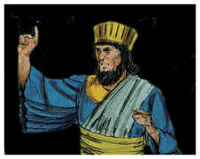
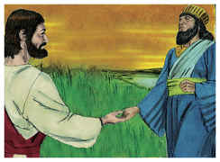

# Jó Capítulo 3

## 1
DEPOIS disto abriu Jó a sua boca, e amaldiçoou o seu dia.

## 2
E Jó, falando, disse:

## 3
Pereça o dia em que nasci, e a noite em que se disse: Foi concebido um homem!

## 4
Converta-se aquele dia em trevas; e Deus, lá de cima, não tenha cuidado dele, nem resplandeça sobre ele a luz.

## 5
Contaminem-no as trevas e a sombra da morte; habitem sobre ele nuvens; a escuridão do dia o espante!

## 6
Quanto àquela noite, dela se apodere a escuridão; e não se regozije ela entre os dias do ano; e não entre no número dos meses!

## 7
Ah! que solitária seja aquela noite, e nela não entre voz de júbilo!

## 8
Amaldiçoem-na aqueles que amaldiçoam o dia, que estão prontos para suscitar o seu pranto.

## 9
Escureçam-se as estrelas do seu crepúsculo; que espere a luz, e não venha; e não veja as pálpebras da alva;

## 10
Porque não fechou as portas do ventre; nem escondeu dos meus olhos a canseira.

## 11
Por que não morri eu desde a madre? E em saindo do ventre, não expirei?

## 12
Por que me receberam os joelhos? E por que os peitos, para que mamasse?

## 13
Porque já agora jazeria e repousaria; dormiria, e então haveria repouso para mim.

## 14
Com os reis e conselheiros da terra, que para si edificam casas nos lugares assolados,

## 15
Ou com os príncipes que possuem ouro, que enchem as suas casas de prata,

## 16
Ou como aborto oculto, não existiria; como as crianças que não viram a luz.

## 17
Ali os maus cessam de perturbar; e ali repousam os cansados.

## 18
Ali os presos juntamente repousam, e não ouvem a voz do exator.

## 19
Ali está o pequeno e o grande, e o servo livre de seu senhor.

## 20
Por que se dá luz ao miserável, e vida aos amargurados de ânimo?

## 21
Que esperam a morte, e ela não vem; e cavam em procura dela mais do que de tesouros ocultos;

## 22
Que de alegria saltam, e exultam, achando a sepultura?

## 23
Por que se dá luz ao homem, cujo caminho é oculto, e a quem Deus o encobriu?

## 24
Porque antes do meu pão vem o meu suspiro; e os meus gemidos se derramam como água.

## 25
Porque aquilo que temia me sobreveio; e o que receava me aconteceu.

## 26
Nunca estive tranqüilo, nem sosseguei, nem repousei, mas veio sobre mim a perturbação.

# João Capítulo 3

## 1
E HAVIA entre os fariseus um homem, chamado Nicodemos, príncipe dos judeus.

## 2
Este foi ter de noite com Jesus, e disse-lhe: Rabi, bem sabemos que és Mestre, vindo de Deus; porque ninguém pode fazer estes sinais que tu fazes, se Deus não for com ele.

## 3
Jesus respondeu, e disse-lhe: Na verdade, na verdade te digo que aquele que não nascer de novo, não pode ver o reino de Deus.

## 4
Disse-lhe Nicodemos: Como pode um homem nascer, sendo velho? Pode, porventura, tornar a entrar no ventre de sua mãe, e nascer?

## 5
Jesus respondeu: Na verdade, na verdade te digo que aquele que não nascer da água e do Espírito, não pode entrar no reino de Deus.

## 6
O que é nascido da carne é carne, e o que é nascido do Espírito é espírito.

## 7
Não te maravilhes de te ter dito: Necessário vos é nascer de novo.

## 8
O vento assopra onde quer, e ouves a sua voz, mas não sabes de onde vem, nem para onde vai; assim é todo aquele que é nascido do Espírito.

## 9
Nicodemos respondeu, e disse-lhe: Como pode ser isso?

## 10
Jesus respondeu, e disse-lhe: Tu és mestre de Israel, e não sabes isto?

## 11
Na verdade, na verdade te digo que nós dizemos o que sabemos, e testificamos o que vimos; e não aceitais o nosso testemunho.

## 12
Se vos falei de coisas terrestres, e não crestes, como crereis, se vos falar das celestiais?

## 13
Ora, ninguém subiu ao céu, senão o que desceu do céu, o Filho do homem, que está no céu.

## 14
E, como Moisés levantou a serpente no deserto, assim importa que o Filho do homem seja levantado;

## 15
Para que todo aquele que nele crê não pereça, mas tenha a vida eterna.

## 16
Porque Deus amou o mundo de tal maneira que deu o seu Filho unigênito, para que todo aquele que nele crê não pereça, mas tenha a vida eterna.

## 17
Porque Deus enviou o seu Filho ao mundo, não para que condenasse o mundo, mas para que o mundo fosse salvo por ele.

## 18
Quem crê nele não é condenado; mas quem não crê já está condenado, porquanto não crê no nome do unigênito Filho de Deus.

## 19
E a condenação é esta: Que a luz veio ao mundo, e os homens amaram mais as trevas do que a luz, porque as suas obras eram más.

## 20
Porque todo aquele que faz o mal odeia a luz, e não vem para a luz, para que as suas obras não sejam reprovadas.

## 21
Mas quem pratica a verdade vem para a luz, a fim de que as suas obras sejam manifestas, porque são feitas em Deus.

## 22
Depois disto foi Jesus com os seus discípulos para a terra da Judéia; e estava ali com eles, e batizava.

## 23
Ora, João batizava também em Enom, junto a Salim, porque havia ali muitas águas; e vinham ali, e eram batizados.

## 24
Porque ainda João não tinha sido lançado na prisão.

## 25
Houve então uma questão entre os discípulos de João e os judeus acerca da purificação.

## 26
E foram ter com João, e disseram-lhe: Rabi, aquele que estava contigo além do Jordão, do qual tu deste testemunho, ei-lo batizando, e todos vão ter com ele.

## 27
João respondeu, e disse: O homem não pode receber coisa alguma, se não lhe for dada do céu.

## 28
Vós mesmos me sois testemunhas de que disse: Eu não sou o Cristo, mas sou enviado adiante dele.

## 29
Aquele que tem a esposa é o esposo; mas o amigo do esposo, que lhe assiste e o ouve, alegra-se muito com a voz do esposo. Assim, pois, já este meu gozo está cumprido.

## 30
É necessário que ele cresça e que eu diminua.

## 31
Aquele que vem de cima é sobre todos; aquele que vem da terra é da terra e fala da terra. Aquele que vem do céu é sobre todos.

## 32
E aquilo que ele viu e ouviu isso testifica; e ninguém aceita o seu testemunho.

## 33
Aquele que aceitou o seu testemunho, esse confirmou que Deus é verdadeiro.

## 34
Porque aquele que Deus enviou fala as palavras de Deus; pois não lhe dá Deus o Espírito por medida.

## 35
O Pai ama o Filho, e todas as coisas entregou nas suas mãos.

## 36
Aquele que crê no Filho tem a vida eterna; mas aquele que não crê no Filho não verá a vida, mas a ira de Deus sobre ele permanece.

