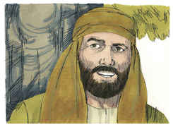

# Jó Capítulo 32

## 1
ENTÃO aqueles três homens cessaram de responder a Jó; porque era justo aos seus próprios olhos.

## 2
E acendeu-se a ira de Eliú, filho de Baraquel, o buzita, da família de Rão; contra Jó se acendeu a sua ira, porque se justificava a si mesmo, mais do que a Deus.

## 3
Também a sua ira se acendeu contra os seus três amigos, porque, não achando que responder, todavia condenavam a Jó.

## 4
Eliú, porém, esperou para falar a Jó, porquanto tinham mais idade do que ele.

## 5
Vendo, pois, Eliú que já não havia resposta na boca daqueles três homens, a sua ira se acendeu.

## 6
E respondeu Eliú, filho de Baraquel, o buzita, dizendo: Eu sou de menos idade, e vós sois idosos; receei-me e temi de vos declarar a minha opinião.

## 7
Dizia eu: Falem os dias, e a multidão dos anos ensine a sabedoria.

## 8
Na verdade, há um espírito no homem, e a inspiração do Todo-Poderoso o faz entendido.

## 9
Os grandes não são os sábios, nem os velhos entendem o que é direito.

## 10
Assim digo: Dai-me ouvidos, e também eu declararei a minha opinião.

## 11
Eis que aguardei as vossas palavras, e dei ouvidos às vossas considerações, até que buscásseis razões.

## 12
Atentando, pois, para vós, eis que nenhum de vós há que possa convencer a Jó, nem que responda às suas razões;

## 13
Para que não digais: Achamos a sabedoria; Deus o derrubou, e não homem algum.

## 14
Ora ele não dirigiu contra mim palavra alguma, nem lhe responderei com as vossas palavras.

## 15
Estão pasmados, não respondem mais, faltam-lhes as palavras.

## 16
Esperei, pois, mas não falam; porque já pararam, e não respondem mais.

## 17
Também eu responderei pela minha parte; também eu declararei a minha opinião.

## 18
Porque estou cheio de palavras; o meu espírito me constrange.

## 19
Eis que dentro de mim sou como o mosto, sem respiradouro, prestes a arrebentar, como odres novos.

## 20
Falarei, para que ache alívio; abrirei os meus lábios, e responderei.

## 21
Que não faça eu acepção de pessoas, nem use de palavras lisonjeiras com o homem!

## 22
Porque não sei usar de lisonjas; em breve me levaria o meu Criador.

