# Jó Capítulo 9

## 1
ENTÃO Jó respondeu, dizendo:

## 2
Na verdade sei que assim é; porque, como se justificaria o homem para com Deus?

## 3
Se quiser contender com ele, nem a uma de mil coisas lhe poderá responder.

## 4
Ele é sábio de coração, e forte em poder; quem se endureceu contra ele, e teve paz?

## 5
Ele é o que remove os montes, sem que o saibam, e o que os transtorna no seu furor.

## 6
O que sacode a terra do seu lugar, e as suas colunas estremecem.

## 7
O que fala ao sol, e ele não nasce, e sela as estrelas.

## 8
O que sozinho estende os céus, e anda sobre os altos do mar.

## 9
O que fez a Ursa, o Órion, e o Sete-estrelo, e as recâmaras do sul.

## 10
O que faz coisas grandes e inescrutáveis; e maravilhas sem número.

## 11
Eis que ele passa por diante de mim, e não o vejo; e torna a passar perante mim, e não o sinto.

## 12
Eis que arrebata a presa; quem lha fará restituir? Quem lhe dirá: Que é o que fazes?

## 13
Deus não revogará a sua ira; debaixo dele se encurvam os auxiliadores soberbos.

## 14
Quanto menos lhe responderia eu, ou escolheria diante dele as minhas palavras!

## 15
Porque, ainda que eu fosse justo, não lhe responderia; antes ao meu Juiz pediria misericórdia.

## 16
Ainda que chamasse, e ele me respondesse, nem por isso creria que desse ouvidos à minha voz.

## 17
Porque me quebranta com uma tempestade, e multiplica as minhas chagas sem causa.

## 18
Não me permite respirar, antes me farta de amarguras.

## 19
Quanto às forças, eis que ele é o forte; e, quanto ao juízo, quem me citará com ele?

## 20
Se eu me justificar, a minha boca me condenará; se for perfeito, então ela me declarará perverso.

## 21
Se for perfeito, não estimo a minha alma; desprezo a minha vida.

## 22
A coisa é esta; por isso eu digo que ele consome ao perfeito e ao ímpio.

## 23
Quando o açoite mata de repente, então ele zomba da prova dos inocentes.

## 24
A terra é entregue nas mãos do ímpio; ele cobre o rosto dos juízes; se não é ele, quem é, logo?

## 25
E os meus dias são mais velozes do que um correio; fugiram, e não viram o bem.

## 26
Passam como navios veleiros; como águia que se lança à comida.

## 27
Se eu disser: Eu me esquecerei da minha queixa, e mudarei o meu aspecto e tomarei alento,

## 28
Receio todas as minhas dores, porque bem sei que não me terás por inocente.

## 29
E, sendo eu ímpio, por que trabalharei em vão?

## 30
Ainda que me lave com água de neve, e purifique as minhas mãos com sabão,

## 31
Ainda me submergirás no fosso, e as minhas próprias vestes me abominarão.

## 32
Porque ele não é homem, como eu, a quem eu responda, vindo juntamente a juízo.

## 33
Não há entre nós árbitro que ponha a mão sobre nós ambos.

## 34
Tire ele a sua vara de cima de mim, e não me amedronte o seu terror.

## 35
Então falarei, e não o temerei; porque não sou assim em mim mesmo.

# João Capítulo 9

## 1
E, PASSANDO Jesus, viu um homem cego de nascença.

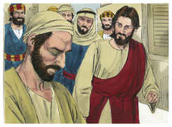

## 2
E os seus discípulos lhe perguntaram, dizendo: Rabi, quem pecou, este ou seus pais, para que nascesse cego?

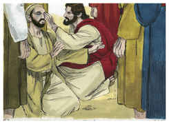

## 3
Jesus respondeu: Nem ele pecou nem seus pais; mas foi assim para que se manifestem nele as obras de Deus.

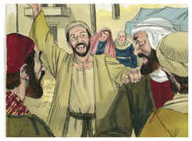

## 4
Convém que eu faça as obras daquele que me enviou, enquanto é dia; a noite vem, quando ninguém pode trabalhar.

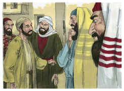

## 5
Enquanto estou no mundo, sou a luz do mundo.

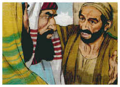

## 6
Tendo dito isto, cuspiu na terra, e com a saliva fez lodo, e untou com o lodo os olhos do cego.

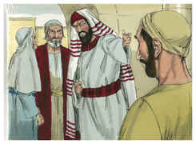

## 7
E disse-lhe: Vai, lava-te no tanque de Siloé (que significa o Enviado). Foi, pois, e lavou-se, e voltou vendo.

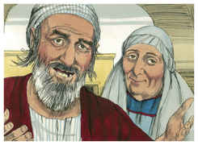

## 8
Então os vizinhos, e aqueles que dantes tinham visto que era cego, diziam: Não é este aquele que estava assentado e mendigava?

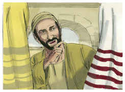

## 9
Uns diziam: É este. E outros: Parece-se com ele. Ele dizia: Sou eu.

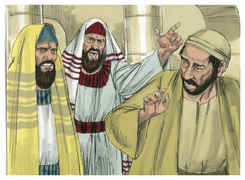

## 10
Diziam-lhe, pois: Como se te abriram os olhos?

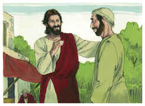

## 11
Ele respondeu, e disse: O homem, chamado Jesus, fez lodo, e untou-me os olhos, e disse-me: Vai ao tanque de Siloé, e lava-te. Então fui, e lavei-me, e vi.

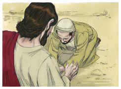

## 12
Disseram-lhe, pois: Onde está ele? Respondeu: Não sei.

## 13
Levaram, pois, aos fariseus o que dantes era cego.

## 14
E era sábado quando Jesus fez o lodo e lhe abriu os olhos.

## 15
Tornaram, pois, também os fariseus a perguntar-lhe como vira, e ele lhes disse: Pôs-me lodo sobre os olhos, lavei-me, e vejo.

## 16
Então alguns dos fariseus diziam: Este homem não é de Deus, pois não guarda o sábado. Diziam outros: Como pode um homem pecador fazer tais sinais? E havia dissensão entre eles.

## 17
Tornaram, pois, a dizer ao cego: Tu, que dizes daquele que te abriu os olhos? E ele respondeu: Que é profeta.

## 18
Os judeus, porém, não creram que ele tivesse sido cego, e que agora visse, enquanto não chamaram os pais do que agora via.

## 19
E perguntaram-lhes, dizendo: É este o vosso filho, que vós dizeis ter nascido cego? Como, pois, vê agora?

## 20
Seus pais lhes responderam, e disseram: Sabemos que este é o nosso filho, e que nasceu cego;

## 21
Mas como agora vê, não sabemos; ou quem lhe tenha aberto os olhos, não sabemos. Tem idade, perguntai-lho a ele mesmo; e ele falará por si mesmo.

## 22
Seus pais disseram isto, porque temiam os judeus. Porquanto já os judeus tinham resolvido que, se alguém confessasse ser ele o Cristo, fosse expulso da sinagoga.

## 23
Por isso é que seus pais disseram: Tem idade, perguntai-lho a ele mesmo.

## 24
Chamaram, pois, pela segunda vez o homem que tinha sido cego, e disseram-lhe: Dá glória a Deus; nós sabemos que esse homem é pecador.

## 25
Respondeu ele pois, e disse: Se é pecador, não sei; uma coisa sei, é que, havendo eu sido cego, agora vejo.

## 26
E tornaram a dizer-lhe: Que te fez ele? Como te abriu os olhos?

## 27
Respondeu-lhes: Já vo-lo disse, e não ouvistes; para que o quereis tornar a ouvir? Quereis vós porventura fazer-vos também seus discípulos?

## 28
Então o injuriaram, e disseram: Discípulo dele sejas tu; nós, porém, somos discípulos de Moisés.

## 29
Nós bem sabemos que Deus falou a Moisés, mas este não sabemos de onde é.

## 30
O homem respondeu, e disse-lhes: Nisto, pois, está a maravilha, que vós não saibais de onde ele é, e contudo me abrisse os olhos.

## 31
Ora, nós sabemos que Deus não ouve a pecadores; mas, se alguém é temente a Deus, e faz a sua vontade, a esse ouve.

## 32
Desde o princípio do mundo nunca se ouviu que alguém abrisse os olhos a um cego de nascença.

## 33
Se este não fosse de Deus, nada poderia fazer.

## 34
Responderam eles, e disseram-lhe: Tu és nascido todo em pecados, e nos ensinas a nós? E expulsaram-no.

## 35
Jesus ouviu que o tinham expulsado e, encontrando-o, disse-lhe: Crês tu no Filho de Deus?

## 36
Ele respondeu, e disse: Quem é ele, Senhor, para que nele creia?

## 37
E Jesus lhe disse: Tu já o tens visto, e é aquele que fala contigo.

## 38
Ele disse: Creio, Senhor. E o adorou.

## 39
E disse-lhe Jesus: Eu vim a este mundo para juízo, a fim de que os que não vêem vejam, e os que vêem sejam cegos.

## 40
E aqueles dos fariseus, que estavam com ele, ouvindo isto, disseram-lhe: Também nós somos cegos?

## 41
Disse-lhes Jesus: Se fôsseis cegos, não teríeis pecado; mas como agora dizeis: Vemos; por isso o vosso pecado permanece.

