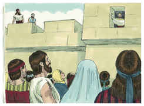
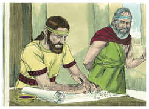
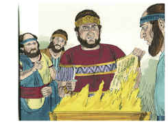
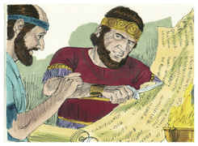
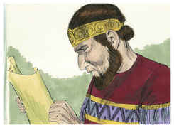

# Jeremías Capítulo 36

## 1
SUCEDEU, pois, no ano quarto de Jeoiaquim, filho de Josias, rei de Judá, que veio esta palavra do Senhor a Jeremias, dizendo:

## 2
Toma o rolo de um livro, e escreve nele todas as palavras que te tenho falado de Israel, e de Judá, e de todas as nações, desde o dia em que eu te falei, desde os dias de Josias até ao dia de hoje.

## 3
Porventura ouvirão os da casa de Judá todo o mal que eu intento fazer-lhes; para que cada qual se converta do seu mau caminho, e eu perdoe a sua maldade e o seu pecado.

## 4
Então Jeremias chamou a Baruque, filho de Nerias; e escreveu Baruque da boca de Jeremias no rolo de um livro todas as palavras do Senhor, que ele lhe tinha falado.

## 5
E Jeremias deu ordem a Baruque, dizendo: Eu estou encarcerado; não posso entrar na casa do Senhor.

## 6
Entra, pois, tu, e pelo rolo que escreveste da minha boca, lê as palavras do Senhor aos ouvidos do povo, na casa do Senhor, no dia de jejum; e também, aos ouvidos de todos os de Judá, que vêm das suas cidades, as lerás.

## 7
Pode ser que caia a sua súplica diante do Senhor, e se converta cada um do seu mau caminho; porque grande é a ira e o furor que o Senhor tem expressado contra este povo.

## 8
E fez Baruque, filho de Nerias, conforme tudo quanto lhe havia ordenado Jeremias, o profeta, lendo naquele livro as palavras do Senhor, na casa do Senhor.

## 9
E aconteceu, no quinto ano de Jeoiaquim, filho de Josias, rei de Judá, no mês nono, que apregoaram jejum diante do Senhor a todo o povo em Jerusalém, como também a todo o povo que vinha das cidades de Judá a Jerusalém.

## 10
Leu, pois, Baruque naquele livro as palavras de Jeremias, na casa do Senhor, na câmara de Gemarias, filho de Safã, o escriba, no átrio superior, à entrada da porta nova da casa do Senhor, aos ouvidos de todo o povo.

## 11
E, ouvindo Micaías, filho de Gemarias, filho de Safã, todas as palavras do Senhor, daquele livro,

## 12
Desceu à casa do rei, à câmara do escriba. E eis que todos os príncipes estavam ali assentados, a saber: Elisama, o escriba, e Delaías, filho de Semaías, e Elnatã, filho de Acbor, e Gemarias, filho de Safã, e Zedequias, filho de Hananias, e todos os outros príncipes.

## 13
E Micaías anunciou-lhes todas as palavras que ouvira, quando Baruque leu o livro, aos ouvidos do povo.

## 14
Então todos os príncipes mandaram Jeudi, filho de Netanias, filho de Selemias, filho de Cusi, a Baruque, para lhe dizer: O rolo que leste aos ouvidos do povo, toma-o na tua mão, e vem. E Baruque, filho de Nerias, tomou o rolo na sua mão, e foi ter com eles.

## 15
E disseram-lhe: Assenta-te agora, e lê-o aos nossos ouvidos. E leu Baruque aos ouvidos deles.

## 16
E sucedeu que, ouvindo eles todas aquelas palavras, voltaram-se temerosos uns para os outros, e disseram a Baruque: Sem dúvida alguma anunciaremos ao rei todas estas palavras.

## 17
E perguntaram a Baruque, dizendo: Declara-nos agora como escreveste da sua boca todas estas palavras.

## 18
E disse-lhes Baruque: Da sua boca ele me ditava todas estas palavras, e eu com tinta as escrevia no livro.

## 19
Então disseram os príncipes a Baruque: Vai, esconde-te, tu e Jeremias, e ninguém saiba onde estais.

## 20
E foram ter com o rei ao átrio: mas depositaram o rolo na câmara de Elisama, o escriba, e anunciaram aos ouvidos do rei todas aquelas palavras.

## 21
Então enviou o rei a Jeudi, para que tomasse o rolo; e Jeudi tomou-o da câmara de Elisama, o escriba, e leu-o aos ouvidos do rei e aos ouvidos de todos os príncipes que estavam em torno do rei.

## 22
Ora, o rei estava assentado na casa de inverno, pelo nono mês; e diante dele estava um braseiro aceso.

## 23
E sucedeu que, tendo Jeudi lido três ou quatro folhas, cortou-as com um canivete de escrivão, e lançou-as no fogo que havia no braseiro, até que todo o rolo se consumiu no fogo que estava sobre o braseiro.

## 24
E não temeram, nem rasgaram as suas vestes, nem o rei, nem nenhum dos seus servos que ouviram todas aquelas palavras.

## 25
E, posto que Elnatã, e Delaías, e Gemarias tivessem rogado ao rei que não queimasse o rolo, ele não lhes deu ouvidos.

## 26
Antes deu ordem o rei a Jerameel, filho de Hamaleque, e a Seraías, filho de Azriel, e a Selemias, filho de Abdeel, que prendessem a Baruque, o escrivão, e a Jeremias, o profeta; mas o Senhor os escondera.

## 27
Então veio a Jeremias a palavra do Senhor, depois que o rei queimara o rolo, com as palavras que Baruque escrevera da boca de Jeremias, dizendo:

## 28
Toma ainda outro rolo, e escreve nele todas aquelas palavras que estavam no primeiro rolo, que queimou Jeoiaquim, rei de Judá.

## 29
E a Jeoiaquim, rei de Judá, dirás: Assim diz o Senhor: Tu queimaste este rolo, dizendo: Por que escreveste nele, dizendo: Certamente virá o rei de Babilônia, e destruirá esta terra e fará cessar nela homens e animais?

## 30
Portanto assim diz o Senhor, acerca de Jeoiaquim, rei de Judá: Não terá quem se assente sobre o trono de Davi, e será lançado o seu cadáver ao calor do dia, e à geada da noite.

## 31
E castigarei a sua iniqüidade nele, e na sua descendência, e nos seus servos; e trarei sobre ele e sobre os moradores de Jerusalém, e sobre os homens de Judá, todo aquele mal que lhes tenho falado, e não ouviram.

## 32
Tomou, pois, Jeremias outro rolo, e deu-o a Baruque, filho de Nerias, o escrivão, o qual escreveu nele, da boca de Jeremias, todas as palavras do livro que Jeoiaquim, rei de Judá, tinha queimado no fogo; e ainda se lhes acrescentaram muitas palavras semelhantes.

