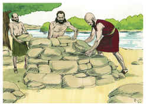
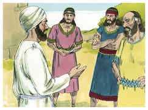
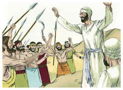
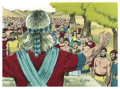

# Josué Capítulo 22

1	ENTÃO Josué chamou os rubenitas, e os gaditas, e a meia tribo de Manassés.

2	E disse-lhes: Tudo quanto Moisés, o servo do Senhor, vos ordenou, guardastes; e à minha voz obedecestes em tudo quanto vos ordenei.

3	A vossos irmãos por todo este tempo, até ao dia de hoje, não desamparastes; antes tivestes cuidado de guardar o mandamento do Senhor vosso Deus.

4	Agora o Senhor vosso Deus deu repouso a vossos irmãos, como lhes tinha prometido; voltai-vos, pois, agora, e ide-vos às vossas tendas, à terra da vossa possessão, que Moisés, o servo do Senhor, vos deu além do Jordão.

5	Tão-somente tende cuidado de guardar com diligência o mandamento e a lei que Moisés, o servo do Senhor, vos mandou: que ameis ao Senhor vosso Deus, e andeis em todos os seus caminhos, e guardeis os seus mandamentos, e vos achegueis a ele, e o sirvais com todo o vosso coração, e com toda a vossa alma.

6	Assim Josué os abençoou, e despediu-os; e foram-se às suas tendas.

7	Ora, Moisés dera herança em Basã à meia tribo de Manassés, porém à outra metade Josué deu herança entre seus irmãos aquém do Jordão para o ocidente; e enviando-os Josué também às suas tendas os abençoou;

8	E falou-lhes, dizendo: Voltai-vos às vossas tendas com grandes riquezas, e com muitíssimo gado, com prata, e com ouro, e com metal, e com ferro, e com muitíssimas roupas; e com vossos irmãos reparti o despojo dos vossos inimigos.

9	Assim os filhos de Rúben, e os filhos de Gade, e a meia tribo de Manassés voltaram, e separaram-se dos filhos de Israel, de Siló, que está na terra de Canaã, para irem à terra de Gileade, à terra da sua possessão, de que foram feitos possuidores, conforme a ordem do Senhor pelo ministério de Moisés.

10	E, chegando eles aos limites do Jordão, ainda na terra de Canaã, ali os filhos de Rúben, e os filhos de Gade, e a meia tribo de Manassés edificaram um altar junto ao Jordão, um altar de grande aparência.

11	E ouviram os filhos de Israel dizer: Eis que os filhos de Rúben, e os filhos de Gade, e a meia tribo de Manassés edificaram um altar diante da terra de Canaã, nos limites do Jordão, do lado dos filhos de Israel.

12	Ouvindo isso os filhos de Israel, reuniu-se toda a congregação dos filhos de Israel em Siló, para saírem em guerra contra eles.

13	E enviaram os filhos de Israel, aos filhos de Rúben, e aos filhos de Gade, e à meia tribo de Manassés, na terra de Gileade, a Finéias, filho de Eleazar, o sacerdote,

14	E a dez príncipes com ele, de cada casa paterna um príncipe, de todas as tribos de Israel; e cada um era cabeça da casa de seus pais entre os milhares de Israel.

15	E, indo eles aos filhos de Rúben, e aos filhos de Gade, e à meia tribo de Manassés, à terra de Gileade, falaram-lhes, dizendo:

16	Assim diz toda a congregação do Senhor: Que transgressão é esta, que cometestes contra o Deus de Israel, deixando hoje de seguir ao Senhor, edificando-vos um altar, para vos rebelardes contra o Senhor?

17	Foi-nos pouco a iniqüidade de Peor, de que ainda até o dia de hoje não estamos purificados, mesmo que tenha havido castigo na congregação do Senhor,

18	Para que hoje deixais de seguir o Senhor? Será que rebelando-vos hoje contra o Senhor, amanhã ele se irará contra toda a congregação de Israel.

19	Se é, porém, que a terra da vossa herança é imunda, passai-vos para a terra da possessão do Senhor, onde habita o tabernáculo do Senhor, e tomai possessão entre nós; mas não vos rebeleis contra o Senhor, nem tampouco vos rebeleis contra nós, edificando-vos um altar, além do altar do Senhor nosso Deus.

20	Não cometeu Acã, filho de Zerá, transgressão no tocante ao anátema? Não veio ira sobre toda a congregação de Israel, de modo que aquele homem não morreu só, na sua iniqüidade?

21	Então responderam os filhos de Rúben, e os filhos de Gade, e a meia tribo de Manassés, e disseram aos cabeças dos milhares de Israel:

22	O Senhor Deus dos deuses, o Senhor Deus dos deuses, ele o sabe, e Israel mesmo o saberá. Se foi por rebeldia, ou por transgressão contra o Senhor, hoje não nos preserve;

23	Se nós edificamos um altar para nos desviarmos do Senhor, ou para sobre ele oferecer holocausto e oferta de alimentos, ou sobre ele apresentar oferta pacífica, o Senhor mesmo de nós o requeira.

24	E, se antes o não fizemos por receio disto, dizendo: Amanhã vossos filhos virão a falar a nossos filhos, dizendo: Que tendes vós com o Senhor Deus de Israel?

25	Pois o Senhor pôs o Jordão por termo entre nós e vós, ó filhos de Rúben, e filhos de Gade; não tendes parte no Senhor; e assim bem poderiam vossos filhos fazer desistir a nossos filhos de temer ao Senhor.

26	Por isso dissemos: Preparemo-nos agora, e edifiquemos um altar, não para holocausto, nem para sacrifício,

27	Mas para que, entre nós e vós, e entre as nossas gerações depois de nós, nos seja em testemunho, para podermos fazer o serviço do Senhor diante dele com os nossos holocaustos, e com os nossos sacrifícios, e com as nossas ofertas pacíficas; para que vossos filhos não digam amanhã a nossos filhos: Não tendes parte no Senhor.

28	Por isso dissemos: Quando suceder que amanhã assim nos digam a nós e às nossas gerações, então diremos: Vede o modelo do altar do Senhor que fizeram nossos pais, não para holocausto nem para sacrifício, porém para ser testemunho entre nós e vós.

29	Nunca tal nos aconteça que nos rebelemos contra o Senhor, ou que hoje nós abandonássemos o Senhor, edificando altar para holocausto, oferta de alimentos ou sacrifício, fora do altar do Senhor nosso Deus, que está perante o seu tabernáculo.

30	Ouvindo, pois, Finéias, o sacerdote, e os príncipes da congregação, e os cabeças dos milhares de Israel, que com eles estavam, as palavras que disseram os filhos de Rúben, e os filhos de Gade, e os filhos de Manassés, pareceu bem aos seus olhos.

31	E disse Finéias, filho de Eleazar, o sacerdote, aos filhos de Rúben, e aos filhos de Gade, e aos filhos de Manassés: Hoje sabemos que o Senhor está no meio de nós; porquanto não cometestes transgressão contra o Senhor; agora livrastes os filhos de Israel da mão do Senhor.

32	E Finéias filho de Eleazar, o sacerdote, com os príncipes, deixando os filhos de Rúben, e os filhos de Gade, voltaram da terra de Gileade à terra de Canaã, aos filhos de Israel, e trouxeram-lhes a resposta.

33	E pareceu a resposta boa aos olhos dos filhos de Israel, e os filhos de Israel louvaram a Deus; e não falaram mais em subir à guerra contra eles em exército, para destruírem a terra em que habitavam os filhos de Rúben e os filhos de Gade.

34	E os filhos de Rúben e os filhos de Gade deram ao altar o nome de Ede; para que seja testemunho entre nós que o Senhor é Deus.

