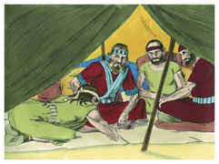

# Josué Capítulo 9

## 1
E SUCEDEU que, ouvindo isto todos os reis, que estavam aquém do Jordão, nas montanhas, e nas campinas, em toda a costa do grande mar, em frente do Líbano, os heteus, e os amorreus, os cananeus, os perizeus, os heveus, e os jebuseus,

## 2
Se ajuntaram eles de comum acordo, para pelejar contra Josué e contra Israel.

## 3
E os moradores de Gibeom, ouvindo o que Josué fizera com Jericó e com Ai,

## 4
Usaram de astúcia, e foram e se fingiram embaixadores, e levando sacos velhos sobre os seus jumentos, e odres de vinho, velhos, e rotos, e remendados;

## 5
E nos seus pés sapatos velhos e remendados, e roupas velhas sobre si; e todo o pão que traziam para o caminho era seco e bolorento.

## 6
E vieram a Josué, ao arraial, a Gilgal, e disseram a ele e aos homens de Israel: Viemos de uma terra distante; fazei, pois, agora, acordo conosco.

## 7
E os homens de Israel responderam aos heveus: Porventura habiteis no meio de nós; como pois faremos acordo convosco?

## 8
Então disseram a Josué: Nós somos teus servos. E disse-lhes Josué: Quem sois vós, e de onde vindes?

## 9
E lhe responderam: Teus servos vieram de uma terra mui distante, por causa do nome do Senhor teu Deus, porquanto ouvimos a sua fama, e tudo quanto fez no Egito;

## 10
E tudo quanto fez aos dois reis dos amorreus, que estavam além do Jordão, a Siom rei de Hesbom, e a Ogue, rei de Basã, que estava em Astarote.

## 11
Por isso nossos anciãos e todos os moradores da nossa terra nos falaram, dizendo: Tomai em vossas mãos provisão para o caminho, e ide-lhes ao encontro e dizei-lhes: Nós somos vossos servos; fazei, pois, agora acordo conosco.

## 12
Este nosso pão tomamos quente das nossas casas para nossa provisão, no dia em que saímos para vir a vós; e ei-lo aqui agora já seco e bolorento;

## 13
E estes odres, que enchemos de vinho, eram novos, e ei-los aqui já rotos; e estas nossas roupas e nossos sapatos já se têm envelhecido, por causa do mui longo caminho.

## 14
Então os homens de Israel tomaram da provisão deles e não pediram conselho ao Senhor.

## 15
E Josué fez paz com eles, e fez um acordo com eles, que lhes daria a vida; e os príncipes da congregação lhes prestaram juramento.

## 16
E sucedeu que, ao fim de três dias, depois de fazerem acordo com eles, ouviram que eram seus vizinhos, e que moravam no meio deles.

## 17
Porque, partindo os filhos de Israel, chegaram às cidades deles ao terceiro dia; e suas cidades eram Gibeom e Cefira, e Beerote, e Quiriate-Jearim.

## 18
E os filhos de Israel não os feriram; porquanto os príncipes da congregação lhes juraram pelo Senhor Deus de Israel; por isso toda a congregação murmurava contra os príncipes.

## 19
Então todos os príncipes disseram a toda a congregação: Nós juramos-lhes pelo Senhor Deus de Israel, pelo que não lhes podemos tocar.

## 20
Isto, porém, lhes faremos: conservar-lhes-emos a vida, para que não haja grande ira sobre nós, por causa do juramento que já lhes fizemos.

## 21
Disseram-lhes, pois, os príncipes: Vivam, e sejam rachadores de lenha e tiradores de água para toda a congregação, como os príncipes lhes disseram.

## 22
E Josué os chamou, e falou-lhes dizendo: Por que nos enganastes dizendo: Mui longe de vós habitamos, morando vós no meio de nós?

## 23
Agora, pois, sereis malditos; e dentre vós não deixará de haver servos, nem rachadores de lenha, nem tiradores de água, para a casa do meu Deus.

## 24
Então responderam a Josué, e disseram: Porquanto com certeza foi anunciado aos teus servos que o Senhor teu Deus ordenou a Moisés, seu servo, que a vós daria toda esta terra, e destruiria todos os moradores da terra diante de vós, tememos muito por nossas vidas por causa de vós; por isso fizemos assim.

## 25
E eis que agora estamos na tua mão; faze-nos aquilo que te pareça bom e reto.

## 26
Assim pois lhes fez, e livrou-os das mãos dos filhos de Israel, e não os mataram.

## 27
E naquele dia, Josué os fez rachadores de lenha e tiradores de água para a congregação e para o altar do Senhor, até ao dia de hoje, no lugar que ele escolhesse.

