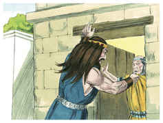
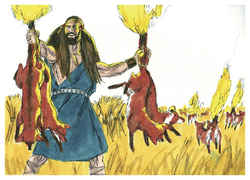
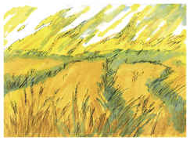
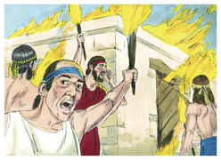
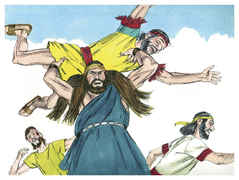
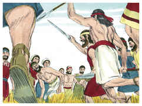
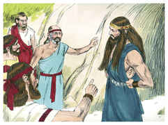
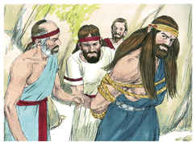
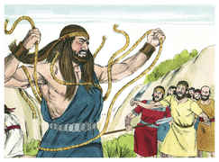
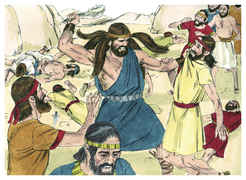

# Juízes Capítulo 15

1	E ACONTECEU, depois de alguns dias, que, na sega do trigo, Sansão visitou a sua mulher, com um cabrito, e disse: Entrarei na câmara de minha mulher. Porém o pai dela não o deixou entrar.

2	E disse-lhe seu pai: Por certo pensava eu que de todo a desprezavas; de sorte que a dei ao teu companheiro; porém não é sua irmã mais nova, mais formosa do que ela? Toma-a, pois, em seu lugar.

3	Então Sansão disse acerca deles: Inocente sou esta vez para com os filisteus, quando lhes fizer algum mal.

4	E foi Sansão, e pegou trezentas raposas; e, tomando tochas, as virou cauda a cauda, e lhes pôs uma tocha no meio de cada duas caudas.

5	E chegou fogo às tochas, e largou-as na seara dos filisteus; e assim abrasou os molhos com a sega do trigo, e as vinhas e os olivais.

6	Então perguntaram os filisteus: Quem fez isto? E responderam: Sansão, o genro do timnita, porque lhe tomou a sua mulher, e a deu a seu companheiro. Então subiram os filisteus, e queimaram a fogo a ela e a seu pai.

7	Então lhes disse Sansão: É assim que fazeis? Pois, havendo-me vingado eu de vós, então cessarei.

8	E feriu-os com grande ferimento, pernas juntamente com coxa; e desceu, e habitou na fenda da rocha de Etã.

9	Então os filisteus subiram, e acamparam-se contra Judá, e estenderam-se por Leí.

10	E perguntaram-lhes os homens de Judá: Por que subistes contra nós? E eles responderam: Subimos para amarrar a Sansão, para lhe fazer a ele como ele nos fez a nós.

11	Então três mil homens de Judá desceram até a fenda da rocha de Etã, e disseram a Sansão: Não sabias tu que os filisteus dominam sobre nós? Por que, pois, nos fizeste isto? E ele lhes disse: Assim como eles me fizeram a mim, eu lhes fiz a eles.

12	E disseram-lhe: Descemos para te amarrar e te entregar nas mãos dos filisteus. Então Sansão lhes disse: Jurai-me que vós mesmos não me acometereis.

13	E eles lhe falaram, dizendo: Não, mas fortemente te amarraremos, e te entregaremos nas mãos deles; porém de maneira nenhuma te mataremos. E amarraram-no com duas cordas novas e fizeram-no subir da rocha.

14	E, vindo ele a Leí, os filisteus lhe saíram ao encontro, jubilando; porém o Espírito do Senhor poderosamente se apossou dele, e as cordas que ele tinha nos braços se tornaram como fios de linho que se queimaram no fogo, e as suas amarraduras se desfizeram das suas mãos.

15	E achou uma queixada fresca de um jumento, e estendeu a sua mão, e tomou-a, e feriu com ela mil homens.

16	Então disse Sansão: Com uma queixada de jumento, montões sobre montões; com uma queixada de jumento feri a mil homens.

17	E aconteceu que, acabando ele de falar, lançou a queixada da sua mão; e chamou aquele lugar Ramate-Leí.

18	E como tivesse grande sede, clamou ao Senhor, e disse: Pela mão do teu servo tu deste esta grande salvação; morrerei eu pois agora de sede, e cairei na mão destes incircuncisos?

19	Então Deus fendeu uma cavidade que estava na queixada; e saiu dela água, e bebeu; e recobrou o seu espírito e reanimou-se; por isso chamou aquele lugar: A fonte do que clama, que está em Leí até ao dia de hoje.

20	E julgou a Israel, nos dias dos filisteus, vinte anos.

