# Lucas Capítulo 18

1	E CONTOU-LHES também uma parábola sobre o dever de orar sempre, e nunca desfalecer,

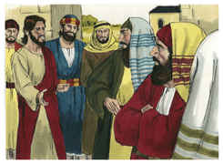

2	Dizendo: Havia numa cidade um certo juiz, que nem a Deus temia, nem respeitava o homem.

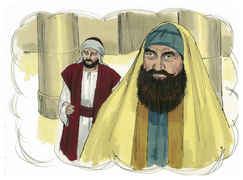

3	Havia também, naquela mesma cidade, uma certa viúva, que ia ter com ele, dizendo: Faze-me justiça contra o meu adversário.

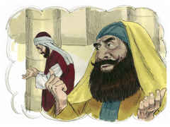

4	E por algum tempo não quis atendê-la; mas depois disse consigo: Ainda que não temo a Deus, nem respeito os homens,

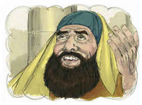

5	Todavia, como esta viúva me molesta, hei de fazer-lhe justiça, para que enfim não volte, e me importune muito.

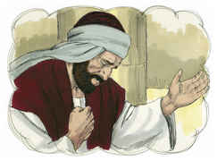

6	E disse o Senhor: Ouvi o que diz o injusto juiz.

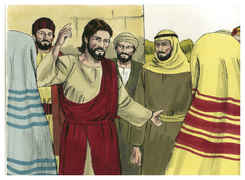

7	E Deus não fará justiça aos seus escolhidos, que clamam a ele de dia e de noite, ainda que tardio para com eles?

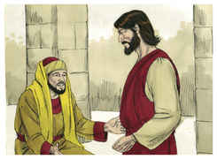

8	Digo-vos que depressa lhes fará justiça. Quando porém vier o Filho do homem, porventura achará fé na terra?

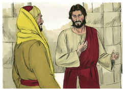

9	E disse também esta parábola a uns que confiavam em si mesmos, crendo que eram justos, e desprezavam os outros:

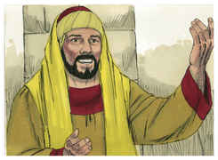

10	Dois homens subiram ao templo, para orar; um, fariseu, e o outro, publicano.

11	O fariseu, estando em pé, orava consigo desta maneira: Ó Deus, graças te dou porque não sou como os demais homens, roubadores, injustos e adúlteros; nem ainda como este publicano.

12	Jejuo duas vezes na semana, e dou os dízimos de tudo quanto possuo.

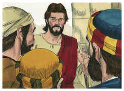

13	O publicano, porém, estando em pé, de longe, nem ainda queria levantar os olhos ao céu, mas batia no peito, dizendo: Ó Deus, tem misericórdia de mim, pecador!

14	Digo-vos que este desceu justificado para sua casa, e não aquele; porque qualquer que a si mesmo se exalta será humilhado, e qualquer que a si mesmo se humilha será exaltado.

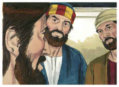

15	E traziam-lhe também meninos, para que ele lhes tocasse; e os discípulos, vendo isto, repreendiam-nos.

16	Mas Jesus, chamando-os para si, disse: Deixai vir a mim os meninos, e não os impeçais, porque dos tais é o reino de Deus.

17	Em verdade vos digo que, qualquer que não receber o reino de Deus como menino, não entrará nele.

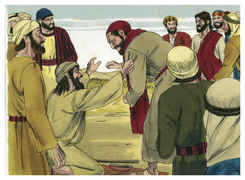

18	E perguntou-lhe um certo príncipe, dizendo: Bom Mestre, que hei de fazer para herdar a vida eterna?

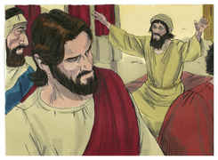

19	Jesus lhe disse: Por que me chamas bom? Ninguém há bom, senão um, que é Deus.

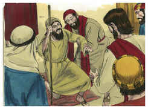

20	Sabes os mandamentos: Não adulterarás, não matarás, não furtarás, não dirás falso testemunho, honra a teu pai e a tua mãe.

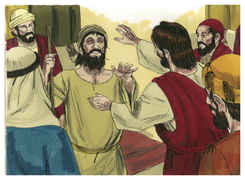

21	E disse ele: Todas essas coisas tenho observado desde a minha mocidade.

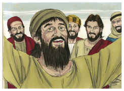

22	E quando Jesus ouviu isto, disse-lhe: Ainda te falta uma coisa; vende tudo quanto tens, reparte-o pelos pobres, e terás um tesouro no céu; vem, e segue-me.

23	Mas, ouvindo ele isto, ficou muito triste, porque era muito rico.

24	E, vendo Jesus que ele ficara muito triste, disse: Quão dificilmente entrarão no reino de Deus os que têm riquezas!

25	Porque é mais fácil entrar um camelo pelo fundo de uma agulha do que entrar um rico no reino de Deus.

26	E os que ouviram isto disseram: Logo quem pode salvar-se?

27	Mas ele respondeu: As coisas que são impossíveis aos homens são possíveis a Deus.

28	E disse Pedro: Eis que nós deixamos tudo e te seguimos.

29	E ele lhes disse: Na verdade vos digo que ninguém há, que tenha deixado casa, ou pais, ou irmãos, ou mulher, ou filhos, pelo reino de Deus,

30	Que não haja de receber muito mais neste mundo, e na idade vindoura a vida eterna.

31	E, tomando consigo os doze, disse-lhes: Eis que subimos a Jerusalém, e se cumprirá no Filho do homem tudo o que pelos profetas foi escrito;

32	Pois há de ser entregue aos gentios, e escarnecido, injuriado e cuspido;

33	E, havendo-o açoitado, o matarão; e ao terceiro dia ressuscitará.

34	E eles nada disto entendiam, e esta palavra lhes era encoberta, não percebendo o que se lhes dizia.

35	E aconteceu que chegando ele perto de Jericó, estava um cego assentado junto do caminho, mendigando.

36	E, ouvindo passar a multidão, perguntou que era aquilo.

37	E disseram-lhe que Jesus Nazareno passava.

38	Então clamou, dizendo: Jesus, Filho de Davi, tem misericórdia de mim.

39	E os que iam passando repreendiam-no para que se calasse; mas ele clamava ainda mais: Filho de Davi, tem misericórdia de mim!

40	Então Jesus, parando, mandou que lho trouxessem; e, chegando ele, perguntou-lhe,

41	Dizendo: Que queres que te faça? E ele disse: Senhor, que eu veja.

42	E Jesus lhe disse: Vê; a tua fé te salvou.

43	E logo viu, e seguia-o, glorificando a Deus. E todo o povo, vendo isto, dava louvores a Deus.

