# Lucas Capítulo 2

## 1
E ACONTECEU naqueles dias que saiu um decreto da parte de César Augusto, para que todo o mundo se alistasse

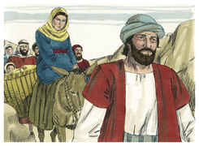

## 2
(Este primeiro alistamento foi feito sendo Quirino presidente da Síria).

## 3
E todos iam alistar-se, cada um à sua própria cidade.

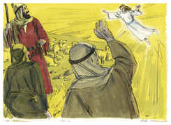

## 4
E subiu também José da Galiléia, da cidade de Nazaré, à Judéia, à cidade de Davi, chamada Belém (porque era da casa e família de Davi),

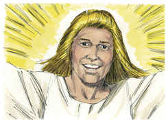

## 5
A fim de alistar-se com Maria, sua esposa, que estava grávida.

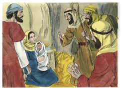

## 6
E aconteceu que, estando eles ali, se cumpriram os dias em que ela havia de dar à luz.

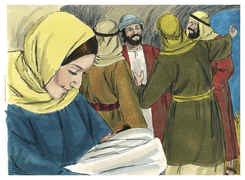

## 7
E deu à luz a seu filho primogênito, e envolveu-o em panos, e deitou-o numa manjedoura, porque não havia lugar para eles na estalagem.

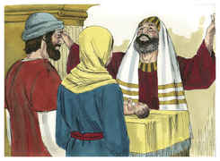

## 8
Ora, havia naquela mesma comarca pastores que estavam no campo, e guardavam, durante as vigílias da noite, o seu rebanho.

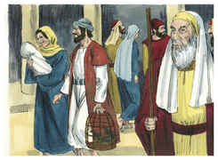

## 9
E eis que o anjo do Senhor veio sobre eles, e a glória do Senhor os cercou de resplendor, e tiveram grande temor.

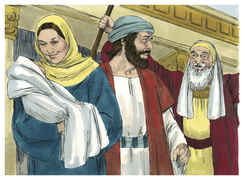

## 10
E o anjo lhes disse: Não temais, porque eis aqui vos trago novas de grande alegria, que será para todo o povo:

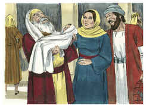

## 11
Pois, na cidade de Davi, vos nasceu hoje o Salvador, que é Cristo, o Senhor.

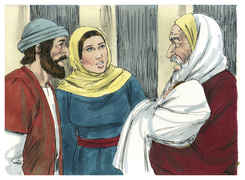

## 12
E isto vos será por sinal: Achareis o menino envolto em panos, e deitado numa manjedoura.

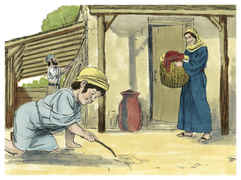

## 13
E, no mesmo instante, apareceu com o anjo uma multidão dos exércitos celestiais, louvando a Deus, e dizendo:

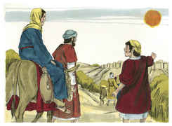

## 14
Glória a Deus nas alturas, Paz na terra, boa vontade para com os homens.

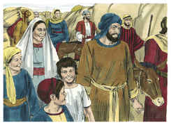

## 15
E aconteceu que, ausentando-se deles os anjos para o céu, disseram os pastores uns aos outros: Vamos, pois, até Belém, e vejamos isso que aconteceu, e que o Senhor nos fez saber.

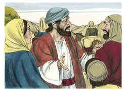

## 16
E foram apressadamente, e acharam Maria, e José, e o menino deitado na manjedoura.

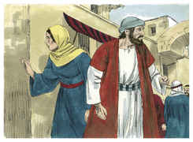

## 17
E, vendo-o, divulgaram a palavra que acerca do menino lhes fora dita;

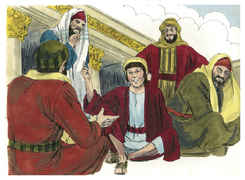

## 18
E todos os que a ouviram se maravilharam do que os pastores lhes diziam.

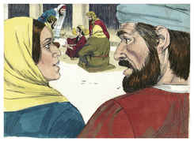

## 19
Mas Maria guardava todas estas coisas, conferindo-as em seu coração.

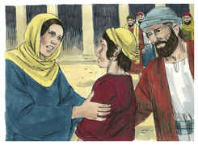

## 20
E voltaram os pastores, glorificando e louvando a Deus por tudo o que tinham ouvido e visto, como lhes havia sido dito.

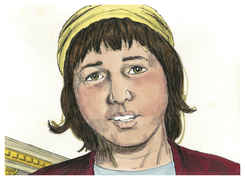

## 21
E, quando os oito dias foram cumpridos, para circuncidar o menino, foi-lhe dado o nome de Jesus, que pelo anjo lhe fora posto antes de ser concebido.

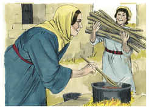

## 22
E, cumprindo-se os dias da purificação dela, segundo a lei de Moisés, o levaram a Jerusalém, para o apresentarem ao Senhor

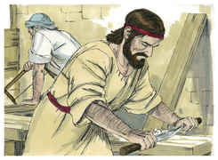

## 23
(Segundo o que está escrito na lei do Senhor: Todo o macho primogênito será consagrado ao Senhor);

## 24
E para darem a oferta segundo o disposto na lei do Senhor: Um par de rolas ou dois pombinhos.

## 25
Havia em Jerusalém um homem cujo nome era Simeão; e este homem era justo e temente a Deus, esperando a consolação de Israel; e o Espírito Santo estava sobre ele.

## 26
E fora-lhe revelado, pelo Espírito Santo, que ele não morreria antes de ter visto o Cristo do Senhor.

## 27
E pelo Espírito foi ao templo e, quando os pais trouxeram o menino Jesus, para com ele procederem segundo o uso da lei,

## 28
Ele, então, o tomou em seus braços, e louvou a Deus, e disse:

## 29
Agora, Senhor, despedes em paz o teu servo, Segundo a tua palavra;

## 30
Pois já os meus olhos viram a tua salvação,

## 31
A qual tu preparaste perante a face de todos os povos;

## 32
Luz para iluminar as nações, E para glória de teu povo Israel.

## 33
E José, e sua mãe, se maravilharam das coisas que dele se diziam.

## 34
E Simeão os abençoou, e disse a Maria, sua mãe: Eis que este é posto para queda e elevação de muitos em Israel, e para sinal que é contraditado

## 35
(E uma espada traspassará também a tua própria alma); para que se manifestem os pensamentos de muitos corações.

## 36
E estava ali a profetisa Ana, filha de Fanuel, da tribo de Aser. Esta era já avançada em idade, e tinha vivido com o marido sete anos, desde a sua virgindade;

## 37
E era viúva, de quase oitenta e quatro anos, e não se afastava do templo, servindo a Deus em jejuns e orações, de noite e de dia.

## 38
E sobrevindo na mesma hora, ela dava graças a Deus, e falava dele a todos os que esperavam a redenção em Jerusalém.

## 39
E, quando acabaram de cumprir tudo segundo a lei do Senhor, voltaram à Galiléia, para a sua cidade de Nazaré.

## 40
E o menino crescia, e se fortalecia em espírito, cheio de sabedoria; e a graça de Deus estava sobre ele.

## 41
Ora, todos os anos iam seus pais a Jerusalém à festa da páscoa;

## 42
E, tendo ele já doze anos, subiram a Jerusalém, segundo o costume do dia da festa.

## 43
E, regressando eles, terminados aqueles dias, ficou o menino Jesus em Jerusalém, e não o soube José, nem sua mãe.

## 44
Pensando, porém, eles que viria de companhia pelo caminho, andaram caminho de um dia, e procuravam-no entre os parentes e conhecidos;

## 45
E, como o não encontrassem, voltaram a Jerusalém em busca dele.

## 46
E aconteceu que, passados três dias, o acharam no templo, assentado no meio dos doutores, ouvindo-os, e interrogando-os.

## 47
E todos os que o ouviam admiravam a sua inteligência e respostas.

## 48
E quando o viram, maravilharam-se, e disse-lhe sua mãe: Filho, por que fizeste assim para conosco? Eis que teu pai e eu ansiosos te procurávamos.

## 49
E ele lhes disse: Por que é que me procuráveis? Não sabeis que me convém tratar dos negócios de meu Pai?

## 50
E eles não compreenderam as palavras que lhes dizia.

## 51
E desceu com eles, e foi para Nazaré, e era-lhes sujeito. E sua mãe guardava no seu coração todas estas coisas.

## 52
E crescia Jesus em sabedoria, e em estatura, e em graça para com Deus e os homens.

