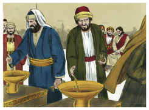
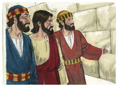
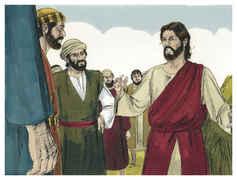
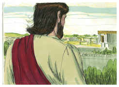

# Lucas Capítulo 21

## 1
E, OLHANDO ele, viu os ricos lançarem as suas ofertas na arca do tesouro;

## 2
E viu também uma pobre viúva lançar ali duas pequenas moedas;

## 3
E disse: Em verdade vos digo que lançou mais do que todos, esta pobre viúva;

## 4
Porque todos aqueles deitaram para as ofertas de Deus do que lhes sobeja; mas esta, da sua pobreza, deitou todo o sustento que tinha.

## 5
E, dizendo alguns a respeito do templo, que estava ornado de formosas pedras e dádivas, disse:

## 6
Quanto a estas coisas que vedes, dias virão em que não se deixará pedra sobre pedra, que não seja derrubada.

## 7
E perguntaram-lhe, dizendo: Mestre, quando serão, pois, estas coisas? E que sinal haverá quando isto estiver para acontecer?

## 8
Disse então ele: Vede não vos enganem, porque virão muitos em meu nome, dizendo: Sou eu, e o tempo está próximo. Não vades, portanto, após eles.

## 9
E, quando ouvirdes de guerras e sedições, não vos assusteis. Porque é necessário que isto aconteça primeiro, mas o fim não será logo.

## 10
Então lhes disse: Levantar-se-á nação contra nação, e reino contra reino;

## 11
E haverá em vários lugares grandes terremotos, e fomes e pestilências; haverá também coisas espantosas, e grandes sinais do céu.

## 12
Mas antes de todas estas coisas lançarão mão de vós, e vos perseguirão, entregando-vos às sinagogas e às prisões, e conduzindo-vos à presença de reis e presidentes, por amor do meu nome.

## 13
E vos acontecerá isto para testemunho.

## 14
Proponde, pois, em vossos corações não premeditar como haveis de responder;

## 15
Porque eu vos darei boca e sabedoria a que não poderão resistir nem contradizer todos quantos se vos opuserem.

## 16
E até pelos pais, e irmãos, e parentes, e amigos sereis entregues; e matarão alguns de vós.

## 17
E de todos sereis odiados por causa do meu nome.

## 18
Mas não perecerá um único cabelo da vossa cabeça.

## 19
Na vossa paciência possuí as vossas almas.

## 20
Mas, quando virdes Jerusalém cercada de exércitos, sabei então que é chegada a sua desolação.

## 21
Então, os que estiverem na Judéia, fujam para os montes; os que estiverem no meio da cidade, saiam; e os que nos campos não entrem nela.

## 22
Porque dias de vingança são estes, para que se cumpram todas as coisas que estão escritas.

## 23
Mas ai das grávidas, e das que criarem naqueles dias! porque haverá grande aperto na terra, e ira sobre este povo.

## 24
E cairão ao fio da espada, e para todas as nações serão levados cativos; e Jerusalém será pisada pelos gentios, até que os tempos dos gentios se completem.

## 25
E haverá sinais no sol e na lua e nas estrelas; e na terra angústia das nações, em perplexidade pelo bramido do mar e das ondas.

## 26
Homens desmaiando de terror, na expectação das coisas que sobrevirão ao mundo; porquanto as virtudes do céu serão abaladas.

## 27
E então verão vir o Filho do homem numa nuvem, com poder e grande glória.

## 28
Ora, quando estas coisas começarem a acontecer, olhai para cima e levantai as vossas cabeças, porque a vossa redenção está próxima.

## 29
E disse-lhes uma parábola: Olhai para a figueira, e para todas as árvores;

## 30
Quando já têm rebentado, vós sabeis por vós mesmos, vendo-as, que perto está já o verão.

## 31
Assim também vós, quando virdes acontecer estas coisas, sabei que o reino de Deus está perto.

## 32
Em verdade vos digo que não passará esta geração até que tudo aconteça.

## 33
Passará o céu e a terra, mas as minhas palavras não hão de passar.

## 34
E olhai por vós, não aconteça que os vossos corações se carreguem de glutonaria, de embriaguez, e dos cuidados da vida, e venha sobre vós de improviso aquele dia.

## 35
Porque virá como um laço sobre todos os que habitam na face de toda a terra.

## 36
Vigiai, pois, em todo o tempo, orando, para que sejais havidos por dignos de evitar todas estas coisas que hão de acontecer, e de estar em pé diante do Filho do homem.

## 37
E de dia ensinava no templo, e à noite, saindo, ficava no monte chamado das Oliveiras.

## 38
E todo o povo ia ter com ele ao templo, de manhã cedo, para o ouvir.

