# Lucas Capítulo 8

1	E ACONTECEU, depois disto, que andava de cidade em cidade, e de aldeia em aldeia, pregando e anunciando o evangelho do reino de Deus; e os doze iam com ele,

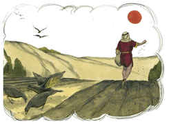

2	E algumas mulheres que haviam sido curadas de espíritos malignos e de enfermidades: Maria, chamada Madalena, da qual saíram sete demônios;

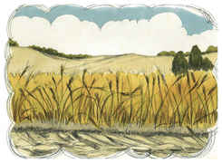

3	E Joana, mulher de Cuza, procurador de Herodes, e Suzana, e muitas outras que o serviam com seus bens.

4	E, ajuntando-se uma grande multidão, e vindo de todas as cidades ter com ele, disse por parábola:

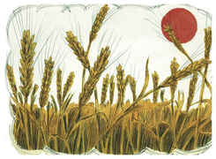

5	Um semeador saiu a semear a sua semente e, quando semeava, caiu alguma junto do caminho, e foi pisada, e as aves do céu a comeram;

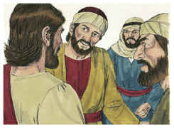

6	E outra caiu sobre pedra e, nascida, secou-se, pois que não tinha umidade;

7	E outra caiu entre espinhos e crescendo com ela os espinhos, a sufocaram;

8	E outra caiu em boa terra, e, nascida, produziu fruto, a cento por um. Dizendo ele estas coisas, clamava: Quem tem ouvidos para ouvir, ouça.

9	E os seus discípulos o interrogaram, dizendo: Que parábola é esta?

10	E ele disse: A vós vos é dado conhecer os mistérios do reino de Deus, mas aos outros por parábolas, para que vendo, não vejam, e ouvindo, não entendam.

11	Esta é, pois, a parábola: A semente é a palavra de Deus;

12	E os que estão junto do caminho, estes são os que ouvem; depois vem o diabo, e tira-lhes do coração a palavra, para que não se salvem, crendo;

13	E os que estão sobre pedra, estes são os que, ouvindo a palavra, a recebem com alegria, mas, como não têm raiz, apenas crêem por algum tempo, e no tempo da tentação se desviam;

14	E a que caiu entre espinhos, esses são os que ouviram e, indo por diante, são sufocados com os cuidados e riquezas e deleites da vida, e não dão fruto com perfeição;

15	E a que caiu em boa terra, esses são os que, ouvindo a palavra, a conservam num coração honesto e bom, e dão fruto com perseverança.

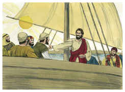

16	E ninguém, acendendo uma candeia, a cobre com algum vaso, ou a põe debaixo da cama; mas põe-na no velador, para que os que entram vejam a luz.

17	Porque não há coisa oculta que não haja de manifestar-se, nem escondida que não haja de saber-se e vir à luz.

18	Vede, pois, como ouvis; porque a qualquer que tiver lhe será dado, e a qualquer que não tiver até o que parece ter lhe será tirado.

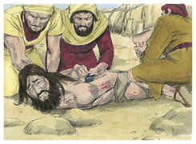

19	E foram ter com ele sua mãe e seus irmãos, e não podiam aproximar-se dele, por causa da multidão.

20	E foi-lhe dito: Estão lá fora tua mãe e teus irmãos, que querem ver-te.

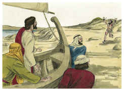

21	Mas, respondendo ele, disse-lhes: Minha mãe e meus irmãos são aqueles que ouvem a palavra de Deus e a executam.

22	E aconteceu que, num daqueles dias, entrou num barco com seus discípulos, e disse-lhes: Passemos para o outro lado do lago. E partiram.

23	E, navegando eles, adormeceu; e sobreveio uma tempestade de vento no lago, e enchiam-se de água, estando em perigo.

24	E, chegando-se a ele, o despertaram, dizendo: Mestre, Mestre, perecemos. E ele, levantando-se, repreendeu o vento e a fúria da água; e cessaram, e fez-se bonança.

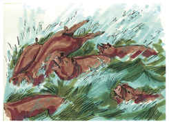

25	E disse-lhes: Onde está a vossa fé? E eles, temendo, maravilharam-se, dizendo uns aos outros: Quem é este, que até aos ventos e à água manda, e lhe obedecem?

26	E navegaram para a terra dos gadarenos, que está defronte da Galiléia.

27	E, quando desceu para terra, saiu-lhe ao encontro, vindo da cidade, um homem que desde muito tempo estava possesso de demônios, e não andava vestido, nem habitava em qualquer casa, mas nos sepulcros.

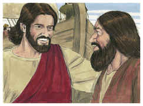

28	E, quando viu a Jesus, prostrou-se diante dele, exclamando, e dizendo com grande voz: Que tenho eu contigo, Jesus, Filho do Deus Altíssimo? Peço-te que não me atormentes.

29	Porque tinha ordenado ao espírito imundo que saísse daquele homem; pois já havia muito tempo que o arrebatava. E guardavam-no preso, com grilhões e cadeias; mas, quebrando as prisões, era impelido pelo demônio para os desertos.

30	E perguntou-lhe Jesus, dizendo: Qual é o teu nome? E ele disse: Legião; porque tinham entrado nele muitos demônios.

31	E rogavam-lhe que os não mandasse para o abismo.

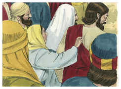

32	E andava ali pastando no monte uma vara de muitos porcos; e rogaram-lhe que lhes concedesse entrar neles; e concedeu-lho.

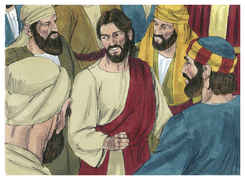

33	E, tendo saído os demônios do homem, entraram nos porcos, e a manada precipitou-se de um despenhadeiro no lago, e afogou-se.

34	E aqueles que os guardavam, vendo o que acontecera, fugiram, e foram anunciá-lo na cidade e nos campos.

35	E saíram a ver o que tinha acontecido, e vieram ter com Jesus. Acharam então o homem, de quem haviam saído os demônios, vestido, e em seu juízo, assentado aos pés de Jesus; e temeram.

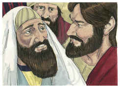

36	E os que tinham visto contaram-lhes também como fora salvo aquele endemoninhado.

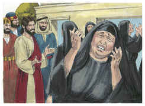

37	E toda a multidão da terra dos gadarenos ao redor lhe rogou que se retirasse deles; porque estavam possuídos de grande temor. E entrando ele no barco, voltou.

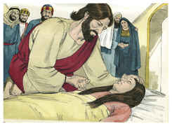

38	E aquele homem, de quem haviam saído os demônios, rogou-lhe que o deixasse estar com ele; mas Jesus o despediu, dizendo:

39	Torna para tua casa, e conta quão grandes coisas te fez Deus. E ele foi apregoando por toda a cidade quão grandes coisas Jesus lhe tinha feito.

40	E aconteceu que, quando voltou Jesus, a multidão o recebeu, porque todos o estavam esperando.

41	E eis que chegou um homem de nome Jairo, que era príncipe da sinagoga; e, prostrando-se aos pés de Jesus, rogava-lhe que entrasse em sua casa;

42	Porque tinha uma filha única, quase de doze anos, que estava à morte. E indo ele, apertava-o a multidão.

43	E uma mulher, que tinha um fluxo de sangue, havia doze anos, e gastara com os médicos todos os seus haveres, e por nenhum pudera ser curada,

44	Chegando por detrás dele, tocou na orla do seu vestido, e logo estancou o fluxo do seu sangue.

45	E disse Jesus: Quem é que me tocou? E, negando todos, disse Pedro e os que estavam com ele: Mestre, a multidão te aperta e te oprime, e dizes: Quem é que me tocou?

46	E disse Jesus: Alguém me tocou, porque bem conheci que de mim saiu virtude.

47	Então, vendo a mulher que não podia ocultar-se, aproximou-se tremendo e, prostrando-se ante ele, declarou-lhe diante de todo o povo a causa por que lhe havia tocado, e como logo sarara.

48	E ele lhe disse: Tem bom ânimo, filha, a tua fé te salvou; vai em paz.

49	Estando ele ainda falando, chegou um dos do príncipe da sinagoga, dizendo: A tua filha já está morta, não incomodes o Mestre.

50	Jesus, porém, ouvindo-o, respondeu-lhe, dizendo: Não temas; crê somente, e será salva.

51	E, entrando em casa, a ninguém deixou entrar, senão a Pedro, e a Tiago, e a João, e ao pai e a mãe da menina.

52	E todos choravam, e a pranteavam; e ele disse: Não choreis; não está morta, mas dorme.

53	E riam-se dele, sabendo que estava morta.

54	Mas ele, pondo-os todos fora, e pegando-lhe na mão, clamou, dizendo: Levanta-te, menina.

55	E o seu espírito voltou, e ela logo se levantou; e Jesus mandou que lhe dessem de comer.

56	E seus pais ficaram maravilhados; e ele lhes mandou que a ninguém dissessem o que havia sucedido.

