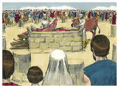

# Levítico Capítulo 1

## 1
E CHAMOU o Senhor a Moisés, e falou com ele da tenda da congregação, dizendo:

## 2
Fala aos filhos de Israel, e dize-lhes: Quando algum de vós oferecer oferta ao Senhor, oferecerá a sua oferta de gado, isto é, de gado vacum e de ovelha.

## 3
Se a sua oferta for holocausto de gado, oferecerá macho sem defeito; à porta da tenda da congregação a oferecerá, de sua própria vontade, perante o Senhor.

## 4
E porá a sua mão sobre a cabeça do holocausto, para que seja aceito a favor dele, para a sua expiação.

## 5
Depois degolará o bezerro perante o Senhor; e os filhos de Arão, os sacerdotes, oferecerão o sangue, e espargirão o sangue em redor sobre o altar que está diante da porta da tenda da congregação.

## 6
Então esfolará o holocausto, e o partirá nos seus pedaços.

## 7
E os filhos de Arão, o sacerdote, porão fogo sobre o altar, pondo em ordem a lenha sobre o fogo.

## 8
Também os filhos de Arão, os sacerdotes, porão em ordem os pedaços, a cabeça e o redenho sobre a lenha que está no fogo em cima do altar;

## 9
Porém a sua fressura e as suas pernas lavar-se-ão com água; e o sacerdote tudo isso queimará sobre o altar; holocausto é, oferta queimada, de cheiro suave ao Senhor.

## 10
E se a sua oferta for de gado miúdo, de ovelhas ou de cabras, para holocausto, oferecerá macho sem defeito.

## 11
E o degolará ao lado do altar que dá para o norte, perante o Senhor; e os filhos de Arão, os sacerdotes, espargirão o seu sangue em redor sobre o altar.

## 12
Depois o partirá nos seus pedaços, como também a sua cabeça e o seu redenho; e o sacerdote os porá em ordem sobre a lenha que está no fogo sobre o altar;

## 13
Porém a fressura e as pernas lavar-se-ão com água; e o sacerdote tudo oferecerá, e o queimará sobre o altar; holocausto é, oferta queimada, de cheiro suave ao Senhor.

## 14
E se a sua oferta ao Senhor for holocausto de aves, oferecerá a sua oferta de rolas ou de pombinhos;

## 15
E o sacerdote a oferecerá sobre o altar, e tirar-lhe-á a cabeça, e a queimará sobre o altar; e o seu sangue será espremido na parede do altar;

## 16
E o seu papo com as suas penas tirará e o lançará junto ao altar, para o lado do oriente, no lugar da cinza;

## 17
E fendê-la-á junto às suas asas, porém não a partirá; e o sacerdote a queimará em cima do altar sobre a lenha que está no fogo; holocausto é, oferta queimada de cheiro suave ao Senhor.

