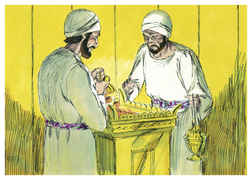
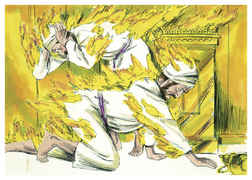
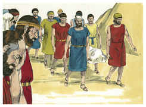

# Levítico Capítulo 10

## 1
E OS filhos de Arão, Nadabe e Abiú, tomaram cada um o seu incensário e puseram neles fogo, e colocaram incenso sobre ele, e ofereceram fogo estranho perante o Senhor, o que não lhes ordenara.

## 2
Então saiu fogo de diante do Senhor e os consumiu; e morreram perante o Senhor.

## 3
E disse Moisés a Arão: Isto é o que o Senhor falou, dizendo: Serei santificado naqueles que se chegarem a mim, e serei glorificado diante de todo o povo. Porém Arão calou-se.

## 4
E Moisés chamou a Misael e a Elzafã, filhos de Uziel, tio de Arão, e disse-lhes: Chegai, levai a vossos irmãos de diante do santuário, para fora do arraial.

## 5
Então chegaram, e os levaram nas suas túnicas para fora do arraial, como Moisés lhes dissera.

## 6
E Moisés disse a Arão, e a seus filhos Eleazar e Itamar: Não descobrireis as vossas cabeças, nem rasgareis vossas vestes, para que não morrais, nem venha grande indignação sobre toda a congregação; mas vossos irmãos, toda a casa de Israel, lamentem este incêndio que o Senhor acendeu.

## 7
Nem saireis da porta da tenda da congregação, para que não morrais; porque está sobre vós o azeite da unção do Senhor. E fizeram conforme à palavra de Moisés.

## 8
E falou o Senhor a Arão, dizendo:

## 9
Não bebereis vinho nem bebida forte, nem tu nem teus filhos contigo, quando entrardes na tenda da congregação, para que não morrais; estatuto perpétuo será isso entre as vossas gerações;

## 10
E para fazer diferença entre o santo e o profano e entre o imundo e o limpo,

## 11
E para ensinar aos filhos de Israel todos os estatutos que o Senhor lhes tem falado por meio de Moisés.

## 12
E disse Moisés a Arão, e a Eleazar e a Itamar, seus filhos, que lhe ficaram: Tomai a oferta de alimentos, restante das ofertas queimadas do Senhor, e comei-a sem levedura junto ao altar, porquanto é coisa santíssima.

## 13
Portanto a comereis no lugar santo; porque isto é a tua porção, e a porção de teus filhos, das ofertas queimadas do Senhor; porque assim me foi ordenado.

## 14
Também o peito da oferta movida e a espádua da oferta alçada, comereis em lugar limpo, tu, e teus filhos e tuas filhas contigo; porque foram dados por tua porção, e por porção de teus filhos, dos sacrifícios pacíficos dos filhos de Israel.

## 15
A espádua da oferta alçada e o peito da oferta movida trarão com as ofertas queimadas de gordura, para oferecer por oferta movida perante o Senhor; o que será por estatuto perpétuo, para ti e para teus filhos contigo, como o Senhor tem ordenado.

## 16
E Moisés diligentemente buscou o bode da expiação, e eis que já fora queimado; portanto indignou-se grandemente contra Eleazar e contra Itamar, os filhos de Arão que ficaram, dizendo:

## 17
Por que não comestes a expiação do pecado no lugar santo, pois é coisa santíssima e Deus a deu a vós, para que levásseis a iniqüidade da congregação, para fazer expiação por eles diante do Senhor?

## 18
Eis que não se trouxe o seu sangue para dentro do santuário; certamente devíeis ter comido no santuário, como tenho ordenado.

## 19
Então disse Arão a Moisés: Eis que hoje ofereceram a sua expiação pelo pecado e o seu holocausto perante o Senhor, e tais coisas me sucederam; se hoje tivesse comido da oferta da expiação pelo pecado, seria isso porventura aceito aos olhos do Senhor?

## 20
E Moisés, ouvindo isto, deu-se por satisfeito.

