# Marcos Capítulo 10

1	E, LEVANTANDO-SE dali, foi para os termos da Judéia, além do Jordão, e a multidão se reuniu em torno dele; e tornou a ensiná-los, como tinha por costume.

2	E, aproximando-se dele os fariseus, perguntaram-lhe, tentando-o: É lícito ao homem repudiar sua mulher?

3	Mas ele, respondendo, disse-lhes: Que vos mandou Moisés?

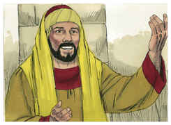

4	E eles disseram: Moisés permitiu escrever carta de divórcio e repudiar.

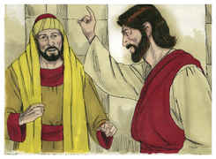

5	E Jesus, respondendo, disse-lhes: Pela dureza dos vossos corações vos deixou ele escrito esse mandamento;

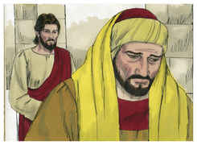

6	Porém, desde o princípio da criação, Deus os fez macho e fêmea.

7	Por isso deixará o homem a seu pai e a sua mãe, e unir-se-á a sua mulher,

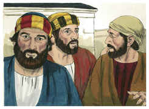

8	E serão os dois uma só carne; e assim já não serão dois, mas uma só carne.

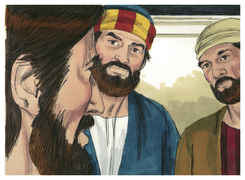

9	Portanto, o que Deus ajuntou não o separe o homem.

10	E em casa tornaram os discípulos a interrogá-lo acerca disto mesmo.

11	E ele lhes disse: Qualquer que deixar a sua mulher e casar com outra, adultera contra ela.

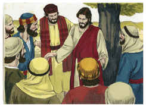

12	E, se a mulher deixar a seu marido, e casar com outro, adultera.

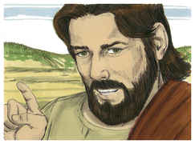

13	E traziam-lhe meninos para que lhes tocasse, mas os discípulos repreendiam aos que lhos traziam.

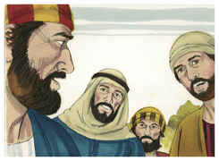

14	Jesus, porém, vendo isto, indignou-se, e disse-lhes: Deixai vir os meninos a mim, e não os impeçais; porque dos tais é o reino de Deus.

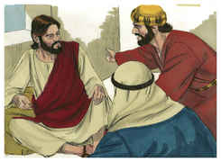

15	Em verdade vos digo que qualquer que não receber o reino de Deus como menino, de maneira nenhuma entrará nele.

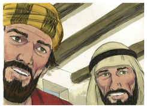

16	E, tomando-os nos seus braços, e impondo-lhes as mãos, os abençoou.

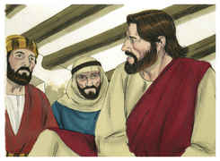

17	E, pondo-se a caminho, correu para ele um homem, o qual se ajoelhou diante dele, e lhe perguntou: Bom Mestre, que farei para herdar a vida eterna?

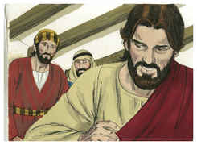

18	E Jesus lhe disse: Por que me chamas bom? Ninguém há bom senão um, que é Deus.

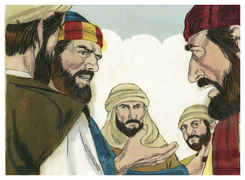

19	Tu sabes os mandamentos: Não adulterarás; não matarás; não furtarás; não dirás falso testemunho; não defraudarás alguém; honra a teu pai e a tua mãe.

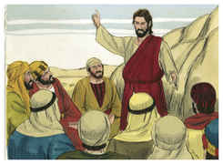

20	Ele, porém, respondendo, lhe disse: Mestre, tudo isso guardei desde a minha mocidade.

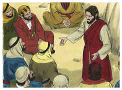

21	E Jesus, olhando para ele, o amou e lhe disse: Falta-te uma coisa: vai, vende tudo quanto tens, e dá-o aos pobres, e terás um tesouro no céu; e vem, toma a cruz, e segue-me.

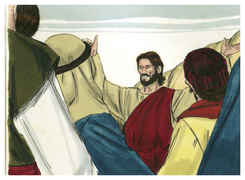

22	Mas ele, pesaroso desta palavra, retirou-se triste; porque possuía muitas propriedades.

23	Então Jesus, olhando em redor, disse aos seus discípulos: Quão dificilmente entrarão no reino de Deus os que têm riquezas!

24	E os discípulos se admiraram destas suas palavras; mas Jesus, tornando a falar, disse-lhes: Filhos, quão difícil é, para os que confiam nas riquezas, entrar no reino de Deus!

25	É mais fácil passar um camelo pelo fundo de uma agulha, do que entrar um rico no reino de Deus.

26	E eles se admiravam ainda mais, dizendo entre si: Quem poderá, pois, salvar-se?

27	Jesus, porém, olhando para eles, disse: Para os homens é impossível, mas não para Deus, porque para Deus todas as coisas são possíveis.

28	E Pedro começou a dizer-lhe: Eis que nós tudo deixamos, e te seguimos.

29	E Jesus, respondendo, disse: Em verdade vos digo que ninguém há, que tenha deixado casa, ou irmãos, ou irmãs, ou pai, ou mãe, ou mulher, ou filhos, ou campos, por amor de mim e do evangelho,

30	Que não receba cem vezes tanto, já neste tempo, em casas, e irmãos, e irmãs, e mães, e filhos, e campos, com perseguições; e no século futuro a vida eterna.

31	Porém muitos primeiros serão derradeiros, e muitos derradeiros serão primeiros.

32	E iam no caminho, subindo para Jerusalém; e Jesus ia adiante deles. E eles maravilhavam-se, e seguiam-no atemorizados. E, tornando a tomar consigo os doze, começou a dizer-lhes as coisas que lhe deviam sobrevir,

33	Dizendo: Eis que nós subimos a Jerusalém, e o Filho do homem será entregue aos príncipes dos sacerdotes, e aos escribas, e o condenarão à morte, e o entregarão aos gentios.

34	E o escarnecerão, e açoitarão, e cuspirão nele, e o matarão; e, ao terceiro dia, ressuscitará.

35	E aproximaram-se dele Tiago e João, filhos de Zebedeu, dizendo: Mestre, queremos que nos faças o que te pedirmos.

36	E ele lhes disse: Que quereis que vos faça?

37	E eles lhe disseram: Concede-nos que na tua glória nos assentemos, um à tua direita, e outro à tua esquerda.

38	Mas Jesus lhes disse: Não sabeis o que pedis; podeis vós beber o cálice que eu bebo, e ser batizados com o batismo com que eu sou batizado?

39	E eles lhe disseram: Podemos. Jesus, porém, disse-lhes: Em verdade, vós bebereis o cálice que eu beber, e sereis batizados com o batismo com que eu sou batizado;

40	Mas, o assentar-se à minha direita, ou à minha esquerda, não me pertence a mim concedê-lo, mas isso é para aqueles a quem está reservado.

41	E os dez, tendo ouvido isto, começaram a indignar-se contra Tiago e João.

42	Mas Jesus, chamando-os a si, disse-lhes: Sabeis que os que julgam ser príncipes dos gentios, deles se assenhoreiam, e os seus grandes usam de autoridade sobre eles;

43	Mas entre vós não será assim; antes, qualquer que entre vós quiser ser grande, será vosso serviçal;

44	E qualquer que dentre vós quiser ser o primeiro, será servo de todos.

45	Porque o Filho do homem também não veio para ser servido, mas para servir e dar a sua vida em resgate de muitos.

46	E depois, foram para Jericó. E, saindo ele de Jericó com seus discípulos e uma grande multidão, Bartimeu, o cego, filho de Timeu, estava assentado junto do caminho, mendigando.

47	E, ouvindo que era Jesus de Nazaré, começou a clamar, e a dizer: Jesus, filho de Davi, tem misericórdia de mim.

48	E muitos o repreendiam, para que se calasse; mas ele clamava cada vez mais: Filho de Davi! tem misericórdia de mim.

49	E Jesus, parando, disse que o chamassem; e chamaram o cego, dizendo-lhe: Tem bom ânimo; levanta-te, que ele te chama.

50	E ele, lançando de si a sua capa, levantou-se, e foi ter com Jesus.

51	E Jesus, falando, disse-lhe: Que queres que te faça? E o cego lhe disse: Mestre, que eu tenha vista.

52	E Jesus lhe disse: Vai, a tua fé te salvou. E logo viu, e seguiu a Jesus pelo caminho.

