# Marcos Capítulo 14

1	E DALI a dois dias era a páscoa, e a festa dos pães ázimos; e os principais dos sacerdotes e os escribas buscavam como o prenderiam com dolo, e o matariam.

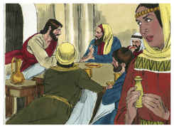

2	Mas eles diziam: Não na festa, para que porventura não se faça alvoroço entre o povo.

3	E, estando ele em Betânia, assentado à mesa, em casa de Simão, o leproso, veio uma mulher, que trazia um vaso de alabastro, com ungüento de nardo puro, de muito preço, e quebrando o vaso, lho derramou sobre a cabeça.

4	E alguns houve que em si mesmos se indignaram, e disseram: Para que se fez este desperdício de ungüento?

5	Porque podia vender-se por mais de trezentos dinheiros, e dá-lo aos pobres. E bramavam contra ela.

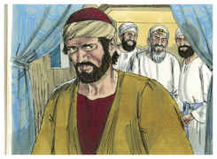

6	Jesus, porém, disse: Deixai-a, por que a molestais? Ela fez-me boa obra.

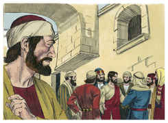

7	Porque sempre tendes os pobres convosco, e podeis fazer-lhes bem, quando quiserdes; mas a mim nem sempre me tendes.

8	Esta fez o que podia; antecipou-se a ungir o meu corpo para a sepultura.

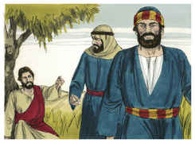

9	Em verdade vos digo que, em todas as partes do mundo onde este evangelho for pregado, também o que ela fez será contado para sua memória.

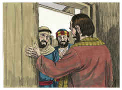

10	E Judas Iscariotes, um dos doze, foi ter com os principais dos sacerdotes para lho entregar.

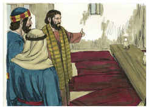

11	E eles, ouvindo-o, folgaram, e prometeram dar-lhe dinheiro; e buscava como o entregaria em ocasião oportuna.

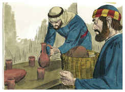

12	E, no primeiro dia dos pães ázimos, quando sacrificavam a páscoa, disseram-lhe os discípulos: Aonde queres que vamos fazer os preparativos para comer a páscoa?

13	E enviou dois dos seus discípulos, e disse-lhes: Ide à cidade, e um homem, que leva um cântaro de água, vos encontrará; segui-o.

14	E, onde quer que entrar, dizei ao senhor da casa: O Mestre diz: Onde está o aposento em que hei de comer a páscoa com os meus discípulos?

15	E ele vos mostrará um grande cenáculo mobilado e preparado; preparai-a ali.

16	E, saindo os seus discípulos, foram à cidade, e acharam como lhes tinha dito, e prepararam a páscoa.

17	E, chegada a tarde, foi com os doze.

18	E, quando estavam assentados a comer, disse Jesus: Em verdade vos digo que um de vós, que comigo come, há de trair-me.

19	E eles começaram a entristecer-se e a dizer-lhe um após outro: Sou eu? E outro disse: Sou eu?

20	Mas ele, respondendo, disse-lhes: É um dos doze, que põe comigo a mão no prato.

21	Na verdade o Filho do homem vai, como dele está escrito, mas ai daquele homem por quem o Filho do homem é traído! Bom seria para o tal homem não haver nascido.

22	E, comendo eles, tomou Jesus pão e, abençoando-o, o partiu e deu-lho, e disse: Tomai, comei, isto é o meu corpo.

23	E, tomando o cálice, e dando graças, deu-lho; e todos beberam dele.

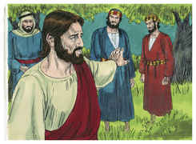

24	E disse-lhes: Isto é o meu sangue, o sangue do novo testamento, que por muitos é derramado.

25	Em verdade vos digo que não beberei mais do fruto da vide, até àquele dia em que o beber, novo, no reino de Deus.

26	E, tendo cantado o hino, saíram para o Monte das Oliveiras.

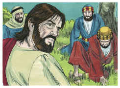

27	E disse-lhes Jesus: Todos vós esta noite vos escandalizareis em mim; porque está escrito: Ferirei o pastor, e as ovelhas se dispersarão.

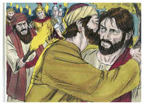

28	Mas, depois que eu houver ressuscitado, irei adiante de vós para a Galiléia.

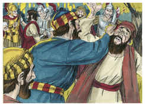

29	E disse-lhe Pedro: Ainda que todos se escandalizem, nunca, porém, eu.

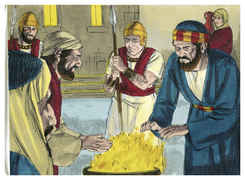

30	E disse-lhe Jesus: Em verdade te digo que hoje, nesta noite, antes que o galo cante duas vezes, três vezes me negarás.

31	Mas ele disse com mais veemência: Ainda que me seja necessário morrer contigo, de modo nenhum te negarei. E da mesma maneira diziam todos também.

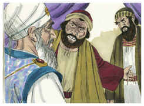

32	E foram a um lugar chamado Getsêmani, e disse aos seus discípulos: Assentai-vos aqui, enquanto eu oro.

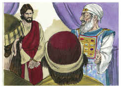

33	E tomou consigo a Pedro, e a Tiago, e a João, e começou a ter pavor, e a angustiar-se.

34	E disse-lhes: A minha alma está profundamente triste até a morte; ficai aqui, e vigiai.

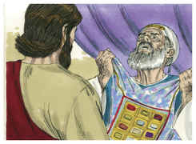

35	E, tendo ido um pouco mais adiante, prostrou-se em terra; e orou para que, se fosse possível, passasse dele aquela hora.

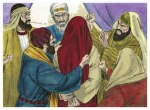

36	E disse: Aba, Pai, todas as coisas te são possíveis; afasta de mim este cálice; não seja, porém, o que eu quero, mas o que tu queres.

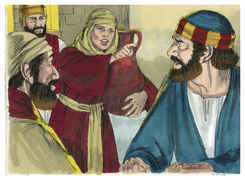

37	E, chegando, achou-os dormindo; e disse a Pedro: Simão, dormes? não podes vigiar uma hora?

38	Vigiai e orai, para que não entreis em tentação; o espírito, na verdade, está pronto, mas a carne é fraca.

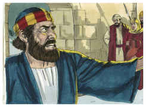

39	E foi outra vez e orou, dizendo as mesmas palavras.

40	E, voltando, achou-os outra vez dormindo, porque os seus olhos estavam pesados, e não sabiam o que responder-lhe.

41	E voltou terceira vez, e disse-lhes: Dormi agora, e descansai. Basta; é chegada a hora. Eis que o Filho do homem vai ser entregue nas mãos dos pecadores.

42	Levantai-vos, vamos; eis que está perto o que me trai.

43	E logo, falando ele ainda, veio Judas, que era um dos doze, da parte dos principais dos sacerdotes, e dos escribas e dos anciãos, e com ele uma grande multidão com espadas e varapaus.

44	Ora, o que o traía, tinha-lhes dado um sinal, dizendo: Aquele que eu beijar, esse é; prendei-o, e levai-o com segurança.

45	E, logo que chegou, aproximou-se dele, e disse-lhe: Rabi, Rabi. E beijou-o.

46	E lançaram-lhe as mãos, e o prenderam.

47	E um dos que ali estavam presentes, puxando da espada, feriu o servo do sumo sacerdote, e cortou-lhe uma orelha.

48	E, respondendo Jesus, disse-lhes: Saístes com espadas e varapaus a prender-me, como a um salteador?

49	Todos os dias estava convosco ensinando no templo, e não me prendestes; mas isto é para que as Escrituras se cumpram.

50	Então, deixando-o, todos fugiram.

51	E um certo jovem o seguia, envolto em um lençol sobre o corpo nu. E lançaram-lhe a mão.

52	Mas ele, largando o lençol, fugiu nu.

53	E levaram Jesus ao sumo sacerdote, e ajuntaram-se todos os principais dos sacerdotes, e os anciãos e os escribas.

54	E Pedro o seguiu de longe até dentro do pátio do sumo sacerdote, e estava assentado com os servidores, aquentando-se ao lume.

55	E os principais dos sacerdotes e todo o concílio buscavam algum testemunho contra Jesus, para o matar, e não o achavam.

56	Porque muitos testificavam falsamente contra ele, mas os testemunhos não eram coerentes.

57	E, levantando-se alguns, testificaram falsamente contra ele, dizendo:

58	Nós ouvimos-lhe dizer: Eu derrubarei este templo, construído por mãos de homens, e em três dias edificarei outro, não feito por mãos de homens.

59	E nem assim o seu testemunho era coerente.

60	E, levantando-se o sumo sacerdote no Sinédrio, perguntou a Jesus, dizendo: Nada respondes? Que testificam estes contra ti?

61	Mas ele calou-se, e nada respondeu. O sumo sacerdote lhe tornou a perguntar, e disse-lhe: És tu o Cristo, Filho do Deus Bendito?

62	E Jesus disse-lhe: Eu o sou, e vereis o Filho do homem assentado à direita do poder de Deus, e vindo sobre as nuvens do céu.

63	E o sumo sacerdote, rasgando as suas vestes, disse: Para que necessitamos de mais testemunhas?

64	Vós ouvistes a blasfêmia; que vos parece? E todos o consideraram culpado de morte.

65	E alguns começaram a cuspir nele, e a cobrir-lhe o rosto, e a dar-lhe punhadas, e a dizer-lhe: Profetiza. E os servidores davam-lhe bofetadas.

66	E, estando Pedro embaixo, no átrio, chegou uma das criadas do sumo sacerdote;

67	E, vendo a Pedro, que se estava aquentando, olhou para ele, e disse: Tu também estavas com Jesus, o Nazareno.

68	Mas ele negou-o, dizendo: Não o conheço, nem sei o que dizes. E saiu fora ao alpendre, e o galo cantou.

69	E a criada, vendo-o outra vez, começou a dizer aos que ali estavam: Este é um dos tais.

70	Mas ele o negou outra vez. E pouco depois os que ali estavam disseram outra vez a Pedro: Verdadeiramente tu és um deles, porque és também galileu, e tua fala é semelhante.

71	E ele começou a praguejar, e a jurar: Não conheço esse homem de quem falais.

72	E o galo cantou segunda vez. E Pedro lembrou-se da palavra que Jesus lhe tinha dito: Antes que o galo cante duas vezes, três vezes me negarás. E, retirando-se dali, chorou.

