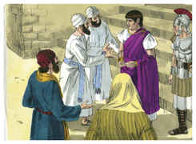
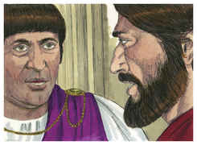
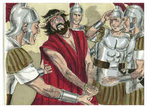
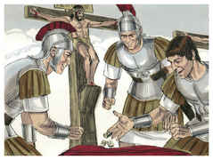
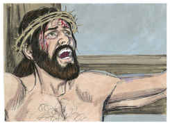

# Marcos Capítulo 15

## 1
E, LOGO ao amanhecer, os principais dos sacerdotes, com os anciãos, e os escribas, e todo o Sinédrio, tiveram conselho; e, ligando Jesus, o levaram e entregaram a Pilatos.

## 2
E Pilatos lhe perguntou: Tu és o Rei dos Judeus? E ele, respondendo, disse-lhe: Tu o dizes.

## 3
E os principais dos sacerdotes o acusavam de muitas coisas; porém ele nada respondia.

## 4
E Pilatos o interrogou outra vez, dizendo: Nada respondes? Vê quantas coisas testificam contra ti.

## 5
Mas Jesus nada mais respondeu, de maneira que Pilatos se maravilhava.

## 6
Ora, no dia da festa costumava soltar-lhes um preso qualquer que eles pedissem.

## 7
E havia um chamado Barrabás, que, preso com outros amotinadores, tinha num motim cometido uma morte.

## 8
E a multidão, dando gritos, começou a pedir que fizesse como sempre lhes tinha feito.

## 9
E Pilatos lhes respondeu, dizendo: Quereis que vos solte o Rei dos Judeus?

## 10
Porque ele bem sabia que por inveja os principais dos sacerdotes o tinham entregado.

## 11
Mas os principais dos sacerdotes incitaram a multidão para que fosse solto antes Barrabás.

## 12
E Pilatos, respondendo, lhes disse outra vez: Que quereis, pois, que faça daquele a quem chamais Rei dos Judeus?

## 13
E eles tornaram a clamar: Crucifica-o.

## 14
Mas Pilatos lhes disse: Mas que mal fez? E eles cada vez clamavam mais: Crucifica-o.

## 15
Então Pilatos, querendo satisfazer a multidão, soltou-lhe Barrabás e, açoitado Jesus, o entregou para ser crucificado.

## 16
E os soldados o levaram dentro à sala, que é a da audiência, e convocaram toda a coorte.

## 17
E vestiram-no de púrpura, e tecendo uma coroa de espinhos, lha puseram na cabeça.

## 18
E começaram a saudá-lo, dizendo: Salve, Rei dos Judeus!

## 19
E feriram-no na cabeça com uma cana, e cuspiram nele e, postos de joelhos, o adoraram.

## 20
E, havendo-o escarnecido, despiram-lhe a púrpura, e o vestiram com as suas próprias vestes; e o levaram para fora a fim de o crucificarem.

## 21
E constrangeram um certo Simão, cireneu, pai de Alexandre e de Rufo, que por ali passava, vindo do campo, a que levasse a cruz.

## 22
E levaram-no ao lugar do Gólgota, que se traduz por lugar da Caveira.

## 23
E deram-lhe a beber vinho com mirra, mas ele não o tomou.

## 24
E, havendo-o crucificado, repartiram as suas vestes, lançando sobre elas sortes, para saber o que cada um levaria.

## 25
E era a hora terceira, e o crucificaram.

## 26
E por cima dele estava escrita a sua acusação: O REI DOS JUDEUS.

## 27
E crucificaram com ele dois salteadores, um à sua direita, e outro à esquerda.

## 28
E cumprindo-se a escritura que diz: E com os malfeitores foi contado.

## 29
E os que passavam blasfemavam dele, meneando as suas cabeças, e dizendo: Ah! tu que derrubas o templo, e em três dias o edificas,

## 30
Salva-te a ti mesmo, e desce da cruz.

## 31
E da mesma maneira também os principais dos sacerdotes, com os escribas, diziam uns para os outros, zombando: Salvou os outros, e não pode salvar-se a si mesmo.

## 32
O Cristo, o Rei de Israel, desça agora da cruz, para que o vejamos e acreditemos. Também os que com ele foram crucificados o injuriavam.

## 33
E, chegada a hora sexta, houve trevas sobre toda a terra até a hora nona.

## 34
E, à hora nona, Jesus exclamou com grande voz, dizendo: Eloí, Eloí, lamá sabactâni? que, traduzido, é: Deus meu, Deus meu, por que me desamparaste?

## 35
E alguns dos que ali estavam, ouvindo isto, diziam: Eis que chama por Elias.

## 36
E um deles correu a embeber uma esponja em vinagre e, pondo-a numa cana, deu-lho a beber, dizendo: Deixai, vejamos se virá Elias tirá-lo.

## 37
E Jesus, dando um grande brado, expirou.

## 38
E o véu do templo se rasgou em dois, de alto a baixo.

## 39
E o centurião, que estava defronte dele, vendo que assim clamando expirara, disse: Verdadeiramente este homem era o Filho de Deus.

## 40
E também ali estavam algumas mulheres, olhando de longe, entre as quais também Maria Madalena, e Maria, mãe de Tiago, o menor, e de José, e Salomé;

## 41
As quais também o seguiam, e o serviam, quando estava na Galiléia; e muitas outras, que tinham subido com ele a Jerusalém.

## 42
E, chegada a tarde, porquanto era o dia da preparação, isto é, a véspera do sábado,

## 43
Chegou José de Arimatéia, senador honrado, que também esperava o reino de Deus, e ousadamente foi a Pilatos, e pediu o corpo de Jesus.

## 44
E Pilatos se maravilhou de que já estivesse morto. E, chamando o centurião, perguntou-lhe se já havia muito que tinha morrido.

## 45
E, tendo-se certificado pelo centurião, deu o corpo a José;

## 46
O qual comprara um lençol fino, e, tirando-o da cruz, o envolveu nele, e o depositou num sepulcro lavrado numa rocha; e revolveu uma pedra para a porta do sepulcro.

## 47
E Maria Madalena e Maria, mãe de José, observavam onde o punham.

