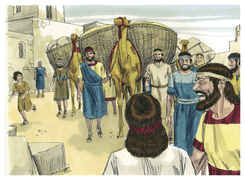
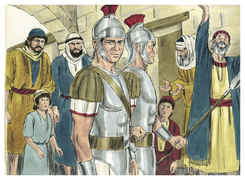
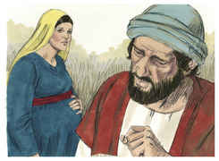
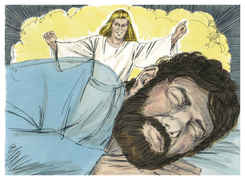
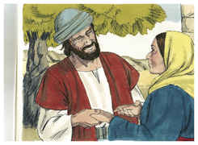
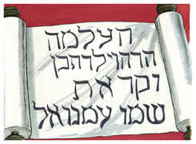

# Mateus Capítulo 1

## 1
LIVRO da geração de Jesus Cristo, filho de Davi, filho de Abraão.

## 2
Abraão gerou a Isaque; e Isaque gerou a Jacó; e Jacó gerou a Judá e a seus irmãos;

## 3
E Judá gerou, de Tamar, a Perez e a Zerá; e Perez gerou a Esrom; e Esrom gerou a Arão;

## 4
E Arão gerou a Aminadabe; e Aminadabe gerou a Naassom; e Naassom gerou a Salmom;

## 5
E Salmom gerou, de Raabe, a Boaz; e Boaz gerou de Rute a Obede; e Obede gerou a Jessé;

## 6
E Jessé gerou ao rei Davi; e o rei Davi gerou a Salomão da que foi mulher de Urias.

## 7
E Salomão gerou a Roboão; e Roboão gerou a Abias; e Abias gerou a Asa;

## 8
E Asa gerou a Josafá; e Josafá gerou a Jorão; e Jorão gerou a Uzias;

## 9
E Uzias gerou a Jotão; e Jotão gerou a Acaz; e Acaz gerou a Ezequias;

## 10
E Ezequias gerou a Manassés; e Manassés gerou a Amom; e Amom gerou a Josias;

## 11
E Josias gerou a Jeconias e a seus irmãos na deportação para Babilônia.

## 12
E, depois da deportação para a Babilônia, Jeconias gerou a Salatiel; e Salatiel gerou a Zorobabel;

## 13
E Zorobabel gerou a Abiúde; e Abiúde gerou a Eliaquim; e Eliaquim gerou a Azor;

## 14
E Azor gerou a Sadoque; e Sadoque gerou a Aquim; e Aquim gerou a Eliúde;

## 15
E Eliúde gerou a Eleazar; e Eleazar gerou a Matã; e Matã gerou a Jacó;

## 16
E Jacó gerou a José, marido de Maria, da qual nasceu JESUS, que se chama o Cristo.

## 17
De sorte que todas as gerações, desde Abraão até Davi, são catorze gerações; e desde Davi até a deportação para a Babilônia, catorze gerações; e desde a deportação para a Babilônia até Cristo, catorze gerações.

## 18
Ora, o nascimento de Jesus Cristo foi assim: Que estando Maria, sua mãe, desposada com José, antes de se ajuntarem, achou-se ter concebido do Espírito Santo.

## 19
Então José, seu marido, como era justo, e a não queria infamar, intentou deixá-la secretamente.

## 20
E, projetando ele isto, eis que em sonho lhe apareceu um anjo do Senhor, dizendo: José, filho de Davi, não temas receber a Maria, tua mulher, porque o que nela está gerado é do Espírito Santo;

## 21
E dará à luz um filho e chamarás o seu nome JESUS; porque ele salvará o seu povo dos seus pecados.

## 22
Tudo isto aconteceu para que se cumprisse o que foi dito da parte do Senhor, pelo profeta, que diz;

## 23
Eis que a virgem conceberá, e dará à luz um filho, E chamá-lo-ão pelo nome de EMANUEL, Que traduzido é: Deus conosco.

## 24
E José, despertando do sono, fez como o anjo do Senhor lhe ordenara, e recebeu a sua mulher;

## 25
E não a conheceu até que deu à luz seu filho, o primogênito; e pôs-lhe por nome JESUS.

