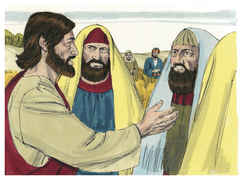
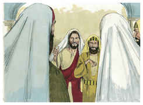
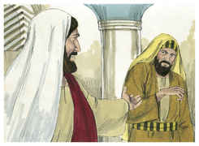
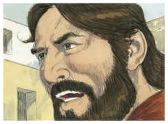

# Mateus Capítulo 12

1	NAQUELE tempo passou Jesus pelas searas, em um sábado; e os seus discípulos, tendo fome, começaram a colher espigas, e a comer.

2	E os fariseus, vendo isto, disseram-lhe: Eis que os teus discípulos fazem o que não é lícito fazer num sábado.

3	Ele, porém, lhes disse: Não tendes lido o que fez Davi, quando teve fome, ele e os que com ele estavam?

4	Como entrou na casa de Deus, e comeu os pães da proposição, que não lhe era lícito comer, nem aos que com ele estavam, mas só aos sacerdotes?

5	Ou não tendes lido na lei que, aos sábados, os sacerdotes no templo violam o sábado, e ficam sem culpa?

6	Pois eu vos digo que está aqui quem é maior do que o templo.

7	Mas, se vós soubésseis o que significa: Misericórdia quero, e não sacrifício, não condenaríeis os inocentes.

8	Porque o Filho do homem até do sábado é Senhor.

9	E, partindo dali, chegou à sinagoga deles.

10	E, estava ali um homem que tinha uma das mãos mirrada; e eles, para o acusarem, o interrogaram, dizendo: É lícito curar nos sábados?

11	E ele lhes disse: Qual dentre vós será o homem que tendo uma ovelha, se num sábado ela cair numa cova, não lançará mão dela, e a levantará?

12	Pois, quanto mais vale um homem do que uma ovelha? É, por conseqüência, lícito fazer bem nos sábados.

13	Então disse àquele homem: Estende a tua mão. E ele a estendeu, e ficou sã como a outra.

14	E os fariseus, tendo saído, formaram conselho contra ele, para o matarem.

15	Jesus, sabendo isso, retirou-se dali, e acompanharam-no grandes multidões, e ele curou a todas.

16	E recomendava-lhes rigorosamente que o não descobrissem,

17	Para que se cumprisse o que fora dito pelo profeta Isaías, que diz:

18	Eis aqui o meu servo, que escolhi, o meu amado, em quem a minha alma se compraz; Porei sobre ele o meu espírito, E anunciará aos gentios o juízo.

19	Não contenderá, nem clamará, Nem alguém ouvirá pelas ruas a sua voz;

20	Não esmagará a cana quebrada, E não apagará o morrão que fumega, Até que faça triunfar o juízo;

21	E no seu nome os gentios esperarão.

22	Trouxeram-lhe, então, um endemoninhado cego e mudo; e, de tal modo o curou, que o cego e mudo falava e via.

23	E toda a multidão se admirava e dizia: Não é este o Filho de Davi?

24	Mas os fariseus, ouvindo isto, diziam: Este não expulsa os demônios senão por Belzebu, príncipe dos demônios.

25	Jesus, porém, conhecendo os seus pensamentos, disse-lhes: Todo o reino dividido contra si mesmo é devastado; e toda a cidade, ou casa, dividida contra si mesma não subsistirá.

26	E, se Satanás expulsa a Satanás, está dividido contra si mesmo; como subsistirá, pois, o seu reino?

27	E, se eu expulso os demônios por Belzebu, por quem os expulsam então vossos filhos? Portanto, eles mesmos serão os vossos juízes.

28	Mas, se eu expulso os demônios pelo Espírito de Deus, logo é chegado a vós o reino de Deus.

29	Ou, como pode alguém entrar na casa do homem valente, e furtar os seus bens, se primeiro não maniatar o valente, saqueando então a sua casa?

30	Quem não é comigo é contra mim; e quem comigo não ajunta, espalha.

31	Portanto, eu vos digo: Todo o pecado e blasfêmia se perdoará aos homens; mas a blasfêmia contra o Espírito não será perdoada aos homens.

32	E, se qualquer disser alguma palavra contra o Filho do homem, ser-lhe-á perdoado; mas, se alguém falar contra o Espírito Santo, não lhe será perdoado, nem neste século nem no futuro.

33	Ou fazei a árvore boa, e o seu fruto bom, ou fazei a árvore má, e o seu fruto mau; porque pelo fruto se conhece a árvore.

34	Raça de víboras, como podeis vós dizer boas coisas, sendo maus? Pois do que há em abundância no coração, disso fala a boca.

35	O homem bom tira boas coisas do bom tesouro do seu coração, e o homem mau do mau tesouro tira coisas más.

36	Mas eu vos digo que de toda a palavra ociosa que os homens disserem hão de dar conta no dia do juízo.

37	Porque por tuas palavras serás justificado, e por tuas palavras serás condenado.

38	Então alguns dos escribas e dos fariseus tomaram a palavra, dizendo: Mestre, quiséramos ver da tua parte algum sinal.

39	Mas ele lhes respondeu, e disse: Uma geração má e adúltera pede um sinal, porém, não se lhe dará outro sinal senão o sinal do profeta Jonas;

40	Pois, como Jonas esteve três dias e três noites no ventre da baleia, assim estará o Filho do homem três dias e três noites no seio da terra.

41	Os ninivitas ressurgirão no juízo com esta geração, e a condenarão, porque se arrependeram com a pregação de Jonas. E eis que está aqui quem é maior do que Jonas.

42	A rainha do sul se levantará no dia do juízo com esta geração, e a condenará; porque veio dos confins da terra para ouvir a sabedoria de Salomão. E eis que está aqui quem é maior do que Salomão.

43	E, quando o espírito imundo tem saído do homem, anda por lugares áridos, buscando repouso, e não o encontra.

44	Então diz: Voltarei para a minha casa, de onde saí. E, voltando, acha-a desocupada, varrida e adornada.

45	Então vai, e leva consigo outros sete espíritos piores do que ele e, entrando, habitam ali; e são os últimos atos desse homem piores do que os primeiros. Assim acontecerá também a esta geração má.

46	E, falando ele ainda à multidão, eis que estavam fora sua mãe e seus irmãos, pretendendo falar-lhe.

47	E disse-lhe alguém: Eis que estão ali fora tua mãe e teus irmãos, que querem falar-te.

48	Ele, porém, respondendo, disse ao que lhe falara: Quem é minha mãe? E quem são meus irmãos?

49	E, estendendo a sua mão para os seus discípulos, disse: Eis aqui minha mãe e meus irmãos;

50	Porque, qualquer que fizer a vontade de meu Pai que está nos céus, este é meu irmão, e irmã e mãe.

