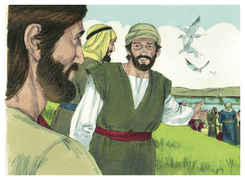
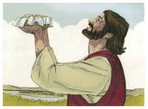
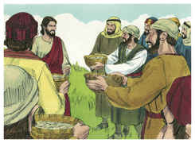

# Mateus Capítulo 14

## 1
NAQUELE tempo ouviu Herodes, o tetrarca, a fama de Jesus,

## 2
E disse aos seus criados: Este é João o Batista; ressuscitou dos mortos, e por isso estas maravilhas operam nele.

## 3
Porque Herodes tinha prendido João, e tinha-o maniatado e encerrado no cárcere, por causa de Herodias, mulher de seu irmão Filipe;

## 4
Porque João lhe dissera: Não te é lícito possuí-la.

## 5
E, querendo matá-lo, temia o povo; porque o tinham como profeta.

## 6
Festejando-se, porém, o dia natalício de Herodes, dançou a filha de Herodias diante dele, e agradou a Herodes.

## 7
Por isso prometeu, com juramento, dar-lhe tudo o que pedisse;

## 8
E ela, instruída previamente por sua mãe, disse: Dá-me aqui, num prato, a cabeça de João o Batista.

## 9
E o rei afligiu-se, mas, por causa do juramento, e dos que estavam à mesa com ele, ordenou que se lhe desse.

## 10
E mandou degolar João no cárcere.

## 11
E a sua cabeça foi trazida num prato, e dada à jovem, e ela a levou a sua mãe.

## 12
E chegaram os seus discípulos, e levaram o corpo, e o sepultaram; e foram anunciá-lo a Jesus.

## 13
E Jesus, ouvindo isto, retirou-se dali num barco, para um lugar deserto, apartado; e, sabendo-o o povo, seguiu-o a pé desde as cidades.

## 14
E, Jesus, saindo, viu uma grande multidão, e possuído de íntima compaixão para com ela, curou os seus enfermos.

## 15
E, sendo chegada a tarde, os seus discípulos aproximaram-se dele, dizendo: O lugar é deserto, e a hora é já avançada; despede a multidão, para que vão pelas aldeias, e comprem comida para si.

## 16
Jesus, porém, lhes disse: Não é mister que vão; dai-lhes vós de comer.

## 17
Então eles lhe disseram: Não temos aqui senão cinco pães e dois peixes.

## 18
E ele disse: Trazei-mos aqui.

## 19
E, tendo mandado que a multidão se assentasse sobre a erva, tomou os cinco pães e os dois peixes, e, erguendo os olhos ao céu, os abençoou, e, partindo os pães, deu-os aos discípulos, e os discípulos à multidão.

## 20
E comeram todos, e saciaram-se; e levantaram dos pedaços, que sobejaram, doze alcofas cheias.

## 21
E os que comeram foram quase cinco mil homens, além das mulheres e crianças.

## 22
E logo ordenou Jesus que os seus discípulos entrassem no barco, e fossem adiante para o outro lado, enquanto despedia a multidão.

## 23
E, despedida a multidão, subiu ao monte para orar, à parte. E, chegada já a tarde, estava ali só.

## 24
E o barco estava já no meio do mar, açoitado pelas ondas; porque o vento era contrário;

## 25
Mas, à quarta vigília da noite, dirigiu-se Jesus para eles, andando por cima do mar.

## 26
E os discípulos, vendo-o andando sobre o mar, assustaram-se, dizendo: É um fantasma. E gritaram com medo.

## 27
Jesus, porém, lhes falou logo, dizendo: Tende bom ânimo, sou eu, não temais.

## 28
E respondeu-lhe Pedro, e disse: Senhor, se és tu, manda-me ir ter contigo por cima das águas.

## 29
E ele disse: Vem. E Pedro, descendo do barco, andou sobre as águas para ir ter com Jesus.

## 30
Mas, sentindo o vento forte, teve medo; e, começando a ir para o fundo, clamou, dizendo: Senhor, salva-me!

## 31
E logo Jesus, estendendo a mão, segurou-o, e disse-lhe: Homem de pouca fé, por que duvidaste?

## 32
E, quando subiram para o barco, acalmou o vento.

## 33
Então aproximaram-se os que estavam no barco, e adoraram-no, dizendo: És verdadeiramente o Filho de Deus.

## 34
E, tendo passado para o outro lado, chegaram à terra de Genesaré.

## 35
E, quando os homens daquele lugar o conheceram, mandaram por todas aquelas terras em redor e trouxeram-lhe todos os que estavam enfermos.

## 36
E rogavam-lhe que ao menos eles pudessem tocar a orla da sua roupa; e todos os que a tocavam ficavam sãos.

