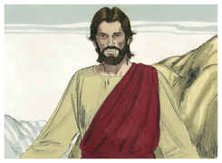
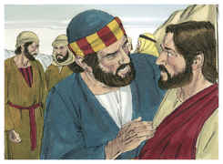
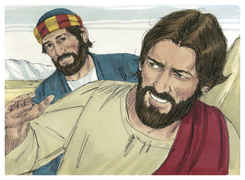
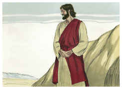

# Mateus Capítulo 16

1	E, CHEGANDO-SE os fariseus e os saduceus, para o tentarem, pediram-lhe que lhes mostrasse algum sinal do céu.

2	Mas ele, respondendo, disse-lhes: Quando é chegada a tarde, dizeis: Haverá bom tempo, porque o céu está rubro.

3	E, pela manhã: Hoje haverá tempestade, porque o céu está de um vermelho sombrio. Hipócritas, sabeis discernir a face do céu, e não conheceis os sinais dos tempos?

4	Uma geração má e adúltera pede um sinal, e nenhum sinal lhe será dado, senão o sinal do profeta Jonas. E, deixando-os, retirou-se.

5	E, passando seus discípulos para o outro lado, tinham-se esquecido de trazer pão.

6	E Jesus disse-lhes: Adverti, e acautelai-vos do fermento dos fariseus e saduceus.

7	E eles arrazoavam entre si, dizendo: É porque não trouxemos pão.

8	E Jesus, percebendo isso, disse: Por que arrazoais entre vós, homens de pouca fé, sobre o não terdes trazido pão?

9	Não compreendeis ainda, nem vos lembrais dos cinco pães para cinco mil homens, e de quantas alcofas levantastes?

10	Nem dos sete pães para quatro mil, e de quantos cestos levantastes?

11	Como não compreendestes que não vos falei a respeito do pão, mas que vos guardásseis do fermento dos fariseus e saduceus?

12	Então compreenderam que não dissera que se guardassem do fermento do pão, mas da doutrina dos fariseus.

13	E, chegando Jesus às partes de Cesaréia de Filipe, interrogou os seus discípulos, dizendo: Quem dizem os homens ser o Filho do homem?

14	E eles disseram: Uns, João o Batista; outros, Elias; e outros, Jeremias, ou um dos profetas.

15	Disse-lhes ele: E vós, quem dizeis que eu sou?

16	E Simão Pedro, respondendo, disse: Tu és o Cristo, o Filho do Deus vivo.

17	E Jesus, respondendo, disse-lhe: Bem-aventurado és tu, Simão Barjonas, porque to não revelou a carne e o sangue, mas meu Pai, que está nos céus.

18	Pois também eu te digo que tu és Pedro, e sobre esta pedra edificarei a minha igreja, e as portas do inferno não prevalecerão contra ela;

19	E eu te darei as chaves do reino dos céus; e tudo o que ligares na terra será ligado nos céus, e tudo o que desligares na terra será desligado nos céus.

20	Então mandou aos seus discípulos que a ninguém dissessem que ele era Jesus o Cristo.

21	Desde então começou Jesus a mostrar aos seus discípulos que convinha ir a Jerusalém, e padecer muitas coisas dos anciãos, e dos principais dos sacerdotes, e dos escribas, e ser morto, e ressuscitar ao terceiro dia.

22	E Pedro, tomando-o de parte, começou a repreendê-lo, dizendo: Senhor, tem compaixão de ti; de modo nenhum te acontecerá isso.

23	Ele, porém, voltando-se, disse a Pedro: Para trás de mim, Satanás, que me serves de escândalo; porque não compreendes as coisas que são de Deus, mas só as que são dos homens.

24	Então disse Jesus aos seus discípulos: Se alguém quiser vir após mim, renuncie-se a si mesmo, tome sobre si a sua cruz, e siga-me;

25	Porque aquele que quiser salvar a sua vida, perdê-la-á, e quem perder a sua vida por amor de mim, achá-la-á.

26	Pois que aproveita ao homem ganhar o mundo inteiro, se perder a sua alma? Ou que dará o homem em recompensa da sua alma?

27	Porque o Filho do homem virá na glória de seu Pai, com os seus anjos; e então dará a cada um segundo as suas obras.

28	Em verdade vos digo que alguns há, dos que aqui estão, que não provarão a morte até que vejam vir o Filho do homem no seu reino.

