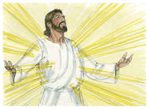
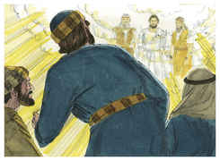
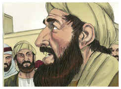
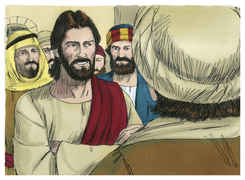
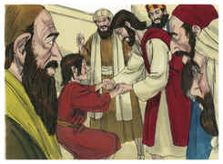

# Mateus Capítulo 17

## 1
SEIS dias depois, tomou Jesus consigo a Pedro, e a Tiago, e a João, seu irmão, e os conduziu em particular a um alto monte,

## 2
E transfigurou-se diante deles; e o seu rosto resplandeceu como o sol, e as suas vestes se tornaram brancas como a luz.

## 3
E eis que lhes apareceram Moisés e Elias, falando com ele.

## 4
E Pedro, tomando a palavra, disse a Jesus: Senhor, bom é estarmos aqui; se queres, façamos aqui três tabernáculos, um para ti, um para Moisés, e um para Elias.

## 5
E, estando ele ainda a falar, eis que uma nuvem luminosa os cobriu. E da nuvem saiu uma voz que dizia: Este é o meu amado Filho, em quem me comprazo; escutai-o.

## 6
E os discípulos, ouvindo isto, caíram sobre os seus rostos, e tiveram grande medo.

## 7
E, aproximando-se Jesus, tocou-lhes, e disse: Levantai-vos, e não tenhais medo.

## 8
E, erguendo eles os olhos, ninguém viram senão unicamente a Jesus.

## 9
E, descendo eles do monte, Jesus lhes ordenou, dizendo: A ninguém conteis a visão, até que o Filho do homem seja ressuscitado dentre os mortos.

## 10
E os seus discípulos o interrogaram, dizendo: Por que dizem então os escribas que é mister que Elias venha primeiro?

## 11
E Jesus, respondendo, disse-lhes: Em verdade Elias virá primeiro, e restaurará todas as coisas;

## 12
Mas digo-vos que Elias já veio, e não o conheceram, mas fizeram-lhe tudo o que quiseram. Assim farão eles também padecer o Filho do homem.

## 13
Então entenderam os discípulos que lhes falara de João o Batista.

## 14
E, quando chegaram à multidão, aproximou-se-lhe um homem, pondo-se de joelhos diante dele, e dizendo:

## 15
Senhor, tem misericórdia de meu filho, que é lunático e sofre muito; pois muitas vezes cai no fogo, e muitas vezes na água;

## 16
E trouxe-o aos teus discípulos; e não puderam curá-lo.

## 17
E Jesus, respondendo, disse: Ó geração incrédula e perversa! até quando estarei eu convosco, e até quando vos sofrerei? Trazei-mo aqui.

## 18
E, repreendeu Jesus o demônio, que saiu dele, e desde aquela hora o menino sarou.

## 19
Então os discípulos, aproximando-se de Jesus em particular, disseram: Por que não pudemos nós expulsá-lo?

## 20
E Jesus lhes disse: Por causa de vossa incredulidade; porque em verdade vos digo que, se tiverdes fé como um grão de mostarda, direis a este monte: Passa daqui para acolá, e há de passar; e nada vos será impossível.

## 21
Mas esta casta de demônios não se expulsa senão pela oração e pelo jejum.

## 22
Ora, achando-se eles na Galiléia, disse-lhes Jesus: O Filho do homem será entregue nas mãos dos homens;

## 23
E matá-lo-ão, e ao terceiro dia ressuscitará. E eles se entristeceram muito.

## 24
E, chegando eles a Cafarnaum, aproximaram-se de Pedro os que cobravam as dracmas, e disseram: O vosso mestre não paga as dracmas?

## 25
Disse ele: Sim. E, entrando em casa, Jesus se lhe antecipou, dizendo: Que te parece, Simão? De quem cobram os reis da terra os tributos, ou o censo? Dos seus filhos, ou dos alheios?

## 26
Disse-lhe Pedro: Dos alheios. Disse-lhe Jesus: Logo, estão livres os filhos.

## 27
Mas, para que os não escandalizemos, vai ao mar, lança o anzol, tira o primeiro peixe que subir, e abrindo-lhe a boca, encontrarás um estáter; toma-o, e dá-o por mim e por ti.

