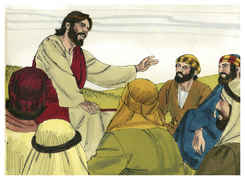
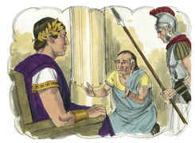
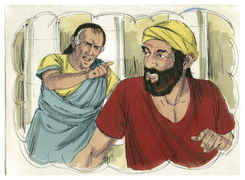
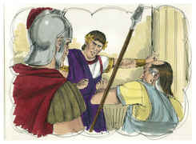
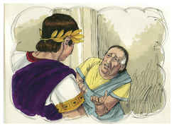
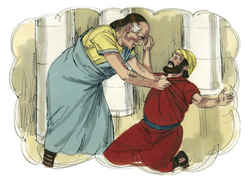
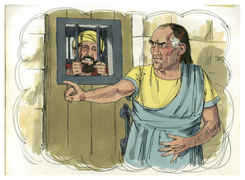
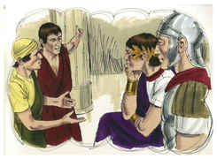
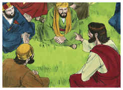

# Mateus Capítulo 18

## 1
NAQUELA mesma hora chegaram os discípulos ao pé de Jesus, dizendo: Quem é o maior no reino dos céus?

## 2
E Jesus, chamando um menino, o pôs no meio deles,

## 3
E disse: Em verdade vos digo que, se não vos converterdes e não vos fizerdes como meninos, de modo algum entrareis no reino dos céus.

## 4
Portanto, aquele que se tornar humilde como este menino, esse é o maior no reino dos céus.

## 5
E qualquer que receber em meu nome um menino, tal como este, a mim me recebe.

## 6
Mas, qualquer que escandalizar um destes pequeninos, que crêem em mim, melhor lhe fora que se lhe pendurasse ao pescoço uma mó de azenha, e se submergisse na profundeza do mar.

## 7
Ai do mundo, por causa dos escândalos; porque é mister que venham escândalos, mas ai daquele homem por quem o escândalo vem!

## 8
Portanto, se a tua mão ou o teu pé te escandalizar, corta-o, e atira-o para longe de ti; melhor te é entrar na vida coxo, ou aleijado, do que, tendo duas mãos ou dois pés, seres lançado no fogo eterno.

## 9
E, se o teu olho te escandalizar, arranca-o, e atira-o para longe de ti; melhor te é entrar na vida com um só olho, do que, tendo dois olhos, seres lançado no fogo do inferno.

## 10
Vede, não desprezeis algum destes pequeninos, porque eu vos digo que os seus anjos nos céus sempre vêem a face de meu Pai que está nos céus.

## 11
Porque o Filho do homem veio salvar o que se tinha perdido.

## 12
Que vos parece? Se algum homem tiver cem ovelhas, e uma delas se desgarrar, não irá pelos montes, deixando as noventa e nove, em busca da que se desgarrou?

## 13
E, se porventura achá-la, em verdade vos digo que maior prazer tem por aquela do que pelas noventa e nove que se não desgarraram.

## 14
Assim, também, não é vontade de vosso Pai, que está nos céus, que um destes pequeninos se perca.

## 15
Ora, se teu irmão pecar contra ti, vai, e repreende-o entre ti e ele só; se te ouvir, ganhaste a teu irmão;

## 16
Mas, se não te ouvir, leva ainda contigo um ou dois, para que pela boca de duas ou três testemunhas toda a palavra seja confirmada.

## 17
E, se não as escutar, dize-o à igreja; e, se também não escutar a igreja, considera-o como um gentio e publicano.

## 18
Em verdade vos digo que tudo o que ligardes na terra será ligado no céu, e tudo o que desligardes na terra será desligado no céu.

## 19
Também vos digo que, se dois de vós concordarem na terra acerca de qualquer coisa que pedirem, isso lhes será feito por meu Pai, que está nos céus.

## 20
Porque, onde estiverem dois ou três reunidos em meu nome, aí estou eu no meio deles.

## 21
Então Pedro, aproximando-se dele, disse: Senhor, até quantas vezes pecará meu irmão contra mim, e eu lhe perdoarei? Até sete?

## 22
Jesus lhe disse: Não te digo que até sete; mas, até setenta vezes sete.

## 23
Por isso o reino dos céus pode comparar-se a um certo rei que quis fazer contas com os seus servos;

## 24
E, começando a fazer contas, foi-lhe apresentado um que lhe devia dez mil talentos;

## 25
E, não tendo ele com que pagar, o seu senhor mandou que ele, e sua mulher e seus filhos fossem vendidos, com tudo quanto tinha, para que a dívida se lhe pagasse.

## 26
Então aquele servo, prostrando-se, o reverenciava, dizendo: Senhor, sê generoso para comigo, e tudo te pagarei.

## 27
Então o senhor daquele servo, movido de íntima compaixão, soltou-o e perdoou-lhe a dívida.

## 28
Saindo, porém, aquele servo, encontrou um dos seus conservos, que lhe devia cem dinheiros, e, lançando mão dele, sufocava-o, dizendo: Paga-me o que me deves.

## 29
Então o seu companheiro, prostrando-se a seus pés, rogava-lhe, dizendo: Sê generoso para comigo, e tudo te pagarei.

## 30
Ele, porém, não quis, antes foi encerrá-lo na prisão, até que pagasse a dívida.

## 31
Vendo, pois, os seus conservos o que acontecia, contristaram-se muito, e foram declarar ao seu senhor tudo o que se passara.

## 32
Então o seu senhor, chamando-o à sua presença, disse-lhe: Servo malvado, perdoei-te toda aquela dívida, porque me suplicaste.

## 33
Não devias tu, igualmente, ter compaixão do teu companheiro, como eu também tive misericórdia de ti?

## 34
E, indignado, o seu senhor o entregou aos atormentadores, até que pagasse tudo o que lhe devia.

## 35
Assim vos fará, também, meu Pai celestial, se do coração não perdoardes, cada um a seu irmão, as suas ofensas.

