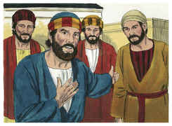
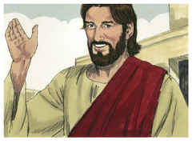

# Mateus Capítulo 19

1	E ACONTECEU que, concluindo Jesus estes discursos, saiu da Galiléia, e dirigiu-se aos confins da Judéia, além do Jordão;

2	E seguiram-no grandes multidões, e curou-as ali.

3	Então chegaram ao pé dele os fariseus, tentando-o, e dizendo-lhe: É lícito ao homem repudiar sua mulher por qualquer motivo?

4	Ele, porém, respondendo, disse-lhes: Não tendes lido que aquele que os fez no princípio macho e fêmea os fez,

5	E disse: Portanto, deixará o homem pai e mãe, e se unirá à sua mulher, e serão dois numa só carne?

6	Assim não são mais dois, mas uma só carne. Portanto, o que Deus ajuntou não o separe o homem.

7	Disseram-lhe eles: Então, por que mandou Moisés dar-lhe carta de divórcio, e repudiá-la?

8	Disse-lhes ele: Moisés, por causa da dureza dos vossos corações, vos permitiu repudiar vossas mulheres; mas ao princípio não foi assim.

9	Eu vos digo, porém, que qualquer que repudiar sua mulher, não sendo por causa de fornicação, e casar com outra, comete adultério; e o que casar com a repudiada também comete adultério.

10	Disseram-lhe seus discípulos: Se assim é a condição do homem relativamente à mulher, não convém casar.

11	Ele, porém, lhes disse: Nem todos podem receber esta palavra, mas só aqueles a quem foi concedido.

12	Porque há eunucos que assim nasceram do ventre da mãe; e há eunucos que foram castrados pelos homens; e há eunucos que se castraram a si mesmos, por causa do reino dos céus. Quem pode receber isto, receba-o.

13	Trouxeram-lhe, então, alguns meninos, para que sobre eles pusesse as mãos, e orasse; mas os discípulos os repreendiam.

14	Jesus, porém, disse: Deixai os meninos, e não os estorveis de vir a mim; porque dos tais é o reino dos céus.

15	E, tendo-lhes imposto as mãos, partiu dali.

16	E eis que, aproximando-se dele um jovem, disse-lhe: Bom Mestre, que bem farei para conseguir a vida eterna?

17	E ele disse-lhe: Por que me chamas bom? Não há bom senão um só, que é Deus. Se queres, porém, entrar na vida, guarda os mandamentos.

18	Disse-lhe ele: Quais? E Jesus disse: Não matarás, não cometerás adultério, não furtarás, não dirás falso testemunho;

19	Honra teu pai e tua mãe, e amarás o teu próximo como a ti mesmo.

20	Disse-lhe o jovem: Tudo isso tenho guardado desde a minha mocidade; que me falta ainda?

21	Disse-lhe Jesus: Se queres ser perfeito, vai, vende tudo o que tens e dá-o aos pobres, e terás um tesouro no céu; e vem, e segue-me.

22	E o jovem, ouvindo esta palavra, retirou-se triste, porque possuía muitas propriedades.

23	Disse então Jesus aos seus discípulos: Em verdade vos digo que é difícil entrar um rico no reino dos céus.

24	E, outra vez vos digo que é mais fácil passar um camelo pelo fundo de uma agulha do que entrar um rico no reino de Deus.

25	Os seus discípulos, ouvindo isto, admiraram-se muito, dizendo: Quem poderá pois salvar-se?

26	E Jesus, olhando para eles, disse-lhes: Aos homens é isso impossível, mas a Deus tudo é possível.

27	Então Pedro, tomando a palavra, disse-lhe: Eis que nós deixamos tudo, e te seguimos; que receberemos?

28	E Jesus disse-lhes: Em verdade vos digo que vós, que me seguistes, quando, na regeneração, o Filho do homem se assentar no trono da sua glória, também vos assentareis sobre doze tronos, para julgar as doze tribos de Israel.

29	E todo aquele que tiver deixado casas, ou irmãos, ou irmãs, ou pai, ou mãe, ou mulher, ou filhos, ou terras, por amor de meu nome, receberá cem vezes tanto, e herdará a vida eterna.

30	Porém, muitos primeiros serão os derradeiros, e muitos derradeiros serão os primeiros.

