# Mateus Capítulo 2

## 1
E, TENDO nascido Jesus em Belém de Judéia, no tempo do rei Herodes, eis que uns magos vieram do oriente a Jerusalém,

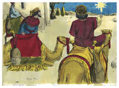

## 2
Dizendo: Onde está aquele que é nascido rei dos judeus? porque vimos a sua estrela no oriente, e viemos a adorá-lo.

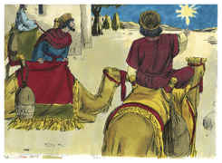

## 3
E o rei Herodes, ouvindo isto, perturbou-se, e toda Jerusalém com ele.

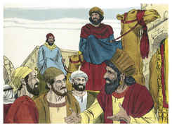

## 4
E, congregados todos os príncipes dos sacerdotes, e os escribas do povo, perguntou-lhes onde havia de nascer o Cristo.

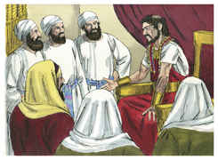

## 5
E eles lhe disseram: Em Belém de Judéia; porque assim está escrito pelo profeta:

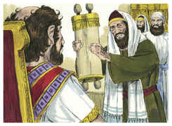

## 6
E tu, Belém, terra de Judá, De modo nenhum és a menor entre as capitais de Judá; Porque de ti sairá o Guia Que há de apascentar o meu povo Israel.

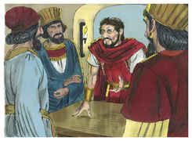

## 7
Então Herodes, chamando secretamente os magos, inquiriu exatamente deles acerca do tempo em que a estrela lhes aparecera.

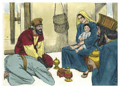

## 8
E, enviando-os a Belém, disse: Ide, e perguntai diligentemente pelo menino e, quando o achardes, participai-mo, para que também eu vá e o adore.

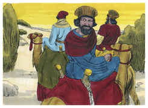

## 9
E, tendo eles ouvido o rei, partiram; e eis que a estrela, que tinham visto no oriente, ia adiante deles, até que, chegando, se deteve sobre o lugar onde estava o menino.

## 10
E, vendo eles a estrela, regozijaram-se muito com grande alegria.

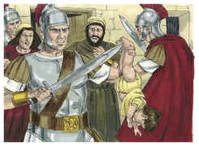

## 11
E, entrando na casa, acharam o menino com Maria sua mãe e, prostrando-se, o adoraram; e abrindo os seus tesouros, ofertaram-lhe dádivas: ouro, incenso e mirra.

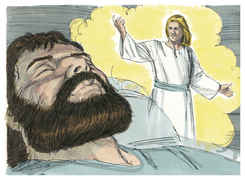

## 12
E, sendo por divina revelação avisados num sonho para que não voltassem para junto de Herodes, partiram para a sua terra por outro caminho.

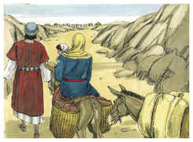

## 13
E, tendo eles se retirado, eis que o anjo do Senhor apareceu a José num sonho, dizendo: Levanta-te, e toma o menino e sua mãe, e foge para o Egito, e demora-te lá até que eu te diga; porque Herodes há de procurar o menino para o matar.

## 14
E, levantando-se ele, tomou o menino e sua mãe, de noite, e foi para o Egito.

## 15
E esteve lá, até à morte de Herodes, para que se cumprisse o que foi dito da parte do Senhor pelo profeta, que diz: Do Egito chamei o meu Filho.

## 16
Então Herodes, vendo que tinha sido iludido pelos magos, irritou-se muito, e mandou matar todos os meninos que havia em Belém, e em todos os seus contornos, de dois anos para baixo, segundo o tempo que diligentemente inquirira dos magos.

## 17
Então se cumpriu o que foi dito pelo profeta Jeremias, que diz:

## 18
Em Ramá se ouviu uma voz, Lamentação, choro e grande pranto: Raquel chorando os seus filhos, E não quer ser consolada, porque já não existem.

## 19
Morto, porém, Herodes, eis que o anjo do Senhor apareceu num sonho a José no Egito,

## 20
Dizendo: Levanta-te, e toma o menino e sua mãe, e vai para a terra de Israel; porque já estão mortos os que procuravam a morte do menino.

## 21
Então ele se levantou, e tomou o menino e sua mãe, e foi para a terra de Israel.

## 22
E, ouvindo que Arquelau reinava na Judéia em lugar de Herodes, seu pai, receou ir para lá; mas avisado num sonho, por divina revelação, foi para as partes da Galiléia.

## 23
E chegou, e habitou numa cidade chamada Nazaré, para que se cumprisse o que fora dito pelos profetas: Ele será chamado Nazareno.

