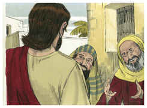
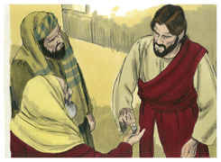
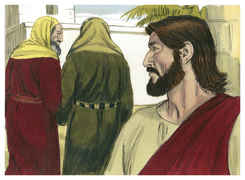

# Mateus Capítulo 22

## 1
ENTÃO Jesus, tomando a palavra, tornou a falar-lhes em parábolas, dizendo:

## 2
O reino dos céus é semelhante a um certo rei que celebrou as bodas de seu filho;

## 3
E enviou os seus servos a chamar os convidados para as bodas, e estes não quiseram vir.

## 4
Depois, enviou outros servos, dizendo: Dizei aos convidados: Eis que tenho o meu jantar preparado, os meus bois e cevados já mortos, e tudo já pronto; vinde às bodas.

## 5
Eles, porém, não fazendo caso, foram, um para o seu campo, outro para o seu negócio;

## 6
E os outros, apoderando-se dos servos, os ultrajaram e mataram.

## 7
E o rei, tendo notícia disto, encolerizou-se e, enviando os seus exércitos, destruiu aqueles homicidas, e incendiou a sua cidade.

## 8
Então diz aos servos: As bodas, na verdade, estão preparadas, mas os convidados não eram dignos.

## 9
Ide, pois, às saídas dos caminhos, e convidai para as bodas a todos os que encontrardes.

## 10
E os servos, saindo pelos caminhos, ajuntaram todos quantos encontraram, tanto maus como bons; e a festa nupcial foi cheia de convidados.

## 11
E o rei, entrando para ver os convidados, viu ali um homem que não estava trajado com veste de núpcias.

## 12
E disse-lhe: Amigo, como entraste aqui, não tendo veste nupcial? E ele emudeceu.

## 13
Disse, então, o rei aos servos: Amarrai-o de pés e mãos, levai-o, e lançai-o nas trevas exteriores; ali haverá pranto e ranger de dentes.

## 14
Porque muitos são chamados, mas poucos escolhidos.

## 15
Então, retirando-se os fariseus, consultaram entre si como o surpreenderiam nalguma palavra;

## 16
E enviaram-lhe os seus discípulos, com os herodianos, dizendo: Mestre, bem sabemos que és verdadeiro, e ensinas o caminho de Deus segundo a verdade, e de ninguém se te dá, porque não olhas a aparência dos homens.

## 17
Dize-nos, pois, que te parece? É lícito pagar o tributo a César, ou não?

## 18
Jesus, porém, conhecendo a sua malícia, disse: Por que me experimentais, hipócritas?

## 19
Mostrai-me a moeda do tributo. E eles lhe apresentaram um dinheiro.

## 20
E ele diz-lhes: De quem é esta efígie e esta inscrição?

## 21
Dizem-lhe eles: De César. Então ele lhes disse: Dai pois a César o que é de César, e a Deus o que é de Deus.

## 22
E eles, ouvindo isto, maravilharam-se, e, deixando-o, se retiraram.

## 23
No mesmo dia chegaram junto dele os saduceus, que dizem não haver ressurreição, e o interrogaram,

## 24
Dizendo: Mestre, Moisés disse: Se morrer alguém, não tendo filhos, casará o seu irmão com a mulher dele, e suscitará descendência a seu irmão.

## 25
Ora, houve entre nós sete irmãos; e o primeiro, tendo casado, morreu e, não tendo descendência, deixou sua mulher a seu irmão.

## 26
Da mesma sorte o segundo, e o terceiro, até ao sétimo;

## 27
Por fim, depois de todos, morreu também a mulher.

## 28
Portanto, na ressurreição, de qual dos sete será a mulher, visto que todos a possuíram?

## 29
Jesus, porém, respondendo, disse-lhes: Errais, não conhecendo as Escrituras, nem o poder de Deus.

## 30
Porque na ressurreição nem casam nem são dados em casamento; mas serão como os anjos de Deus no céu.

## 31
E, acerca da ressurreição dos mortos, não tendes lido o que Deus vos declarou, dizendo:

## 32
Eu sou o Deus de Abraão, o Deus de Isaque, e o Deus de Jacó? Ora, Deus não é Deus dos mortos, mas dos vivos.

## 33
E, as turbas, ouvindo isto, ficaram maravilhadas da sua doutrina.

## 34
E os fariseus, ouvindo que ele fizera emudecer os saduceus, reuniram-se no mesmo lugar.

## 35
E um deles, doutor da lei, interrogou-o para o experimentar, dizendo:

## 36
Mestre, qual é o grande mandamento na lei?

## 37
E Jesus disse-lhe: Amarás o Senhor teu Deus de todo o teu coração, e de toda a tua alma, e de todo o teu pensamento.

## 38
Este é o primeiro e grande mandamento.

## 39
E o segundo, semelhante a este, é: Amarás o teu próximo como a ti mesmo.

## 40
Destes dois mandamentos dependem toda a lei e os profetas.

## 41
E, estando reunidos os fariseus, interrogou-os Jesus,

## 42
Dizendo: Que pensais vós do Cristo? De quem é filho? Eles disseram-lhe: De Davi.

## 43
Disse-lhes ele: Como é então que Davi, em espírito, lhe chama Senhor, dizendo:

## 44
Disse o Senhor ao meu Senhor: Assenta-te à minha direita, Até que eu ponha os teus inimigos por escabelo de teus pés?

## 45
Se Davi, pois, lhe chama Senhor, como é seu filho?

## 46
E ninguém podia responder-lhe uma palavra; nem desde aquele dia ousou mais alguém interrogá-lo.

