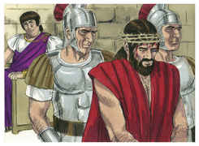
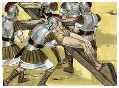
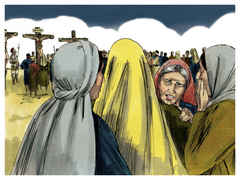
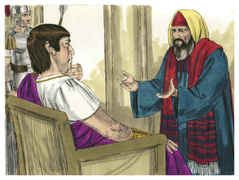
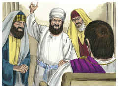
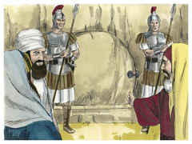

# Mateus Capítulo 27

## 1
E, CHEGANDO a manhã, todos os príncipes dos sacerdotes, e os anciãos do povo, formavam juntamente conselho contra Jesus, para o matarem;

## 2
E maniatando-o, o levaram e entregaram ao presidente Pôncio Pilatos.

## 3
Então Judas, o que o traíra, vendo que fora condenado, trouxe, arrependido, as trinta moedas de prata aos príncipes dos sacerdotes e aos anciãos,

## 4
Dizendo: Pequei, traindo o sangue inocente. Eles, porém, disseram: Que nos importa? Isso é contigo.

## 5
E ele, atirando para o templo as moedas de prata, retirou-se e foi-se enforcar.

## 6
E os príncipes dos sacerdotes, tomando as moedas de prata, disseram: Não é lícito colocá-las no cofre das ofertas, porque são preço de sangue.

## 7
E, tendo deliberado em conselho, compraram com elas o campo de um oleiro, para sepultura dos estrangeiros.

## 8
Por isso foi chamado aquele campo, até ao dia de hoje, Campo de Sangue.

## 9
Então se realizou o que vaticinara o profeta Jeremias: Tomaram as trinta moedas de prata, preço do que foi avaliado, que certos filhos de Israel avaliaram,

## 10
E deram-nas pelo campo do oleiro, segundo o que o Senhor me determinou.

## 11
E foi Jesus apresentado ao presidente, e o presidente o interrogou, dizendo: És tu o Rei dos Judeus? E disse-lhe Jesus: Tu o dizes.

## 12
E, sendo acusado pelos príncipes dos sacerdotes e pelos anciãos, nada respondeu.

## 13
Disse-lhe então Pilatos: Não ouves quanto testificam contra ti?

## 14
E nem uma palavra lhe respondeu, de sorte que o presidente estava muito maravilhado.

## 15
Ora, por ocasião da festa, costumava o presidente soltar um preso, escolhendo o povo aquele que quisesse.

## 16
E tinham então um preso bem conhecido, chamado Barrabás.

## 17
Portanto, estando eles reunidos, disse-lhes Pilatos: Qual quereis que vos solte? Barrabás, ou Jesus, chamado Cristo?

## 18
Porque sabia que por inveja o haviam entregado.

## 19
E, estando ele assentado no tribunal, sua mulher mandou-lhe dizer: Não entres na questão desse justo, porque num sonho muito sofri por causa dele.

## 20
Mas os príncipes dos sacerdotes e os anciãos persuadiram à multidão que pedisse Barrabás e matasse Jesus.

## 21
E, respondendo o presidente, disse-lhes: Qual desses dois quereis vós que eu solte? E eles disseram: Barrabás.

## 22
Disse-lhes Pilatos: Que farei então de Jesus, chamado Cristo? Disseram-lhe todos: Seja crucificado.

## 23
O presidente, porém, disse: Mas que mal fez ele? E eles mais clamavam, dizendo: Seja crucificado.

## 24
Então Pilatos, vendo que nada aproveitava, antes o tumulto crescia, tomando água, lavou as mãos diante da multidão, dizendo: Estou inocente do sangue deste justo. Considerai isso.

## 25
E, respondendo todo o povo, disse: O seu sangue caia sobre nós e sobre nossos filhos.

## 26
Então soltou-lhes Barrabás, e, tendo mandado açoitar a Jesus, entregou-o para ser crucificado.

## 27
E logo os soldados do presidente, conduzindo Jesus à audiência, reuniram junto dele toda a coorte.

## 28
E, despindo-o, o cobriram com uma capa de escarlate;

## 29
E, tecendo uma coroa de espinhos, puseram-lha na cabeça, e em sua mão direita uma cana; e, ajoelhando diante dele, o escarneciam, dizendo: Salve, Rei dos judeus.

## 30
E, cuspindo nele, tiraram-lhe a cana, e batiam-lhe com ela na cabeça.

## 31
E, depois de o haverem escarnecido, tiraram-lhe a capa, vestiram-lhe as suas vestes e o levaram para ser crucificado.

## 32
E, quando saíam, encontraram um homem cireneu, chamado Simão, a quem constrangeram a levar a sua cruz.

## 33
E, chegando ao lugar chamado Gólgota, que se diz: Lugar da Caveira,

## 34
Deram-lhe a beber vinagre misturado com fel; mas ele, provando-o, não quis beber.

## 35
E, havendo-o crucificado, repartiram as suas vestes, lançando sortes, para que se cumprisse o que foi dito pelo profeta: Repartiram entre si as minhas vestes, e sobre a minha túnica lançaram sortes.

## 36
E, assentados, o guardavam ali.

## 37
E por cima da sua cabeça puseram escrita a sua acusação: ESTE É JESUS, O REI DOS JUDEUS.

## 38
E foram crucificados com ele dois salteadores, um à direita, e outro à esquerda.

## 39
E os que passavam blasfemavam dele, meneando as cabeças,

## 40
E dizendo: Tu, que destróis o templo, e em três dias o reedificas, salva-te a ti mesmo. Se és Filho de Deus, desce da cruz.

## 41
E da mesma maneira também os príncipes dos sacerdotes, com os escribas, e anciãos, e fariseus, escarnecendo, diziam:

## 42
Salvou os outros, e a si mesmo não pode salvar-se. Se é o Rei de Israel, desça agora da cruz, e crê-lo-emos.

## 43
Confiou em Deus; livre-o agora, se o ama; porque disse: Sou Filho de Deus.

## 44
E o mesmo lhe lançaram também em rosto os salteadores que com ele estavam crucificados.

## 45
E desde a hora sexta houve trevas sobre toda a terra, até à hora nona.

## 46
E perto da hora nona exclamou Jesus em alta voz, dizendo: Eli, Eli, lamá sabactâni; isto é, Deus meu, Deus meu, por que me desamparaste?

## 47
E alguns dos que ali estavam, ouvindo isto, diziam: Este chama por Elias,

## 48
E logo um deles, correndo, tomou uma esponja, e embebeu-a em vinagre, e, pondo-a numa cana, dava-lhe de beber.

## 49
Os outros, porém, diziam: Deixa, vejamos se Elias vem livrá-lo.

## 50
E Jesus, clamando outra vez com grande voz, rendeu o espírito.

## 51
E eis que o véu do templo se rasgou em dois, de alto a baixo; e tremeu a terra, e fenderam-se as pedras;

## 52
E abriram-se os sepulcros, e muitos corpos de santos que dormiam foram ressuscitados;

## 53
E, saindo dos sepulcros, depois da ressurreição dele, entraram na cidade santa, e apareceram a muitos.

## 54
E o centurião e os que com ele guardavam a Jesus, vendo o terremoto, e as coisas que haviam sucedido, tiveram grande temor, e disseram: Verdadeiramente este era o Filho de Deus.

## 55
E estavam ali, olhando de longe, muitas mulheres que tinham seguido Jesus desde a Galiléia, para o servir;

## 56
Entre as quais estavam Maria Madalena, e Maria, mãe de Tiago e de José, e a mãe dos filhos de Zebedeu.

## 57
E, vinda já a tarde, chegou um homem rico, de Arimatéia, por nome José, que também era discípulo de Jesus.

## 58
Este foi ter com Pilatos, e pediu-lhe o corpo de Jesus. Então Pilatos mandou que o corpo lhe fosse dado.

## 59
E José, tomando o corpo, envolveu-o num fino e limpo lençol,

## 60
E o pôs no seu sepulcro novo, que havia aberto em rocha, e, rodando uma grande pedra para a porta do sepulcro, retirou-se.

## 61
E estavam ali Maria Madalena e a outra Maria, assentadas defronte do sepulcro.

## 62
E no dia seguinte, que é o dia depois da Preparação, reuniram-se os príncipes dos sacerdotes e os fariseus em casa de Pilatos,

## 63
Dizendo: Senhor, lembramo-nos de que aquele enganador, vivendo ainda, disse: Depois de três dias ressuscitarei.

## 64
Manda, pois, que o sepulcro seja guardado com segurança até ao terceiro dia, não se dê o caso que os seus discípulos vão de noite, e o furtem, e digam ao povo: Ressuscitou dentre os mortos; e assim o último erro será pior do que o primeiro.

## 65
E disse-lhes Pilatos: Tendes a guarda; ide, guardai-o como entenderdes.

## 66
E, indo eles, seguraram o sepulcro com a guarda, selando a pedra.

