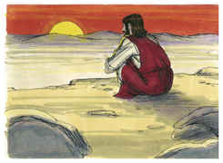
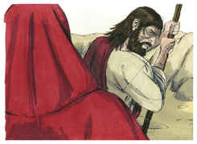
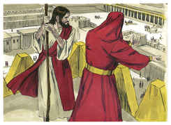
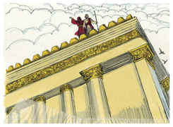
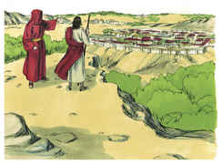
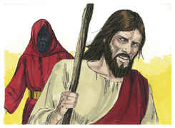
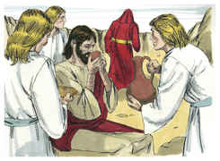

# Mateus Capítulo 4

## 1
ENTÃO foi conduzido Jesus pelo Espírito ao deserto, para ser tentado pelo diabo.

## 2
E, tendo jejuado quarenta dias e quarenta noites, depois teve fome;

## 3
E, chegando-se a ele o tentador, disse: Se tu és o Filho de Deus, manda que estas pedras se tornem em pães.

## 4
Ele, porém, respondendo, disse: Está escrito: Nem só de pão viverá o homem, mas de toda a palavra que sai da boca de Deus.

## 5
Então o diabo o transportou à cidade santa, e colocou-o sobre o pináculo do templo,

## 6
E disse-lhe: Se tu és o Filho de Deus, lança-te de aqui abaixo; porque está escrito: Que aos seus anjos dará ordens a teu respeito, E tomar-te-ão nas mãos, Para que nunca tropeces com o teu pé em alguma pedra.

## 7
Disse-lhe Jesus: Também está escrito: Não tentarás o Senhor teu Deus.

## 8
Novamente o transportou o diabo a um monte muito alto; e mostrou-lhe todos os reinos do mundo, e a glória deles.

## 9
E disse-lhe: Tudo isto te darei se, prostrado, me adorares.

## 10
Então disse-lhe Jesus: Vai-te, Satanás, porque está escrito: Ao Senhor teu Deus adorarás, e só a ele servirás.

## 11
Então o diabo o deixou; e, eis que chegaram os anjos, e o serviam.

## 12
Jesus, porém, ouvindo que João estava preso, voltou para a Galiléia;

## 13
E, deixando Nazaré, foi habitar em Cafarnaum, cidade marítima, nos confins de Zebulom e Naftali;

## 14
Para que se cumprisse o que foi dito pelo profeta Isaías, que diz:

## 15
A terra de Zebulom, e a terra de Naftali, Junto ao caminho do mar, além do Jordão, A Galiléia das nações;

## 16
O povo, que estava assentado em trevas, Viu uma grande luz; E, aos que estavam assentados na região e sombra da morte, A luz raiou.

## 17
Desde então começou Jesus a pregar, e a dizer: Arrependei-vos, porque é chegado o reino dos céus.

## 18
E Jesus, andando junto ao mar da Galiléia, viu a dois irmãos, Simão, chamado Pedro, e André, seu irmão, os quais lançavam as redes ao mar, porque eram pescadores;

## 19
E disse-lhes: Vinde após mim, e eu vos farei pescadores de homens.

## 20
Então eles, deixando logo as redes, seguiram-no.

## 21
E, adiantando-se dali, viu outros dois irmãos, Tiago, filho de Zebedeu, e João, seu irmão, num barco com seu pai, Zebedeu, consertando as redes;

## 22
E chamou-os; eles, deixando imediatamente o barco e seu pai, seguiram-no.

## 23
E percorria Jesus toda a Galiléia, ensinando nas suas sinagogas e pregando o evangelho do reino, e curando todas as enfermidades e moléstias entre o povo.

## 24
E a sua fama correu por toda a Síria, e traziam-lhe todos os que padeciam, acometidos de várias enfermidades e tormentos, os endemoninhados, os lunáticos, e os paralíticos, e ele os curava.

## 25
E seguia-o uma grande multidão da Galiléia, de Decápolis, de Jerusalém, da Judéia, e de além do Jordão.

