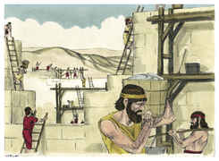

# Neemias Capítulo 3

1	E LEVANTOU-SE Eliasibe, o sumo sacerdote, com os seus irmãos, os sacerdotes, e reedificaram a porta das ovelhas, a qual consagraram; e levantaram as suas portas, e até à torre de Meá consagraram, e até à torre de Hananel.

2	E junto a ele edificaram os homens de Jericó; também ao seu lado edificou Zacur, filho de Imri.

3	E à porta do peixe edificaram os filhos de Hassenaá; a qual emadeiraram, e levantaram as suas portas com as suas fechaduras e os seus ferrolhos.

4	E ao seu lado reparou Meremote, filho de Urias, o filho de Coz; e ao seu lado reparou Mesulão, filho de Berequias, o filho de Mesezabeel; e ao seu lado reparou Zadoque, filho de Baana.

5	E ao seu lado repararam os tecoítas; porém os seus nobres não submeteram a cerviz ao serviço de seu Senhor.

6	E a porta velha repararam-na Joiada, filho de Paséia, e Mesulão, filho de Besodias; estes a emadeiraram, e levantaram as suas portas com as suas fechaduras e os seus ferrolhos.

7	E ao seu lado repararam Melatias, o gibeonita, e Jadom, meronotita, homens de Gibeom e Mizpá, que pertenciam ao domínio do governador dalém do rio.

8	Ao seu lado reparou Uziel, filho de Haraías, um dos ourives; e ao seu lado reparou Hananias, filho de um dos boticários; e fortificaram a Jerusalém até ao muro largo.

9	E ao seu lado reparou Refaías, filho de Hur, líder da metade de Jerusalém.

10	E ao seu lado reparou Jedaías, filho de Harumafe, e defronte de sua casa e ao seu lado reparou Hatus, filho de Hasabnéias.

11	A outra porção reparou Malquias, filho de Harim, e Hasube, filho de Paate-Moabe; como também a torre dos fornos.

12	E ao seu lado reparou Salum, filho de Haloés, líder da outra meia parte de Jerusalém, ele e suas filhas.

13	A porta do vale reparou-a Hanum e os moradores de Zanoa; estes a edificaram, e lhe levantaram as portas com as suas fechaduras e os seus ferrolhos, como também mil côvados do muro, até a porta do monturo.

14	E a porta do monturo reparou-a Malquias, filho de Recabe, líder do distrito de Bete-Haquerém; este a edificou, e lhe levantou as portas com as suas fechaduras e os seus ferrolhos.

15	E a porta da fonte reparou-a Salum, filho de Col-Hoze, líder do distrito de Mizpá; este a edificou, e a cobriu, e lhe levantou as portas com as suas fechaduras e os seus ferrolhos, como também o muro do tanque de Hasselá, ao pé do jardim do rei, e até aos degraus que descem da cidade de Davi.

16	Depois dele edificou Neemias, filho de Azbuque, líder da metade de Bete-Zur, até defronte dos sepulcros de Davi, até ao tanque artificial e até à casa dos valentes.

17	Depois dele repararam os levitas, Reum, filho de Bani; ao seu lado reparou Hasabias, líder da metade de Queila, no seu distrito.

18	Depois dele repararam seus irmãos, Bavai, filho de Henadade, líder da outra meia parte de Queila.

19	Ao seu lado reparou Ezer, filho de Jesuá, líder de Mizpá, outra porção, defronte da subida à casa das armas, à esquina.

20	Depois dele reparou com grande ardor Baruque, filho de Zabai, outra medida, desde a esquina até à porta da casa de Eliasibe, o sumo sacerdote.

21	Depois dele reparou Meremote, filho de Urias, o filho de Coz, outra porção, desde a porta da casa de Eliasibe, até à extremidade da casa de Eliasibe.

22	E depois dele repararam os sacerdotes que habitavam na campina.

23	Depois reparou Benjamim e Hasube, defronte da sua casa; depois dele reparou Azarias, filho de Maaséias, o filho de Ananias, junto à sua casa.

24	Depois dele reparou Binui, filho de Henadade, outra porção, desde a casa de Azarias até à esquina, e até ao canto.

25	Palal, filho de Uzai, reparou defronte da esquina, e a torre que sai da casa real superior, que está junto ao pátio da prisão; depois dele Pedaías, filho de Parós.

26	E os servidores do templo que habitavam em Ofel, até defronte da porta das águas, para o oriente, e até à torre alta.

27	Depois repararam os tecoítas outra porção, defronte da torre grande e alta, e até ao muro de Ofel.

28	Desde acima da porta dos cavalos repararam os sacerdotes, cada um defronte da sua casa.

29	Depois deles reparou Zadoque, filho de Imer, defronte da sua casa; e depois dele reparou Semaías, filho de Secanias, guarda da porta oriental.

30	Depois dele reparou Hananias, filho de Selemias, e Hanum, filho de Zalafe, o sexto, outra porção; depois dele reparou Mesulão, filho de Berequias, defronte da sua câmara.

31	Depois dele reparou Malquias, filho de um ourives, até à casa dos servidores do templo e mercadores, defronte da porta de Mifcade, e até à câmara do canto.

32	E entre a câmara do canto e a porta das ovelhas, repararam os ourives e os mercadores.

