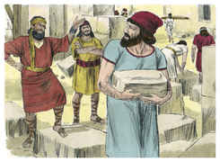
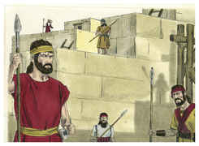
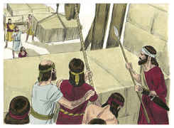

# Neemias Capítulo 4

## 1
E SUCEDEU que, ouvindo Sambalate que edificávamos o muro, ardeu em ira, e se indignou muito; e escarneceu dos judeus.

## 2
E falou na presença de seus irmãos, e do exército de Samaria, e disse: Que fazem estes fracos judeus? Permitir-se-lhes-á isto? Sacrificarão? Acabá-lo-ão num só dia? Vivificarão dos montões do pó as pedras que foram queimadas?

## 3
E estava com ele Tobias, o amonita, e disse: Ainda que edifiquem, contudo, vindo uma raposa, derrubará facilmente o seu muro de pedra.

## 4
Ouve, ó nosso Deus, que somos tão desprezados, e torna o seu opróbrio sobre a sua cabeça, e dá-os por presa, na terra do cativeiro.

## 5
E não cubras a sua iniqüidade, e não se risque de diante de ti o seu pecado, pois que te irritaram na presença dos edificadores.

## 6
Porém edificamos o muro, e todo o muro se fechou até sua metade; porque o coração do povo se inclinava a trabalhar.

## 7
E sucedeu que, ouvindo Sambalate e Tobias, e os árabes, os amonitas, e os asdoditas, que tanto ia crescendo a reparação dos muros de Jerusalém, que já as roturas se começavam a tapar, iraram-se sobremodo,

## 8
E ligaram-se entre si todos, para virem guerrear contra Jerusalém, e para os desviarem do seu intento.

## 9
Porém nós oramos ao nosso Deus e pusemos uma guarda contra eles, de dia e de noite, por causa deles.

## 10
Então disse Judá: Já desfaleceram as forças dos carregadores, e o pó é muito, e nós não poderemos edificar o muro.

## 11
Disseram, porém, os nossos inimigos: Nada saberão disto, nem verão, até que entremos no meio deles, e os matemos; assim faremos cessar a obra.

## 12
E sucedeu que, vindo os judeus que habitavam entre eles, dez vezes nos disseram: De todos os lugares, tornarão contra nós.

## 13
Então pus guardas nos lugares baixos por detrás do muro e nos altos; e pus ao povo pelas suas famílias com as suas espadas, com as suas lanças, e com os seus arcos.

## 14
E olhei, e levantei-me, e disse aos nobres, aos magistrados, e ao restante do povo: Não os temais; lembrai-vos do grande e terrível Senhor, e pelejai pelos vossos irmãos, vossos filhos, vossas mulheres e vossas casas.

## 15
E sucedeu que, ouvindo os nossos inimigos que já o sabíamos, e que Deus tinha dissipado o conselho deles, todos voltamos ao muro, cada um à sua obra.

## 16
E sucedeu que, desde aquele dia, metade dos meus servos trabalhava na obra, e metade deles tinha as lanças, os escudos, os arcos e as couraças; e os líderes estavam por detrás de toda a casa de Judá.

## 17
Os que edificavam o muro, os que traziam as cargas e os que carregavam, cada um com uma das mãos fazia a obra e na outra tinha as armas.

## 18
E os edificadores cada um trazia a sua espada cingida aos lombos, e edificavam; e o que tocava a trombeta estava junto comigo.

## 19
E disse eu aos nobres, aos magistrados e ao restante do povo: Grande e extensa é a obra, e nós estamos apartados do muro, longe uns dos outros.

## 20
No lugar onde ouvirdes o som da buzina, ali vos ajuntareis conosco; o nosso Deus pelejará por nós.

## 21
Assim trabalhávamos na obra; e metade deles tinha as lanças desde a subida da alva até ao sair das estrelas.

## 22
Também naquele tempo disse ao povo: Cada um com o seu servo fique em Jerusalém, para que à noite nos sirvam de guarda, e de dia na obra.

## 23
E nem eu, nem meus irmãos, nem meus servos, nem os homens da guarda que me seguiam largávamos as nossas vestes; cada um tinha suas armas e água.

