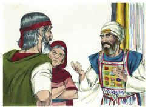
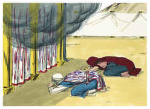
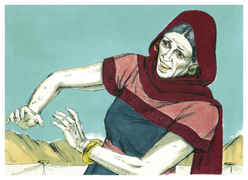

# Números Capítulo 12

1	E FALARAM Miriã e Arão contra Moisés, por causa da mulher cusita, com quem casara; porquanto tinha casado com uma mulher cusita.

2	E disseram: Porventura falou o Senhor somente por Moisés? Não falou também por nós? E o Senhor o ouviu.

3	E era o homem Moisés mui manso, mais do que todos os homens que havia sobre a terra.

4	E logo o Senhor disse a Moisés, a Arão e a Miriã: Vós três saí à tenda da congregação. E saíram eles três.

5	Então o Senhor desceu na coluna de nuvem, e se pôs à porta da tenda; depois chamou a Arão e a Miriã e ambos saíram.

6	E disse: Ouvi agora as minhas palavras; se entre vós houver profeta, eu, o Senhor, em visão a ele me farei conhecer, ou em sonhos falarei com ele.

7	Não é assim com o meu servo Moisés que é fiel em toda a minha casa.

8	Boca a boca falo com ele, claramente e não por enigmas; pois ele vê a semelhança do Senhor; por que, pois, não tivestes temor de falar contra o meu servo, contra Moisés?

9	Assim a ira do Senhor contra eles se acendeu; e retirou-se.

10	E a nuvem se retirou de sobre a tenda; e eis que Miriã ficou leprosa como a neve; e olhou Arão para Miriã, e eis que estava leprosa.

11	Por isso Arão disse a Moisés: Ai, senhor meu, não ponhas sobre nós este pecado, pois agimos loucamente, e temos pecado.

12	Ora, não seja ela como um morto, que saindo do ventre de sua mãe, a metade da sua carne já esteja consumida.

13	Clamou, pois, Moisés ao Senhor, dizendo: Ó Deus, rogo-te que a cures.

14	E disse o Senhor a Moisés: Se seu pai cuspira em seu rosto, não seria envergonhada sete dias? Esteja fechada sete dias fora do arraial, e depois a recolham.

15	Assim Miriã esteve fechada fora do arraial sete dias, e o povo não partiu, até que recolheram a Miriã.

16	Porém, depois o povo partiu de Hazerote; e acampou-se no deserto de Parã.

