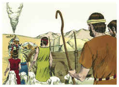
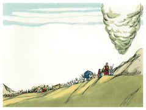

# Números Capítulo 21

## 1
OUVINDO o cananeu, rei de Arade, que habitava para o lado sul, que Israel vinha pelo caminho dos espias, pelejou contra Israel, e dele levou alguns prisioneiros.

## 2
Então Israel fez um voto ao Senhor, dizendo: Se de fato entregares este povo na minha mão, destruirei totalmente as suas cidades.

## 3
O Senhor, pois, ouviu a voz de Israel, e lhe entregou os cananeus; e os israelitas destruíram totalmente, a eles e às suas cidades; e o nome daquele lugar chamou Hormá.

## 4
Então partiram do monte Hor, pelo caminho do Mar Vermelho, a rodear a terra de Edom; porém a alma do povo angustiou-se naquele caminho.

## 5
E o povo falou contra Deus e contra Moisés: Por que nos fizestes subir do Egito para que morrêssemos neste deserto? Pois aqui nem pão nem água há; e a nossa alma tem fastio deste pão tão vil.

## 6
Então o Senhor mandou entre o povo serpentes ardentes, que picaram o povo; e morreu muita gente em Israel.

## 7
Por isso o povo veio a Moisés, e disse: Havemos pecado, porquanto temos falado contra o Senhor e contra ti; ora ao Senhor que tire de nós estas serpentes. Então Moisés orou pelo povo.

## 8
E disse o Senhor a Moisés: Faze-te uma serpente ardente, e põe-na sobre uma haste; e será que viverá todo o que, tendo sido picado, olhar para ela.

## 9
E Moisés fez uma serpente de metal, e pô-la sobre uma haste; e sucedia que, picando alguma serpente a alguém, quando esse olhava para a serpente de metal, vivia.

## 10
Então os filhos de Israel partiram, e alojaram-se em Obote.

## 11
Depois partiram de Obote e alojaram-se nos outeiros de Ije-Abarim, no deserto que está defronte de Moabe, ao nascente do sol.

## 12
Dali partiram, e alojaram-se junto ao ribeiro de Zerede.

## 13
E dali partiram e alojaram-se no lado de Arnom, que está no deserto e sai dos termos dos amorreus; porque Arnom é o termo de Moabe, entre Moabe e os amorreus.

## 14
Por isso se diz no livro das guerras do Senhor: O que fiz no Mar Vermelho e nos ribeiros de Arnom,

## 15
E à corrente dos ribeiros, que descendo para a situação de Ar, se encosta aos termos de Moabe.

## 16
E dali partiram para Beer; este é o poço do qual o Senhor disse a Moisés: Ajunta o povo e lhe darei água.

## 17
Então Israel cantou este cântico: Brota, ó poço! Cantai dele:

## 18
Tu, poço, que cavaram os príncipes, que escavaram os nobres do povo, e o legislador com os seus bordões; e do deserto partiram para Mataná;

## 19
E de Mataná a Naaliel, e de Naaliel a Bamote.

## 20
E de Bamote ao vale que está no campo de Moabe, no cume de Pisga, e à vista do deserto.

## 21
Então Israel mandou mensageiros a Siom, rei dos amorreus, dizendo:

## 22
Deixa-me passar pela tua terra; não nos desviaremos pelos campos nem pelas vinhas; as águas dos poços não beberemos; iremos pela estrada real até que passemos os teus termos.

## 23
Porém Siom não deixou passar a Israel pelos seus termos; antes Siom congregou todo o seu povo, e saiu ao encontro de Israel no deserto, e veio a Jaza, e pelejou contra Israel.

## 24
Mas Israel o feriu ao fio da espada, e tomou a sua terra em possessão, desde Arnom até Jaboque, até aos filhos de Amom; porquanto o termo dos filhos de Amom era forte.

## 25
Assim Israel tomou todas as cidades; e habitou em todas elas, em Hesbom e em todas as suas aldeias.

## 26
Porque Hesbom era cidade de Siom, rei dos amorreus, que tinha pelejado contra o precedente rei dos moabitas, e tinha tomado da sua mão toda a sua terra até Arnom.

## 27
Por isso dizem os que falam em provérbios: Vinde a Hesbom; edifique-se e estabeleça-se a cidade de Siom.

## 28
Porque fogo saiu de Hesbom, e uma chama da cidade de Siom; e consumiu a Ar dos moabitas, e os senhores dos altos de Arnom.

## 29
Ai de ti, Moabe! perdido és, povo de Quemós! entregou seus filhos, que iam fugindo, e suas filhas, como cativas a Siom, rei dos amorreus.

## 30
E nós os derribamos; Hesbom perdida é até Dibom, e os assolamos até Nofá, que se estende até Medeba.

## 31
Assim Israel habitou na terra dos amorreus.

## 32
Depois mandou Moisés espiar a Jazer, e tomaram as suas aldeias, e daquela possessão lançaram os amorreus que estavam ali.

## 33
Então viraram-se, e subiram o caminho de Basã; e Ogue, rei de Basã, saiu contra eles, ele e todo o seu povo, à peleja em Edrei.

## 34
E disse o Senhor a Moisés: Não o temas, porque eu o tenho dado na tua mão, a ele, e a todo o seu povo, e a sua terra, e far-lhe-ás como fizeste a Siom, rei dos amorreus, que habitava em Hesbom.

## 35
E de tal maneira o feriram, a ele e a seus filhos, e a todo o seu povo, que nenhum deles escapou; e tomaram a sua terra em possessão.

