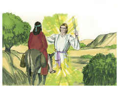
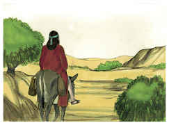
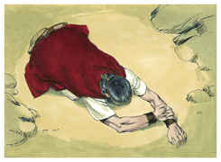
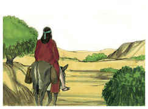

# Números Capítulo 22

1	DEPOIS partiram os filhos de Israel, e acamparam-se nas campinas de Moabe, além do Jordão na altura de Jericó.

2	Vendo, pois, Balaque, filho de Zipor, tudo o que Israel fizera aos amorreus,

3	Moabe temeu muito diante deste povo, porque era numeroso; e Moabe andava angustiado por causa dos filhos de Israel.

4	Por isso Moabe disse aos anciãos dos midianitas: Agora lamberá esta congregação tudo quanto houver ao redor de nós, como o boi lambe a erva do campo. Naquele tempo Balaque, filho de Zipor, era rei dos moabitas.

5	Este enviou mensageiros a Balaão, filho de Beor, a Petor, que está junto ao rio, na terra dos filhos do seu povo, a chamá-lo, dizendo: Eis que um povo saiu do Egito; eis que cobre a face da terra, e está parado defronte de mim.

6	Vem, pois, agora, rogo-te, amaldiçoa-me este povo, pois mais poderoso é do que eu; talvez o poderei ferir e lançar fora da terra; porque eu sei que, a quem tu abençoares será abençoado, e a quem tu amaldiçoares será amaldiçoado.

7	Então foram-se os anciãos dos moabitas e os anciãos dos midianitas com o preço dos encantamentos nas suas mãos; e chegaram a Balaão, e disseram-lhe as palavras de Balaque.

8	E ele lhes disse: Passai aqui esta noite, e vos trarei a resposta, como o Senhor me falar; então os príncipes dos moabitas ficaram com Balaão.

9	E veio Deus a Balaão, e disse: Quem são estes homens que estão contigo?

10	E Balaão disse a Deus: Balaque, filho de Zipor, rei dos moabitas, os enviou, dizendo:

11	Eis que o povo que saiu do Egito cobre a face da terra; vem agora, amaldiçoa-o; porventura poderei pelejar contra ele e expulsá-lo.

12	Então disse Deus a Balaão: Não irás com eles, nem amaldiçoarás a este povo, porquanto é bendito.

13	Então Balaão levantou-se pela manhã, e disse aos príncipes de Balaque: Ide à vossa terra, porque o Senhor recusa deixar-me ir convosco.

14	E levantaram-se os príncipes dos moabitas, e vieram a Balaque, e disseram: Balaão recusou vir conosco.

15	Porém Balaque tornou a enviar mais príncipes, mais honrados do que aqueles.

16	Os quais foram a Balaão, e lhe disseram: Assim diz Balaque, filho de Zipor: Rogo-te que não te demores em vir a mim.

17	Porque grandemente te honrarei, e farei tudo o que me disseres; vem pois, rogo-te, amaldiçoa-me este povo.

18	Então Balaão respondeu, e disse aos servos de Balaque: Ainda que Balaque me desse a sua casa cheia de prata e de ouro, eu não poderia ir além da ordem do Senhor meu Deus, para fazer coisa pequena ou grande;

19	Agora, pois, rogo-vos que também aqui fiqueis esta noite, para que eu saiba o que mais o Senhor me dirá.

20	Veio, pois, Deus a Balaão, de noite, e disse-lhe: Se aqueles homens te vieram chamar, levanta-te, vai com eles; todavia, farás o que eu te disser.

21	Então Balaão levantou-se pela manhã, e albardou a sua jumenta, e foi com os príncipes de Moabe.

22	E a ira de Deus acendeu-se, porque ele se ia; e o anjo do Senhor pôs-se-lhe no caminho por adversário; e ele ia caminhando, montado na sua jumenta, e dois de seus servos com ele.

23	Viu, pois, a jumenta o anjo do Senhor, que estava no caminho, com a sua espada desembainhada na mão; pelo que desviou-se a jumenta do caminho, indo pelo campo; então Balaão espancou a jumenta para fazê-la tornar ao caminho.

24	Mas o anjo do Senhor pôs-se numa vereda entre as vinhas, havendo uma parede de um e de outro lado.

25	Vendo, pois, a jumenta, o anjo do Senhor, encostou-se contra a parede, e apertou contra a parede o pé de Balaão; por isso tornou a espancá-la.

26	Então o anjo do Senhor passou mais adiante, e pôs-se num lugar estreito, onde não havia caminho para se desviar nem para a direita nem para a esquerda.

27	E, vendo a jumenta o anjo do Senhor, deitou-se debaixo de Balaão; e a ira de Balaão acendeu-se, e espancou a jumenta com o bordão.

28	Então o Senhor abriu a boca da jumenta, a qual disse a Balaão: Que te fiz eu, que me espancaste estas três vezes?

29	E Balaão disse à jumenta: Por que zombaste de mim; quem dera tivesse eu uma espada na mão, porque agora te mataria.

30	E a jumenta disse a Balaão: Porventura não sou a tua jumenta, em que cavalgaste desde o tempo em que me tornei tua até hoje? Acaso tem sido o meu costume fazer assim contigo? E ele respondeu: Não.

31	Então o Senhor abriu os olhos a Balaão, e ele viu o anjo do Senhor, que estava no caminho e a sua espada desembainhada na mão; pelo que inclinou a cabeça, e prostrou-se sobre a sua face.

32	Então o anjo do Senhor lhe disse: Por que já três vezes espancaste a tua jumenta? Eis que eu saí para ser teu adversário, porquanto o teu caminho é perverso diante de mim;

33	Porém a jumenta me viu, e já três vezes se desviou de diante de mim; se ela não se desviasse de diante de mim, na verdade que eu agora te haveria matado, e a ela deixaria com vida.

34	Então Balaão disse ao anjo do Senhor: Pequei, porque não sabia que estavas neste caminho para te opores a mim; e agora, se parece mal aos teus olhos, voltarei.

35	E disse o anjo do Senhor a Balaão: Vai-te com estes homens; mas somente a palavra que eu falar a ti, esta falarás. Assim Balaão se foi com os príncipes de Balaque.

36	Ouvindo, pois, Balaque que Balaão vinha, saiu-lhe ao encontro até à cidade de Moabe, que está no termo de Arnom, na extremidade do termo dele.

37	E Balaque disse a Balaão: Porventura não enviei diligentemente a chamar-te? Por que não vieste a mim? Não posso eu na verdade honrar-te?

38	Então Balaão disse a Balaque: Eis que eu tenho vindo a ti; porventura poderei eu agora de alguma forma falar alguma coisa? A palavra que Deus puser na minha boca, essa falarei.

39	E Balaão foi com Balaque, e chegaram a Quiriate-Huzote.

40	Então Balaque matou bois e ovelhas; e deles enviou a Balaão e aos príncipes que estavam com ele.

41	E sucedeu que, pela manhã Balaque tomou a Balaão, e o fez subir aos altos de Baal, e viu ele dali a última parte do povo.

