# Rute Capítulo 2

1	E TINHA Noemi um parente de seu marido, homem valente e poderoso, da família de Elimeleque; e era o seu nome Boaz.

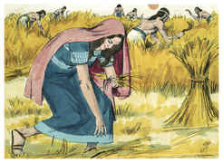

2	E Rute, a moabita, disse a Noemi: Deixa-me ir ao campo, e apanharei espigas atrás daquele em cujos olhos eu achar graça. E ela disse: Vai, minha filha.

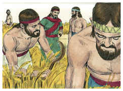

3	Foi, pois, e chegou, e apanhava espigas no campo após os segadores; e caiu-lhe em sorte uma parte do campo de Boaz, que era da família de Elimeleque.

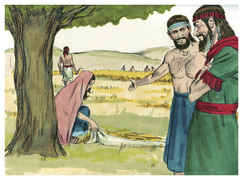

4	E eis que Boaz veio de Belém, e disse aos segadores: O Senhor seja convosco. E disseram-lhe eles: O Senhor te abençoe.

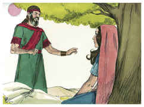

5	Depois disse Boaz a seu moço, que estava posto sobre os segadores: De quem é esta moça?

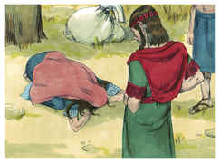

6	E respondeu o moço, que estava posto sobre os segadores, e disse: Esta é a moça moabita que voltou com Noemi dos campos de Moabe.

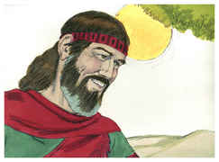

7	Disse-me ela: Deixa-me colher espigas, e ajuntá-las entre as gavelas após os segadores. Assim ela veio, e desde pela manhã está aqui até agora, a não ser um pouco que esteve sentada em casa.

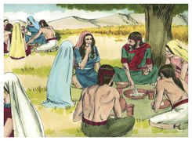

8	Então disse Boaz a Rute: Ouve, filha minha; não vás colher em outro campo, nem tampouco passes daqui; porém aqui ficarás com as minhas moças.

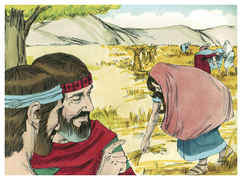

9	Os teus olhos estarão atentos no campo que segarem, e irás após elas; não dei ordem aos moços, que não te molestem? Tendo tu sede, vai aos vasos, e bebe do que os moços tirarem.

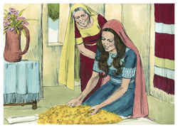

10	Então ela caiu sobre o seu rosto, e se inclinou à terra; e disse-lhe: Por que achei graça em teus olhos, para que faças caso de mim, sendo eu uma estrangeira?

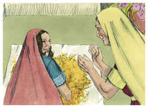

11	E respondeu Boaz, e disse-lhe: Bem se me contou quanto fizeste à tua sogra, depois da morte de teu marido; e deixaste a teu pai e a tua mãe, e a terra onde nasceste, e vieste para um povo que antes não conheceste.

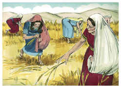

12	O Senhor retribua o teu feito; e te seja concedido pleno galardão da parte do Senhor Deus de Israel, sob cujas asas te vieste abrigar.

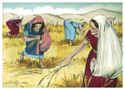

13	E disse ela: Ache eu graça em teus olhos, senhor meu, pois me consolaste, e falaste ao coração da tua serva, não sendo eu ainda como uma das tuas criadas.

14	E, sendo já hora de comer, disse-lhe Boaz: Achega-te aqui, e come do pão, e molha o teu bocado no vinagre. E ela se assentou ao lado dos segadores, e ele lhe deu do trigo tostado, e comeu, e se fartou, e ainda lhe sobejou.

15	E, levantando-se ela a colher, Boaz deu ordem aos seus moços, dizendo: Até entre as gavelas deixai-a colher, e não a censureis.

16	E deixai cair alguns punhados, e deixai-os ficar, para que os colha, e não a repreendais.

17	E esteve ela apanhando naquele campo até à tarde; e debulhou o que apanhou, e foi quase um efa de cevada.

18	E tomou-o, e veio à cidade; e viu sua sogra o que tinha apanhado; também tirou, e deu-lhe o que sobejara depois de fartar-se.

19	Então disse-lhe sua sogra: Onde colheste hoje, e onde trabalhaste? Bendito seja aquele que te reconheceu. E relatou à sua sogra com quem tinha trabalhado, e disse: O nome do homem com quem hoje trabalhei é Boaz.

20	Então Noemi disse à sua nora: Bendito seja ele do Senhor, que ainda não tem deixado a sua beneficência nem para com os vivos nem para com os mortos. Disse-lhe mais Noemi: Este homem é nosso parente chegado, e um dentre os nossos remidores.

21	E disse Rute, a moabita: Também ainda me disse: Com os moços que tenho te ajuntarás, até que acabem toda a sega que tenho.

22	E disse Noemi a sua nora: Melhor é, filha minha, que saias com as suas moças, para que noutro campo não te encontrem.

23	Assim, ajuntou-se com as moças de Boaz, para colher até que a sega das cevadas e dos trigos se acabou; e ficou com a sua sogra.

