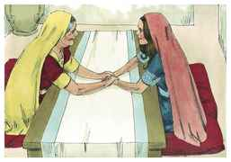
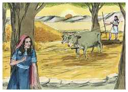
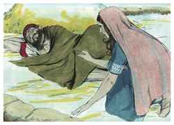
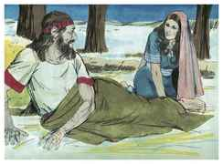
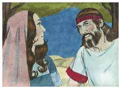

# Rute Capítulo 3

## 1
E DISSE-LHE Noemi, sua sogra: Minha filha, não hei de buscar descanso, para que fiques bem?

## 2
Ora, pois, não é Boaz, com cujas moças estiveste, de nossa parentela? Eis que esta noite padejará a cevada na eira.

## 3
Lava-te, pois, e unge-te, e veste os teus vestidos, e desce à eira; porém não te dês a conhecer ao homem, até que tenha acabado de comer e beber.

## 4
E há de ser que, quando ele se deitar, notarás o lugar em que se deitar; então entrarás, e descobrir-lhe-ás os pés, e te deitarás, e ele te fará saber o que deves fazer.

## 5
E ela lhe disse: Tudo quanto me disseres, farei.

## 6
Então foi para a eira, e fez conforme a tudo quanto sua sogra lhe tinha ordenado.

## 7
Havendo, pois, Boaz comido e bebido, e estando já o seu coração alegre, veio deitar-se ao pé de um monte de grãos; então veio ela de mansinho, e lhe descobriu os pés, e se deitou.

## 8
E sucedeu que, pela meia-noite, o homem estremeceu, e se voltou; e eis que uma mulher jazia a seus pés.

## 9
E disse ele: Quem és tu? E ela disse: Sou Rute, tua serva; estende pois tua capa sobre a tua serva, porque tu és o remidor.

## 10
E disse ele: Bendita sejas tu do Senhor, minha filha; melhor fizeste esta tua última benevolência do que a primeira, pois após nenhum dos jovens foste, quer pobre quer rico.

## 11
Agora, pois, minha filha, não temas; tudo quanto disseste te farei, pois toda a cidade do meu povo sabe que és mulher virtuosa.

## 12
Porém agora é verdade que eu sou remidor, mas ainda outro remidor há mais chegado do que eu.

## 13
Fica-te aqui esta noite, e será que, pela manhã, se ele te redimir, bem está, que te redima; porém, se não quiser te redimir, vive o Senhor, que eu te redimirei. Deita-te aqui até amanhã.

## 14
Ficou-se, pois, deitada a seus pés até pela manhã, e levantou-se antes que pudesse um conhecer o outro, porquanto ele disse: Não se saiba que alguma mulher veio à eira.

## 15
Disse mais: Dá-me a capa que tens sobre ti, e segura-a. E ela a segurou; e ele mediu seis medidas de cevada, e lhas pôs em cima; então foi para a cidade.

## 16
E foi à sua sogra, que lhe disse: Como foi, minha filha? E ela lhe contou tudo quanto aquele homem lhe fizera.

## 17
Disse mais: Estas seis medidas de cevada me deu, porque me disse: Não vás vazia à tua sogra.

## 18
Então disse ela: Espera, minha filha, até que saibas como irá o caso, porque aquele homem não descansará até que conclua hoje este negócio.

