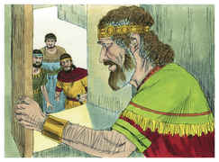

# Salmos Capítulo 23

## 1
O SENHOR é o meu pastor, nada me faltará.

## 2
Deitar-me faz em verdes pastos, guia-me mansamente a águas tranqüilas.

## 3
Refrigera a minha alma; guia-me pelas veredas da justiça, por amor do seu nome.

## 4
Ainda que eu andasse pelo vale da sombra da morte, não temeria mal algum, porque tu estás comigo; a tua vara e o teu cajado me consolam.

## 5
Preparas uma mesa perante mim na presença dos meus inimigos, unges a minha cabeça com óleo, o meu cálice transborda.

## 6
Certamente que a bondade e a misericórdia me seguirão todos os dias da minha vida; e habitarei na casa do Senhor por longos dias.

