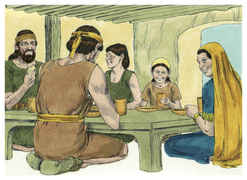

# Salmos Capítulo 31

1	EM ti, Senhor, confio; nunca me deixes confundido. Livra-me pela tua justiça.

2	Inclina para mim os teus ouvidos, livra-me depressa; sê a minha firme rocha, uma casa fortíssima que me salve.

3	Porque tu és a minha rocha e a minha fortaleza; assim, por amor do teu nome, guia-me e encaminha-me.

4	Tira-me da rede que para mim esconderam, pois tu és a minha força.

5	Nas tuas mãos encomendo o meu espírito; tu me redimiste, Senhor Deus da verdade.

6	Odeio aqueles que se entregam a vaidades enganosas; eu, porém, confio no Senhor.

7	Eu me alegrarei e regozijarei na tua benignidade, pois consideraste a minha aflição; conheceste a minha alma nas angústias.

8	E não me entregaste nas mãos do inimigo; puseste os meus pés num lugar espaçoso.

9	Tem misericórdia de mim, ó Senhor, porque estou angustiado. Consumidos estão de tristeza os meus olhos, a minha alma e o meu ventre.

10	Porque a minha vida está gasta de tristeza, e os meus anos de suspiros; a minha força descai por causa da minha iniqüidade, e os meus ossos se consomem.

11	Fui opróbrio entre todos os meus inimigos, até entre os meus vizinhos, e horror para os meus conhecidos; os que me viam na rua fugiam de mim.

12	Estou esquecido no coração deles, como um morto; sou como um vaso quebrado.

13	Pois ouvi a murmuração de muitos, temor havia ao redor; enquanto juntamente consultavam contra mim, intentaram tirar-me a vida.

14	Mas eu confiei em ti, Senhor; e disse: Tu és o meu Deus.

15	Os meus tempos estão nas tuas mãos; livra-me das mãos dos meus inimigos e dos que me perseguem.

16	Faze resplandecer o teu rosto sobre o teu servo; salva-me por tuas misericórdias.

17	Não me deixes confundido, Senhor, porque te tenho invocado. Deixa confundidos os ímpios, e emudeçam na sepultura.

18	Emudeçam os lábios mentirosos que falam coisas más com soberba e desprezo contra o justo.

19	Oh! quão grande é a tua bondade, que guardaste para os que te temem, a qual operaste para aqueles que em ti confiam na presença dos filhos dos homens!

20	Tu os esconderás, no secreto da tua presença, dos desaforos dos homens; encobri-los-ás em um pavilhão, da contenda das línguas.

21	Bendito seja o Senhor, pois fez maravilhosa a sua misericórdia para comigo em cidade segura.

22	Pois eu dizia na minha pressa: Estou cortado de diante dos teus olhos; não obstante, tu ouviste a voz das minhas súplicas, quando eu a ti clamei.

23	Amai ao Senhor, vós todos que sois seus santos; porque o Senhor guarda os fiéis e retribui com abundância ao que usa de soberba.

24	Esforçai-vos, e ele fortalecerá o vosso coração, vós todos que esperais no Senhor.

