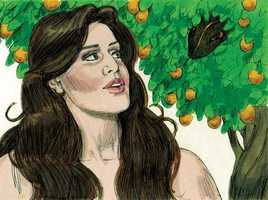
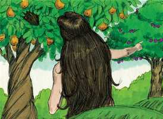
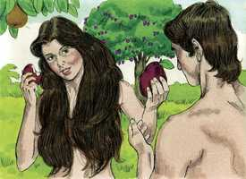
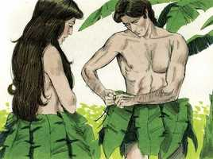
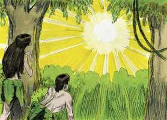
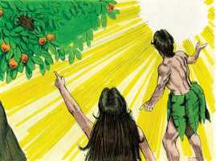
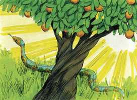
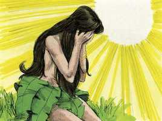
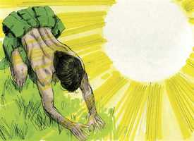
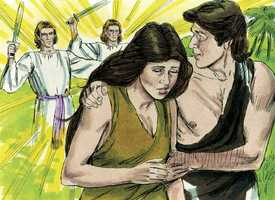

# Gênesis Cap 03

**1** 	ORA, a serpente era mais astuta que todas as alimárias do campo que o Senhor Deus tinha feito. E esta disse à mulher: É assim que Deus disse: Não comereis de toda a árvore do jardim?

> **Cmt MHenry**: *Versículos 1-5* Satanás atacou a nossos primeiros pais para conduzi-los a pecar; a tentação lhes resultou fatal. O tentador foi o diabo, na forma e semelhança de uma serpente. O plano de Satanás era arrastar a nossos primeiros pais ao pecado e assim, pôr separação entre eles e seu Deus. deste modo o diabo foi desde o começo um homicida e grande operador de maldades. A pessoa tentada foi a mulher: a tática de Satanás foi começar uma conversação com ela enquanto estava sozinha. Há muitas tentações nas que o estar a sós dá grande vantagem ao tentador; em vez disso, a comunhão dos santos cuida em grande medida a fortaleza e seguridade deles. Satanás levou vantagem ao achar a mulher sozinha perto da árvore proibida. Satanás tentou a Eva para, através dela, poder tentar a Adão. Sua tática é enviar as tentações por meios dos que não suspeitamos, e através dos que têm maior influência sobre nós. Satanás pôs em dúvida se era ou não pecado comer desta árvore. Não deixou ao descoberto seu desígnio ao começo, mas apresentou uma pergunta que parecia inocente. Quem quiser estar a salvo deve cuidar-se de não falar com o tentador. Citou errado o mandamento. Ele falou em forma sarcástica. O diabo, assim como é de mentiroso, é também um escarnecedor desde o princípio; e os escarnecedores são seus filhos. A arte de Satanás em falar da lei divina como duvidosa ou irracional e, assim, atrai a gente ao pecado; nossa sabedoria consiste em manter firme nossa crença no mandamento de Deus e um elevado respeito por Ele. É assim então que Deus disse: "Não mentirás, não tomarás seu nome em vão, não te embriagarás, etc.?" Sim, estou bem seguro de que disse isso, e está bem dito; e, por Sua graça, eu o cumprirei. O iniciar esta conversa com a serpente foi a fraqueza de Eva: por sua pergunta deveria ter percebido que não tinha boas intenções e, portanto, deveria ter retrocedido. Satanás ensina primeiro aos homens a duvidar e, depois, a negar. Promete-lhes benefícios se comem deste fruto, seu objetivo é introduzir o descontentamento com seu estado presente, como se não for bom como poderia e deveria ser. Nenhum estado por si mesmo dará felicidade a menos que a mente seja colocada nisso. Os tenta para que busquem ascender, como se fossem dignos de serem deuses. Satanás se arruinou a si mesmo quando desejou ser como o Altíssimo; depois, procurou infestar a nossos primeiros pais com o mesmo desejo para arruiná-los também. O diabo continua ainda atraindo as pessoas a sua esfera de interesse, sugerindo-lhes pensamentos perversos acerca de Deus e falsas esperanças de conseguirem benefícios por meio do pecado. Portanto, pensemos sempre bem de Deus como o sumo bem, e pensemos mal do pecado como o sumo mal: assim resistiremos ao diabo e ele fugirá de nós.

 

**2** 	E disse a mulher à serpente: Do fruto das árvores do jardim comeremos,

 

**3** 	Mas do fruto da árvore que está no meio do jardim, disse Deus: Não comereis dele, nem nele tocareis para que não morrais.

> **Cmt MHenry**: *CAPÍTULO 30A-Am 31A-Ob 32A-Jn 33A-Mq 34A-Na 35A-Hc 36A-Sf 37A-Ag 38A-Zc 39A-Ml

**4** 	Então a serpente disse à mulher: Certamente não morrereis.

 

**5** 	Porque Deus sabe que no dia em que dele comerdes se abrirão os vossos olhos, e sereis como Deus, sabendo o bem e o mal.

**6** 	E viu a mulher que aquela árvore era boa para se comer, e agradável aos olhos, e árvore desejável para dar entendimento; tomou do seu fruto, e comeu, e deu também a seu marido, e ele comeu com ela.

> **Cmt MHenry**: *Versículos 6-8* Observe os passos da transgressão: não são passos ascendentes, senão descendentes, rumo ao abismo. 1) *Ela viu*. Uma grande quantidade de pecado vem pelos olhos. Não atentemos para aquilo que traz consigo o risco de estimular a concupiscência ([Mt 5.28](../40N-Mt/05.md#28)). 2) *Ela tomou*. Foi seu próprio ato e obra. Satanás pode tentar mas não pode obrigar; pode persuadir-nos a que nos lancemos ao precipício, porém não pode lançar-nos ([Mt 4.6](../40N-Mt/04.md#6)). 3) *Ela comeu*. Quando olhou talvez não tivesse intenção de tomá-lo; ou quando o pegou, que não tivesse a intenção de comer; porém, acabou nisso. É sabedoria deter os primeiros movimentos do pecado, e abandoná-lo antes de ver-se comprometido com ele. 4) *Deu também a seu marido*. Os que têm feito mal, estão dispostos a arrastar consigo a outros a fazerem o mesmo. 5) *Ele comeu*. Ao não levar em conta a árvore da vida, do qual lhe era permitido comer, e ao comer da árvore do conhecimento do bem e do mal, que estava proibido, Adão claramente mostra seu desprezo pelo que Deus tinha-lhe outorgado, e seu desejo pelo que Deus considerou prudente não dar-lhe. Desejava ter o que queria e fazer o que lhe aprazer. Em uma palavra, seu pecado foi a desobediência ([Rm 5.19](../45N-Rm/05.md#19)); a desobediência a um mandado claro, simples e expresso. Não tinha uma natureza pecaminosa que o traísse; em vez disso tinha liberdade de vontade, com toda sua força, não enfraquecida nem desequilibrada. Afastou-se com muita presteza. Arrastou a toda sua posteridade no pecado e na miséria. Então, quem pode dizer que o pecado de Adão em si causou pouco dano? Já era demasiado tarde, quando Adão e Eva viram a tolice de comer a fruta proibida. Viram a felicidade da qual caíram e a miséria em que afundaram. Viram um Deus amante irritado, e a perda de sua graça e seu favor. Veja-se aqui que desonra e transtorno provoca o pecado; faz maldade onde quer que se introduza e destrói todo consolo. Cedo ou tarde acarreta a vergonha; seja a vergonha do arrependimento verdadeiro, que termina em glória, ou a vergonha e confusão perpétua, na qual despertarão os malvados no grande dia. Veja-se aqui em que consiste correntemente a idiotice dos que pecaram. Cuidam mais de salvar seu crédito ante os homens que de obterem o perdão de Deus. As escusas que dão os homens para cobrirem e restar importância a seus pecados são vãs e frívolas; assim como os aventais de folhas de figueira que se fizeram não conseguiram melhorar as coisas: não obstante, todos temos a tradição de cobrir as nossas transgressões como Adão. Antes de pecar, eles acolhiam com gozo humilde as bondosas visitas de Deus; agora Ele se convertia num terror para eles. Não cabe assombrar-se de que se convertessem em terror para si mesmos e se enchessem de confusão. Isto mostra a falsidade do tentador e a fraude de suas tentações. Satanás prometeu que estariam a salvo, porém, eles não podem nem pensar que seja assim! Adão e Eva eram, agora, consoladores infelizes o um para o outro!

 

**7** 	Então foram abertos os olhos de ambos, e conheceram que estavam nus; e coseram folhas de figueira, e fizeram para si aventais.

 

**8** 	E ouviram a voz do Senhor Deus, que passeava no jardim pela viração do dia; e esconderam-se Adão e sua mulher da presença do Senhor Deus, entre as árvores do jardim.

 

**9** 	E chamou o Senhor Deus a Adão, e disse-lhe: Onde estás?

> **Cmt MHenry**: *Versículos 9-13* Observe a surpreendente pergunta: "Adão, onde você está?" Aqueles que se descaminham de Deus pelo pecado devem considerar seriamente onde estão: estão longe de todo bem, em meio de seus inimigos, escravizados a Satanás, e no caminho real à ruína total. Esta ovelha perdida teria vagueado sem fim se o bom Pastor não a tiver procurado e lhe tiver dito que o lugar onde estava descaminhada, não poderia ser fácil nem cômodo. Se os pecadores quisessem considerar onde estão, não descansariam até regressar a Deus. É falha e tolice comum dos que têm agido errado, quando perguntados ao respeito, reconhecer somente o que é tão evidente que não pode ser negado. Como Adão, temos razão para ter medo de aproximados a Deus se não estamos cobertos e vestidos com a justiça de Cristo. o pecado aparece mais claro no espelho do mandamento, e assim, Deus o colocou ante Adão; e nesse espelho devemos olhar nosso rosto. Porém, em lugar de reconhecer o pecado em toda sua magnitude, e assumir a vergonha neles mesmos, Adão e Eva justificaram o pecado e carregaram a vergonha e a culpa em outros. nos que são tentados existe uma estranha tradição a dizer que são tentados por Deus; como se nosso abuso dos dons de Deus desculpasse nossa transgressão das leis de Deus. Os que estão prestes a aceitar o prazer e lucro do pecado, são lerdos para assumirem a culpa e a vergonha disso. Aprendamos, então, que as tentações de Satanás são todas seduções; seus argumentos, todos enganosos; seus incentivos, todas armadilhas; quando fala bem, não devemos acreditar nele. É pelo engano do pecado que o coração se endurece. Veja [Romanos 7.11](../45N-Rm/07.md#11), [Hebreus 3.13](../58N-Hb/03.md#13). Embora a sutileza de Satanás pudesse arrastar-nos ao pecado, de jeito nenhum nos justifica que estejamos no pecado. Ainda que ele é o tentador, nós somos os pecadores. Que não diminua nosso pesar pelo pecado ao qual tenhamos sido enganados; antes, que aumente nossa indignação conosco por termos permitido sermos enganados por um conhecido vigarista e inimigo juramentado, que deseja a destruição de nossa alma.

 

**10** 	E ele disse: Ouvi a tua voz soar no jardim, e temi, porque estava nu, e escondi-me.

**11** 	E Deus disse: Quem te mostrou que estavas nu? Comeste tu da árvore de que te ordenei que não comesses?

**12** 	Então disse Adão: A mulher que me deste por companheira, ela me deu da árvore, e comi.

**13** 	E disse o Senhor Deus à mulher: Por que fizeste isto? E disse a mulher: A serpente me enganou, e eu comi.

**14** 	Então o Senhor Deus disse à serpente: Porquanto fizeste isto, maldita serás mais que toda a fera, e mais que todos os animais do campo; sobre o teu ventre andarás, e pó comerás todos os dias da tua vida.

> **Cmt MHenry**: *Versículos 14-15* Deus dita sentença; e começa onde começou o pecado, com a serpente. Os instrumentos do diabo devem partilhar os castigos do diabo. Sob o disfarce da serpente, o diabo é sentenciado a ser degradado e amaldiçoado por Deus; detestado e aborrecido por toda a humanidade: também a ser destruído e arruinado, a final, pelo grande Redentor, coisa significada pelo esmagamento de sua cabeça. Declara-se a guerra entre a Semente da mulher e a semente da serpente. O fruto desta inimizade é que haja uma guerra contínua entre a graça e a corrupção nos corações do Povo de Deus. o céu e o inferno nunca podem ser reconciliados, tampouco a luz e as trevas; não mais que Satanás e uma alma santificada. Além disso, existe uma luta contínua entre os malvados e os santos deste mundo. É feita uma promessa bondosa sobre Cristo, como o libertador do homem caído do poder de Satanás. Esta era a aurora do dia do evangelho: tão logo como foi feita a ferida, foi provido e se revelou o remédio. Esta bondosa revelação de um Salvador chegou sem que a pedissem nem a procurassem. Sem uma revelação de misericórdia, que dá esperanças de perdão, o pecador convicto afundaria no desespero e se endureceria. Pela fé nesta promessa foram justificados e salvos nossos primeiros pais, e os patriarcas anteriores ao dilúvio. São dados detalhes sobre Cristo: 1) *Sua encarnação ou vinda na carne*. Que seu Salvador seja a Semente da mulher, osso de nosso osso, dá grande ânimo aos pecadores ([Hb 2.11](../58N-Hb/02.md#11),[14](../58N-Hb/02.md#14)). 2) *Seus sofrimentos e* *morte*, indicados em que Satanás feriria seu calcanhar, isto é, sua natureza humana. Os sofrimentos de Cristo continuam nos sofrimentos dos santos por seu nome. O diabo os tenta, os persegue e os mata; e assim fere o calcanhar de Cristo, que é afligido nas aflições dos santos. todavia, enquanto o calcanhar é ferido na terra, a Cabeça está noção céu. 3) *Sua vitória sobre Satanás*. Cristo frustrou as tentações de Satanás, resgatou almas de suas mãos. Por sua morte assestou um golpe final ao reino do diabo, uma ferida incurável na cabeça desta serpente. A medida que o evangelho ganha terreno, Satanás cai.

 

**15** 	E porei inimizade entre ti e a mulher, e entre a tua semente e a sua semente; esta te ferirá a cabeça, e tu lhe ferirás o calcanhar.

**16** 	E à mulher disse: Multiplicarei grandemente a tua dor, e a tua conceição; com dor darás à luz filhos; e o teu desejo será para o teu marido, e ele te dominará.

> **Cmt MHenry**: *Versículos 16-19* Por seu pecado, a mulher é condenada a um estado de pesar e submissão; castigo adequado desse pecado em que ela procurou satisfazer a concupiscência dos olhos e da carne, e seu orgulho. O pecado trouxe dor ao mundo; fez do mundo um vale de lágrimas. Não é de estranhar que nossas dores se multipliquem quando nossos pecados se multiplicam. Ele se apoderará de você, é somente o mandamento de Deus: esposas, submetam-se a seus maridos. Se o homem não tiver pecado, sempre se teria feito senhor com sabedoria e amor; se a mulher não tivesse pecado, ela sempre teria obedecido com humilde e mansidão. Adão culpou a sua esposa, e embora tivesse sido uma falta dela o convencê-lo para que comesse do fruto proibido, foi falta de Adão tê-la obedecido. Assim que as frívolas escusas dos homens se tornarão em sua contra no dia do juízo de Deus. Deus pôs marcas de desagrado em Adão. 1) *Amaldiçoa sua habitação*. Deus deu a terra aos filhos dos homens para que fosse uma morada cômoda, mas agora está maldita pelo pecado do homem. Contudo, Adão mesmo não é amaldiçoado, como o foi a serpente, senão tão só o solo, por amor a ele. 2) *Seus esforços e prazeres lhe são amargos*. O trabalho é nosso dever e devemos realizá-lo fielmente; é parte da sentença do homem, coisa que a ociosidade desafia atrevidamente. O incômodo e o cansaço no trabalho são nosso justo castigo, ao qual devemos submeter-nos com paciência, já que são menos que o merecido por nossa iniqüidade. O alimento do homem se tornará desagradável. Contudo, o homem não é sentenciado a comer pó como a serpente, senão somente a comer a erva do campo. 3) sua vida também é encurtada. Porém, considerando quão cheios de problemas estão seus dias, é um favor que sejam poucos. A morte é espantosa por natureza, apesar de que a vida é desagradável, e com isso conclui o castigo. O pecado introduziu a morte no mundo: se Adão não tiver pecado, não teria morrido. Ele cedeu à tentação, mas o Salvador a resistiu. Quão admiravelmente a satisfação de nosso Senhor Jesus, por sua morte e sofrimentos, respondeu à sentença ditada contra nossos primeiros pais! Entraram as dores de parta a causa do pecado? Lemos do fruto da aflição da alma de Cristo, ([Is 53.11](../23A-Is/53.md#11)), e as dores da morte que o retiveram são assim chamadas ([At 2.24](../44N-At/02.md#24)). Entrou para permanecer embaixo do pecado? Cristo nasceu sob a lei ([Gl 4.4](../48N-Gl/04.md#4)). Entrou maldição com o pecado? Cristo foi feito maldição por nós, e morreu uma morte maldita ([Gl 3.13](../48N-Gl/03.md#13)). Vieram os espinhos com o pecado? Ele foi coroado com espinhos por nós. Chegou a dor com o pecado? Ele suou por nós, e seu suor foi como grandes gotas de sangue. Chegou a dor com o pecado? Ele foi um varão de dores; em sua agonia sua alma esteve sobremodo dolorida. Veio a morte com o pecado? Ele se fez obediente até a morte. Assim, a bandagem é tão grande quanto a ferida. Bendito seja Deus por seu Filho, nosso Senhor Jesus Cristo.

 

**17** 	E a Adão disse: Porquanto deste ouvidos à voz de tua mulher, e comeste da árvore de que te ordenei, dizendo: Não comerás dela, maldita é a terra por causa de ti; com dor comerás dela todos os dias da tua vida.

 

**18** 	Espinhos, e cardos também, te produzirá; e comerás a erva do campo.

**19** 	No suor do teu rosto comerás o teu pão, até que te tornes à terra; porque dela foste tomado; porquanto és pó e em pó te tornarás.

**20** 	E chamou Adão o nome de sua mulher Eva; porquanto era a mãe de todos os viventes.

> **Cmt MHenry**: *Versículos 20-21* Deus deu nome ao homem e o chamou Adão, que significa *terra vermelha*; Adão deu nome à mulher e a chamou Eva, isto é, *vida*. Adão leva o nome do corpo mortal, Eva o da ama viva. Provavelmente Adão tenha levado em conta a bênção de um Redentor, a Semente prometida, ao chamar Eva ou vida a sua esposa; pois Ele seria a vida de todos os crentes, e nEle seriam abençoadas todas as famílias da terra. Veja-se, também, o cuidado de Deus por nossos primeiros pais, as fez agasalhantes e fortes, rústicas e muito simples; não mantos de escarlate, senão túnicas de peles. Tendo comida e abrigo, fiquem contentes; eles estão tão bem como Adão e Eva. Que aqueles que estão finalmente vestidos, aprendam a não fazer das vestimentas seu ornamento. Supõe-se que as bestas, de cujas peles Deus os vestiu, foram mortas não para comida do homem, senão para sacrifício, para tipificar Cristo, o grande Sacrifício. Adão e Eva se fizeram aventais de folhas de figueira, cobertura demasiado estreita para envolvê-los ([Is 28.20](../23A-Is/28.md#20)). tais são todos os trapos de nossa justiça própria. Mas Deus lhes fez túnicas de peles, grandes, firmes, duradouras e de sua medida: tal é a justiça de Cristo; portanto, vistam-se do Senhor Jesus Cristo.

**21** 	E fez o Senhor Deus a Adão e à sua mulher túnicas de peles, e os vestiu.

**22** 	Então disse o Senhor Deus: Eis que o homem é como um de nós, sabendo o bem e o mal; ora, para que não estenda a sua mão, e tome também da árvore da vida, e coma e viva eternamente,

> **Cmt MHenry**: *Versículos 22-24* Deus expulsou o homem; lhe disse que já não devir ocupar nem desfrutar esse jardim: mas o homem gostava daquele lugar e não estava disposto a sair, portanto Deus o fez partir. Isto significou a exclusão dele e de toda sua raça culpável da comunhão com Deus, que era a bênção e a glória do paraíso. Porém o homem foi enviado a lavrar o solo do qual fora tomado. Ele foi enviado a um lugar de árduo trabalho, não a um lugar de tormento. Nossos primeiros pais foram excluídos dos privilégios de seu estado de inocência, embora não foram livrados ao desespero. Foi fechado o caminho a árvore da vida. Daí em diante seria em vão que ele e os seus esperassem retidão, vida e felicidade pela aliança de obras; porque ao quebrantar o mandamento dessa aliança, sua maldição cobra plena vigência: somos todos destruídos se somos julgados por essa aliança. Deus revelou isto a Adão, não para levá-lo ao desespero, senão para animá-lo a buscar a vida e a felicidade na Semente prometida, por quem se abre ante nós um caminho novo e vivo para o Lugar Santíssimo. "

**23** 	O Senhor Deus, pois, o lançou fora do jardim do Éden, para lavrar a terra de que fora tomado.

**24** 	E havendo lançado fora o homem, pôs querubins ao oriente do jardim do Éden, e uma espada inflamada que andava ao redor, para guardar o caminho da árvore da vida.

 

> **Cmt MHenry** Intro: *• Versículos 1-5*> *A serpente engana a Eva*> *• Versículos 6-8*> *Adão e Eva transgridem o mandamento divino, e caem no*> *pecado e na miséria*> *• Versículos 9-13*> *Deus chama a Adão e Eva para que respondam*> *• Versículos 14-15*> *Maldição para a serpente – A Semente prometida*> *• Versículos 16-19*> *O castigo da humanidade*> *• Versículos 20-21*> *A primeira vestimenta da humanidade*> *• Versículos 22-24*> *Adão e Eva são expulsos do paraíso*