# Gênesis Cap 04

**1** 	E CONHECEU Adão a Eva, sua mulher, e ela concebeu e deu à luz a Caim, e disse: Alcancei do Senhor um homem.

> **Cmt MHenry**: *Versículos 1-7* Quando nasceu Caim, Eva disse: "Gerei um varão do Senhor". Talvez pensou que era a semente prometida. De ser assim, teve uma amarga desilusão. Abel significa *vaidade*: quando ela pensou que tinha a semente prometida em Caim, cujo nome significa *possessão*, ele se absorveu tanto com ele que outro filho era como vaidade para ela. Note-se que cada filho tinha um chamamento. A vontade de Deus para todos é que cada um tenha algo que fazer neste mundo. Os pais devem criar a seus filhos para que trabalhem. "Lhes dê uma Bíblia e um chamamento", dizia o bom senhor Dod, e Deus seja com eles. Podemos supor que, depois da queda, Deus mandou a Adão que derramasse o sangue de animais *inocentes* e, uma vez mortos, queimasse parte ou todos os corpos com fogo. Assim foram prefigurados o castigo que merecem os pecadores, isto é, a morte do corpo e a ira de d., da qual o fogo é um emblema bem conhecido, além dos sofrimentos de Cristo. Observe que a adoração religiosa de Deus não é um invento novo. foi desde o começo; é o *bom caminho antigo* ([Jr 6.16](../24A-Jr/06.md#16)). As ofertas de Caim e Abel foram diferentes. Caim demonstrou um orgulhoso coração incrédulo. Em conseqüência, ele e sua oferta foram rejeitados. Abel chegou em qualidade de pecador e, conforme com o estabelecido por Deus, por meio de seu sacrifício expressava humildade, sinceridade, obediência e fé. deste modo, ao buscar o benefício da nova aliança de misericórdia, por meio da Semente prometida, seu sacrifício tinha uma expressão que Deus aceitou. Abel ofereceu *em fé*, mas não Caim ([Hb 11.4](../58N-Hb/11.md#4)). Em todas as épocas tem havido duas classes de adoradores, à maneira de Caim e Abel; a saber, os orgulhosos e endurecidos que desprezam o método da salvação do evangelho, que tentam agradar a Deus com métodos desenhados por eles mesmos; e os crentes humildes que se aproximam dEle pelo caminho que Ele lhes revelou. Caim entregou-se à ira maligna contra Abel. Albergou um espírito maligno de descontentamento e rebelião contra Deus. Deus percebe todas as nossas paixões e desagrados pecaminosos. Não há olhar de raiva, inveja ou de aborrecimento que fuja a seu olho vigilante. O Senhor arrazoou com este homem rebelde; se tomar o caminho certo, seria aceito. Alguns entendem isto como um anúncio de misericórdia. "Se não fizer isto bem, o pecado, isto é, a oferta pelo pecado, está a porta e você pode se beneficiar dela". A mesma palavra significa pecado e sacrifício pelo pecado. "Embora não o tenhas feito bem, não desesperes ainda; o remédio está perto". É dito que Cristo, a grande oferta pelo pecado, está na porta ([Ap 3.20](../66N-Ap/03.md#20)). bem merecem perecer em seus pecados os que não vão à porta a pedir o benefício desta oferta pelo pecado. A aceitação da oferta de Abel por parte de Deus, não mudou o direito de primogenitura fazendo-o seu; então, por que haveria de irritar-se Caim? Os arrebatamentos e inquietudes pecaminosas se esvaecem quando se procura em forma estrita e justa a causa.

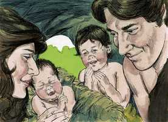 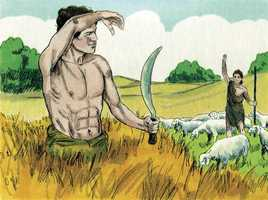 

**2** 	E deu à luz mais a seu irmão Abel; e Abel foi pastor de ovelhas, e Caim foi lavrador da terra.

**3** 	E aconteceu ao cabo de dias que Caim trouxe do fruto da terra uma oferta ao Senhor.

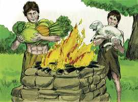 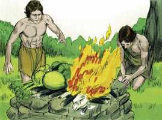 

**4** 	E Abel também trouxe dos primogênitos das suas ovelhas, e da sua gordura; e atentou o Senhor para Abel e para a sua oferta.

> **Cmt MHenry**: *CAPÍTULO 40N-Mt 41N-Mc 42N-Lc 43N-Joa 44N-At 45N-Rm 46N-1Co 47N-2Co 48N-Gl 49N-Ef

**5** 	Mas para Caim e para a sua oferta não atentou. E irou-se Caim fortemente, e descaiu-lhe o semblante.

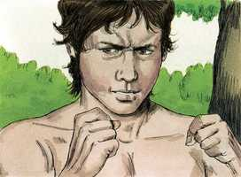 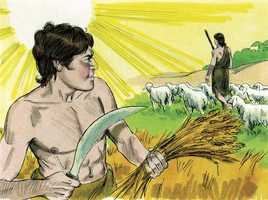 

**6** 	E o Senhor disse a Caim: Por que te iraste? E por que descaiu o teu semblante?

**7** 	Se bem fizeres, não é certo que serás aceito? E se não fizeres bem, o pecado jaz à porta, e sobre ti será o seu desejo, mas sobre ele deves dominar.

**8** 	E falou Caim com o seu irmão Abel; e sucedeu que, estando eles no campo, se levantou Caim contra o seu irmão Abel, e o matou.

> **Cmt MHenry**: *Versículos 8-15* A maldade do coração termina no assassinato realizado com as mãos. Caim matou Abel, seu próprio irmão, o filho de sua própria mãe, a quem deveria ter amado; a seu irmão menor, a quem deveria ter protegido; um irmão bom, que nunca tinha feito nada de errado. Que efeitos fatais do pecado de nossos primeiros pais foram estes, e como devem ter-se enchido de angústia seus corações! Observe o orgulho, a incredulidade e a soberba de Caim. Nega o crime, como se pudesse ocultá-lo de Deus. Trata de encobrir o homicídio deliberado com uma mentira deliberada. O assassinato é um pecado que clama. O sangue pede sangue, o sangue do assassino pelo sangue do assassinado. Quem conhece o alcance e o peso de uma maldição divina, quão longe chega, quão profundo penetra? Os crentes se salvam dela somente em Cristo, e herdam a bênção. Caim foi amaldiçoado pela terra. Ele achou seu castigo ali onde escolheu sua sorte e depositou seu coração. Toda criatura é para nós o que Deus a fizer, um consolo ou uma cruz, uma bênção ou uma maldição. A maldade do perverso traz maldição a todo o que faz e a todo o que tem. Caim se queixa, não de seu pecado, senão de seu castigo. Mostra-se grande dureza de coração quando nos preocupam mais nossos sofrimentos que nossos pecados. Deus tem propósitos sábios e santos ao prolongar as vidas até dos piores homens. Vão é inquirir qual foi o sinal colocado sobre Caim. Sem dúvida era conhecido tanto como marca de infâmia sobre Caim, e como sinal de Deus para que não o matassem. Abel falava ainda estando morto. Fala da odiosa culpa do crime e nos avisa que devemos reprimir os primeiros acessos de ira, e nos ensina que o justo deve esperar perseguição. Também, que existe um estado futuro e uma recompensa eterna para desfrutar, pela fé em Cristo e em seu sacrifício expiatório. Ele nos fala da excelência da fé no sacrifício e o sangue expiatório do Cordeiro de Deus. Caim matou a seu irmão porque suas próprias obras eram más, e as de seu irmão, justas ([1 João 3.12](../62N-1Jo/03.md#12)). Como conseqüência da inimizade colocada entre a Semente da mulher e a semente da serpente explodiu a guerra, que se tem livrado continuamente desde então. Nesta guerra estamos todos comprometidos, ninguém é neutral; nosso Capitão tem declarado que o que não é com Ele, é contra Ele. Apoiemos decididamente, porém com mansidão, a causa da verdade e da justiça contra Satanás.

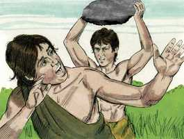 

**9** 	E disse o Senhor a Caim: Onde está Abel, teu irmão? E ele disse: Não sei; sou eu guardador do meu irmão?

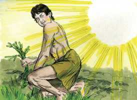 

**10** 	E disse Deus: Que fizeste? A voz do sangue do teu irmão clama a mim desde a terra.

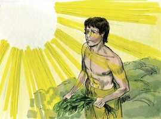 

**11** 	E agora maldito és tu desde a terra, que abriu a sua boca para receber da tua mão o sangue do teu irmão.

**12** 	Quando lavrares a terra, não te dará mais a sua força; fugitivo e vagabundo serás na terra.

**13** 	Então disse Caim ao Senhor: É maior a minha maldade que a que possa ser perdoada.

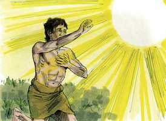 

**14** 	Eis que hoje me lanças da face da terra, e da tua face me esconderei; e serei fugitivo e vagabundo na terra, e será que todo aquele que me achar, me matará.

**15** 	O Senhor, porém, disse-lhe: Portanto qualquer que matar a Caim, sete vezes será castigado. E pôs o Senhor um sinal em Caim, para que o não ferisse qualquer que o achasse.

**16** 	E saiu Caim de diante da face do Senhor, e habitou na terra de Node, do lado oriental do Éden.

> **Cmt MHenry**: *Versículos 16-18* Caim desprezou todo o temor de Deus e não quis ouvir os mandados dEle. Os professantes hipócritas que fingem e se negam a levar a sério a Deus, são justamente abandonados a sua sorte para que façam algo extremamente escandaloso. Assim, pois, se desprendem daquela forma de santidade para a qual têm sido repreensão e cujo poder negam. Caim saiu da presença do Senhor e nunca encontramos que tenha regressado, para seu consolo. A terra na que habitou Caim foi chamada de terra de Node, que significa "estremecimento" ou "tremente", o que, deste modo, mostra a inquietude e incômodo de seu espírito, ou "a terra do vagabundo". Os que se afastam de Deus nunca podem achar repouso em nenhuma outra parte. Os que na terra buscavam a cidade celestial, optaram por morar em tabernáculos ou tendas; porém Caim, por não importar-lhe essa cidade, edificou uma na terra. Assim, todos os amaldiçoados por Deus procuram sua estabilidade e satisfação aqui embaixo.

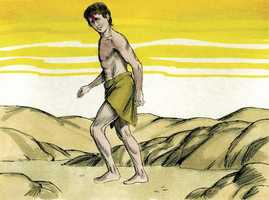 

**17** 	E conheceu Caim a sua mulher, e ela concebeu, e deu à luz a Enoque; e ele edificou uma cidade, e chamou o nome da cidade conforme o nome de seu filho Enoque;

**18** 	E a Enoque nasceu Irade, e Irade gerou a Meujael, e Meujael gerou a Metusael e Metusael gerou a Lameque.

**19** 	E tomou Lameque para si duas mulheres; o nome de uma era Ada, e o nome da outra, Zilá.

> **Cmt MHenry**: *Versículos 19-24* Um da perversa raça de Caim é o primeiro que se registra quebrantando a lei do matrimônio. Até aqui, um homem somente tinha uma esposa por vez; porém Lameque tomou duas. As únicas coisas sobre as que a perversa gente carnal coloca seu coração são as coisas deste mundo, e são sumamente espertos e diligentes a este respeito. Assim aconteceu com a raça de Caim. Aqui havia um pai de pastores e um pai de músicos, mas não um pai de fiéis. Aqui há um que ensina sobre o bronze e o ferro, mas não há quem ensine o bom conhecimento do Senhor; aqui há recursos para enriquecer-se e para ser poderoso e estarem alegres, porém nada de Deus, de seu temor e seu serviço. As coisas presentes enchem a cabeça da maioria. Lameque tinha inimigos, aos que havia provocado. Faz uma comparação entre ele mesmo e seu antepassado Caim; e se elogia por ser muito menos criminoso. Parece abusar da paciência de Deus ao dispensar a Caim, tomando isso como um estímulo para ter a expectativa de pecar e de não receber castigo.

**20** 	E Ada deu à luz a Jabal; este foi o pai dos que habitam em tendas e têm gado.

**21** 	E o nome do seu irmão era Jubal; este foi o pai de todos os que tocam harpa e órgão.

**22** 	E Zilá também deu à luz a Tubalcaim, mestre de toda a obra de cobre e ferro; e a irmã de Tubalcaim foi Noema.

**23** 	E disse Lameque a suas mulheres Ada e Zilá: Ouvi a minha voz; vós, mulheres de Lameque, escutai as minhas palavras; porque eu matei um homem por me ferir, e um jovem por me pisar.

**24** 	Porque sete vezes Caim será castigado; mas Lameque setenta vezes sete.

**25** 	E tornou Adão a conhecer a sua mulher; e ela deu à luz um filho, e chamou o seu nome Sete; porque, disse ela, Deus me deu outro filho em lugar de Abel; porquanto Caim o matou.

> **Cmt MHenry**: *Versículos 25-26* Nossos primeiros pais foram consolados em sua aflição pelo nascimento de um filho, ao qual chamaram Sete, isto é, "substituto", "estabelecido" ou "colocado"; em sua semente, a humanidade continuaria até o fim dos tempos, e dele desceria o Messias. Enquanto Caim, a cabeça da apostasia, é feito errante, Sete, de quem surgiria a igreja verdadeira, é um estabelecido. Em Cristo e sua igreja está o único estabelecimento verdadeiro. Sete andou nos passos de seu martirizado irmão Abel; foi partícipe de uma fé igualmente preciosa na justiça de nosso Deus e Salvador Jesus Cristo e, assim, chegou a ser um novo testemunho da graça e influência de Deus Espírito Santo. Deus concedeu a Adão e Eva que vissem o avivamento religioso de sua família. Os adoradores de Deus começaram a fazer mais em religião; alguns, por uma profissão franca da verdadeira religião, protestavam contra a maldade do mundo circundante. Quanto piores sejam os outros, melhores devemos ser nós, e mais zelosos. Então começou a distinção entre professantes e profanos, a qual tem continuado desde então e continuará enquanto houver mundo. "

**26** 	E a Sete também nasceu um filho; e chamou o seu nome Enos; então se começou a invocar o nome do Senhor.

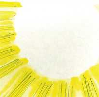 

> **Cmt MHenry** Intro: *• Versículos 1-7*> *O nascimento, trabalho e religião de Caim e Abel*> *• Versículos 8-15*> *Caim mata a Abel – A maldição de Caim*> *• Versículos 16-18*> *A conduta de Caim – Sua família*> *• Versículos 19-24*> *Lameque e suas esposas – A destreza dos descendentes de*> *• Versículos 25-26*> *O nascimento de outro filho e neto de Adão*