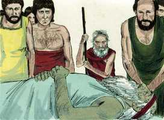

# Gênesis Cap 05

**1** 	ESTE é o livro das gerações de Adão. No dia em que Deus criou o homem, à semelhança de Deus o fez.

> **Cmt MHenry**: *Versículos 1-5* Adão foi feito a imagem de Deus; porém, estando caído gerou um filho a sua própria imagem, pecador e corrupto, frágil, miserável e mortal, como ele mesmo. não somente *homem* como ele mesmo, composto de corpo e alma, senão *pecador* como ele mesmo. Isto é o contrário da semelhança divina em que foi feito Adão; tendo-a perdido, não podia transmiti-la a sua semente. Adão viveu 930 anos em total; e então morreu, conforme com a sentença ditada: "ao pó voltarás". Embora não morreu no dia em que comeu o fruto proibido, nesse mesmo dia se tornou mortal. Então começou a morrer; toda sua vida posterior não foi senão uma execução demorada, uma vida condenada e perdida; foi uma vida moribunda e desolada. A vida do homem não é senão um morrer gradualmente.

**2** 	Homem e mulher os criou; e os abençoou e chamou o seu nome Adão, no dia em que foram criados.

**3** 	E Adão viveu cento e trinta anos, e gerou um filho à sua semelhança, conforme a sua imagem, e pôs-lhe o nome de Sete.

**4** 	E foram os dias de Adão, depois que gerou a Sete, oitocentos anos, e gerou filhos e filhas.

**5** 	E foram todos os dias que Adão viveu, novecentos e trinta anos, e morreu.

> **Cmt MHenry**: *CAPÍTULO 50N-Fp 51N-Cl 52N-1Ts 53N-2Ts 54N-1Tm 55N-2Tm 56N-Tt 57N-Fm 58N-Hb 59N-Tg

 

**6** 	E viveu Sete cento e cinco anos, e gerou a Enos.

> **Cmt MHenry**: *Versículos 6-20* É dito "e morreu" de cada um destes, exceto de Enoque. Bom é observar a morte dos outros. Todos eles viveram muito; nem um só deles morreu senão até ter quase oitocentos anos, e alguns viveram muito mais que isso; um tempo muito longo para que uma alma imortal esteja prisioneira numa vivenda de barro. Seguramente a vida presente não era para eles tanta carga como o é comumente agora, de outro jeito teriam-se cansado dela. Tampouco a vida futura teria sido então tão claramente revelada como agora, sob o evangelho, do contrário teriam estado urgidos a sair dela. Todos os patriarcas que viveram antes do dilúvio, salvo Noé, nasceram antes que morresse Adão. Dele devem ter recebido um relato total da criação, a queda, a promessa e os preceitos divinos sobre a adoração e a vida religiosa. Assim, Deus manteve em sua igreja o conhecimento de sua vontade.

**7** 	E viveu Sete, depois que gerou a Enos, oitocentos e sete anos, e gerou filhos e filhas.

**8** 	E foram todos os dias de Sete novecentos e doze anos, e morreu.

**9** 	E viveu Enos noventa anos, e gerou a Cainã.

**10** 	E viveu Enos, depois que gerou a Cainã, oitocentos e quinze anos, e gerou filhos e filhas.

**11** 	E foram todos os dias de Enos novecentos e cinco anos, e morreu.

**12** 	E viveu Cainã setenta anos, e gerou a Maalalel.

**13** 	E viveu Cainã, depois que gerou a Maalalel, oitocentos e quarenta anos, e gerou filhos e filhas.

**14** 	E foram todos os dias de Cainã novecentos e dez anos, e morreu.

**15** 	E viveu Maalalel sessenta e cinco anos, e gerou a Jerede.

**16** 	E viveu Maalalel, depois que gerou a Jerede, oitocentos e trinta anos, e gerou filhos e filhas.

**17** 	E foram todos os dias de Maalalel oitocentos e noventa e cinco anos, e morreu.

**18** 	E viveu Jerede cento e sessenta e dois anos, e gerou a Enoque.

**19** 	E viveu Jerede, depois que gerou a Enoque, oitocentos anos, e gerou filhos e filhas.

**20** 	E foram todos os dias de Jerede novecentos e sessenta e dois anos, e morreu.

**21** 	E viveu Enoque sessenta e cinco anos, e gerou a Matusalém.

> **Cmt MHenry**: *Versículos 21-24* Enoque foi o sétimo contando desde Adão. A piedade é caminhar com Deus; o qual mostra a reconciliação com Deus, pois dois não podem andar juntos se não estiverem de acordo ([Am 3.3](../30A-Am/03.md#3)). Inclui todas as partes de uma vida reta, santa e sóbria. Caminhar com Deus é ter a Deus sempre diante de nós, agir como estando sempre sob seu olhar. É preocupar-se constantemente de agradar a Deus em todas as coisas e não ofendê-lo em nenhuma. É ser seguidores dEle como filhos amados. O Espírito Santo diz que *andou Enoque com Deus*, em lugar de dizer *viveu Enoque (com Deus)*. Esta foi sua preocupação e trabalho constante; enquanto os outros viviam para si mesmos e o mundo, ele viveu para Deus. era o gozo de sua vida. Enoque foi *levado* a um mundo melhor. Como ele não viveu como o resto da humanidade, ele não saiu do mundo pela morte, como o resto. Não foi achado porque Deus o transpôs ([Hb 11.5](../58N-Hb/11.md#5)). Ele tinha vivido somente 365 anos que, segundo a idade dos homens daquele então, era somente a metade da vida deles. Freqüentemente Deus se leva mais pronto aos quais Ele ama; o tempo perdido na terra ganham-no no céu, inefável vantagem para eles. Veja como se expressa a transposição de Enoque: desapareceu porque Deus o levou. Já não esteve mais neste mundo; foi transformado, como o serão todos os santos que estiverem vivos na segunda vinda de Cristo. Os que começam a caminhar com Deus quando são novos têm a esperança de caminhar com Ele longa, cômoda e obsequiosamente. A marcha constante na santidade do cristão verdadeiro, durante muitos anos, até que Deus o levar, é a melhor recomendação para a religião a qual muitos se opõem e contra a qual muitos abusam. Caminhar com Deus concorda bem com as preocupações, consolos e deveres da vida.

**22** 	E andou Enoque com Deus, depois que gerou a Matusalém, trezentos anos, e gerou filhos e filhas.

**23** 	E foram todos os dias de Enoque trezentos e sessenta e cinco anos.

**24** 	E andou Enoque com Deus; e não apareceu mais, porquanto Deus para si o tomou.

**25** 	E viveu Matusalém cento e oitenta e sete anos, e gerou a Lameque.

> **Cmt MHenry**: *Versículos 25-32* Matusalém significa "quando ele morrer, virá como um dardo", ou "um envio", a saber, o dilúvio que chegou no ano em que morreu Matusalém. Viveu 969 anos, a vida mais longa de um homem sobre a terra; porém ainda o que viver mais, deverá morrer afinal. Noé significa *descanso*; seus pais lhe deram este nome com a perspectiva de que ele fosse uma grande bênção para sua geração. Observe a queixa de seu pai acerca do estado calamitoso da vida humana, devido à entrada do pecado e à maldição pelo pecado. toda a nossa vida se gasta em trabalhar e nosso tempo se enche com esforço contínuo. Por ter amaldiçoado Deus a terra, o mais que agonias podem fazer, com o maior cuidado e aflições, é obter uma dura manutenção dela. Lameque esperava alívio pelo nascimento deste filho: "Este nos aliviará de nossas obras". Isso significa não só o desejo e a expectativa que geralmente têm os pais no que diz respeito a seus filhos, de que eles sejam consolo e ajuda para eles, embora amiúde resultem ser o contrário; senão que também significa uma perspectiva de algo a mais. Cristo é nosso? O céu é nosso? Em nosso afã e aflição necessitamos melhores consoladores que as mais caras relações e a mais prometedora descendência; podemos buscar e achar consolo em Cristo. "

**26** 	E viveu Matusalém, depois que gerou a Lameque, setecentos e oitenta e dois anos, e gerou filhos e filhas.

**27** 	E foram todos os dias de Matusalém novecentos e sessenta e nove anos, e morreu.

**28** 	E viveu Lameque cento e oitenta e dois anos, e gerou um filho,

**29** 	A quem chamou Noé, dizendo: Este nos consolará acerca de nossas obras e do trabalho de nossas mãos, por causa da terra que o Senhor amaldiçoou.

**30** 	E viveu Lameque, depois que gerou a Noé, quinhentos e noventa e cinco anos, e gerou filhos e filhas.

**31** 	E foram todos os dias de Lameque setecentos e setenta e sete anos, e morreu.

**32** 	E era Noé da idade de quinhentos anos, e gerou Noé a Sem, Cão e Jafé.

> **Cmt MHenry** Intro: *• Versículos 1-5*> *Adão e Sete*> *• Versículos 6-20*> 28A-Os patriarcas desde Sete até Enoque*> *• Versículos 21-24*> *• Versículos 25-32*> *Matusalém a Noé*