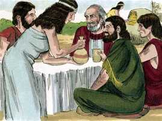
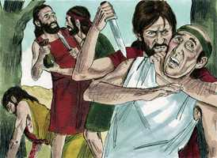
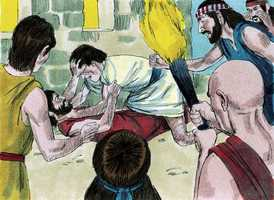
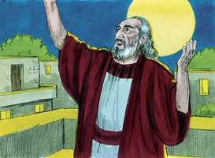
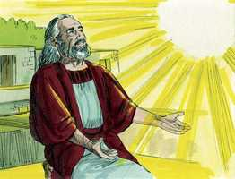
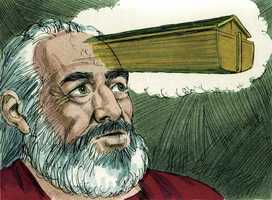
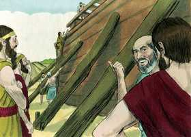
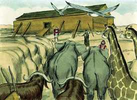
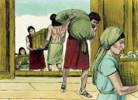

# Gênesis Cap 06

**1** 	E ACONTECEU que, como os homens começaram a multiplicar-se sobre a face da terra, e lhes nasceram filhas,

> **Cmt MHenry**: *Versículos 1-7* A coisa mais notável acerca do mundo antigo é sua destruição pelo dilúvio. Nos é falado da abundante iniqüidade desse mundo mau: a justa ira de Deus e sua santa resolução de castigá-lo. Em todas as épocas tem havido uma maldição específica de Deus para o matrimônio entre um professante da verdadeira religião e seus inimigos declarados. O mau exemplo do cônjuge ímpio corrompe ou fere muito o outro. Acaba-se a religião da família e as crianças são educadas conforme às máximas mundanas do progenitor que não tem temor de Deus. se professarmos ser filhos ou filhas de Senhor Todo Poderoso, não devemos casar sem seu consentimento. Ele não nos sua bênção; se preferimos a beleza, a inteligente, a riqueza ou as honras mundanas à fé e a santidade. O Espírito de Deus contendeu com os homens enviando a Enoque, Noé e talvez a outros, para que lhes predicassem; esperava mostrar sua graça apesar de suas rebeliões, despertando temor e convicção em suas crenças. Porém o Senhor declarou que seu Espírito não sempre contenderia assim com os homens; Ele os deixaria endurecer-se no pecado e amadurecer para a destruição. Isto foi determinado por Ele porque o homem era carne: não só frágil e débil, senão carnal e depravado, tendo usado mal os poderes nobres de sua alma para satisfazer suas inclinações corruptas. Deus vê toda a maldade que há entre os filhos dos homens; não a podem ocultar *dEle* agora; e se não se arrependem dela, será dada a conhecer *por* Ele daqui a pouco. Sem dúvida a maldade de um povo é grande quando os pecadores notórios são homens célebres entre eles. Muitíssimo pecado era cometido por toda classe de pessoas. Qualquer podia ver que a maldade do homem era grande: mas Deus viu que toda imaginação ou propósito dos pensamentos do coração do homem era de contínuo somente o mal. Isto era a raiz amarga, a fonte corrupta. O coração era enganoso e perverso; os princípios eram corruptos, os hábitos e as disposições, más. Suas intenções e planos eram malvados. Eles faziam o mal deliberadamente, e se esforçavam para cometer atrocidades. Não havia bem entre eles. Deus viu a maldade do homem como quem é ferido e maltratado por ela. A viu como um pai tenro vê a tolice e a porfia de um filho rebelde e desobediente, coisa que o aflige e o faz desejar não haver tido filhos. As palavras usadas aqui são muito notáveis; as usa segundo o entendimento dos homens e não significam que Deus possa mudar ou sentir-se infeliz. Deus odeia assim nosso pecado? e nós, não deveríamos afligir-nos por isso? Oh, que possamos olhar para Aquele a quem temos afligido, e lamentar! Deus se arrependeu de ter feito o homem; porém nunca o encontramos arrependido de ter redimido o homem. Deus resolve destruir o homem: a palavra original é muito impressionante, "rasparei da face da terra os homens", como se varre o pó ou a sujeira de um lugar que deve estar limpo e se lança num monte de lixo, o lugar apropriado para isso. Deus fala do homem como de sua própria criatura, quando resolve seu castigo. Perdem sua vida os que não respondem ao propósito de suas vidas. Deus tomou esta decisão sobre os homens depois que seu Espírito havia contendido por muito tempo com eles, mas em vão. Ninguém é castigado pela justiça de Deus, senão aqueles que detestam ser reformados pela graça de Deus.

**2** 	Viram os filhos de Deus que as filhas dos homens eram formosas; e tomaram para si mulheres de todas as que escolheram.

 

**3** 	Então disse o Senhor: Não contenderá o meu Espírito para sempre com o homem; porque ele também é carne; porém os seus dias serão cento e vinte anos.

**4** 	Havia naqueles dias gigantes na terra; e também depois, quando os filhos de Deus entraram às filhas dos homens e delas geraram filhos; estes eram os valentes que houve na antiguidade, os homens de fama.

**5** 	E viu o Senhor que a maldade do homem se multiplicara sobre a terra e que toda a imaginação dos pensamentos de seu coração era só má continuamente.

  

**6** 	Então arrependeu-se o Senhor de haver feito o homem sobre a terra e pesou-lhe em seu coração.

> **Cmt MHenry**: *CAPÍTULO 60N-1Pe 61N-2Pe 62N-1Jo 63N-2Jo 64N-3Jo 65N-Jd 66N-Ap

**7** 	E disse o Senhor: Destruirei o homem que criei de sobre a face da terra, desde o homem até ao animal, até ao réptil, e até à ave dos céus; porque me arrependo de os haver feito.

**8** 	Noé, porém, achou graça aos olhos do Senhor.

> **Cmt MHenry**: *Versículos 8-11* Noé não achou favor ante os olhos dos homens; eles o odiaram e perseguiram porque por sua vida e predicação ele condenava o mundo: mas achou graça ante os olhos do Senhor e isso o fez verdadeiramente mais honorável que os homens de renome. Que este seja nosso desejo principal, esforcemo-nos para que possamos ser aceitos por Ele. quando o resto do mundo era mau, Noé manteve sua integridade. A boa vontade de Deus para com Noé produziu esta boa obra nele. Ele era justo, isto é, um homem justificado ante Deus pela fé na Semente prometida. Como tal, foi feito santo e teve princípios justos. E foi justo em sua conduta. Não só foi honesto senão devotado; seu afã constante era fazer a vontade de Deus. Deus olha com favor aos que atentam sinceramente a Ele com os olhos da fé. fácil é ser religioso quando a religião está de moda; porém demonstra fé e resolução firme nadar contra a correnteza e estar por Deus quando mais ninguém está por Ele; Noé agiu assim. Toda classe de pecados se achavam entre os homens. Eles corromperam a adoração de Deus. O pecado enche a terra com violência e isto justificava plenamente a decisão de Deus de destruir o mundo. O contágio se espalha. Quando a maldade se torna geral, a ruína não está longe; enquanto em uma nação exista um remanescente de gente que ora, esvaziando assim a medida antes que se encha, os juízos podem ser aprazados; porém, quando todas as mãos estão ocupadas em destruir as cercas, pelo pecado, e ninguém se coloca na brecha para repará-la, que pode esperar-se senão um dilúvio de ira?

**9** 	Estas são as gerações de Noé. Noé era homem justo e perfeito em suas gerações; Noé andava com Deus.

 

**10** 	E gerou Noé três filhos: Sem, Cão e Jafé.

**11** 	A terra, porém, estava corrompida diante da face de Deus; e encheu-se a terra de violência.

**12** 	E viu Deus a terra, e eis que estava corrompida; porque toda a carne havia corrompido o seu caminho sobre a terra.

> **Cmt MHenry**: *Versículos 12-21* Deus contou a Noé seu propósito de destruir o mundo malvado com água. A comunhão íntima do Senhor é com os que o temem ([Sl 25.14](../19A-Sl/25.md#14)). está com os crentes, capacitando-os para entender e aplicar as declarações e advertências da palavra escrita. Deus optou por fazê-lo com inundação das águas que alagariam o mundo. Ao escolher a vara com que corrige a seus filhos, Ele escolhe a espada com que corta seus inimigos. Deus estabeleceu sua aliança com Noé. Este é o primeiro lugar da Bíblia em que se encontra a palavra "aliança" ou "pacto"; parece significar: 1) O acordo de providência; que o curso da natureza continuará até o final do tempo. 2) A aliança de graça em que Deus será o Deus de Noé, e que de sua semente Deus tomaria um povo para sim. Deus deu ordens a Noé para que fizesse uma arca. Esta arca era como o casco de um navio, adequado para flutuar sobre as águas. Era muito grande, a metade do tamanho da catedral de são Paulo (Londres, Inglaterra). E poderia conter mais de dezoito das maiores naves usadas em nosso tempo. Deus teria podido salvar a Noé se fazê-lo passar por trabalhos, dores e problemas, porém o empregou para construir o que seria o meio de preservá-lo, para prova de sua fé e obediência. A providência e a graça de Deus possuem e coroam ao obediente e diligente. Deus deu ordens específicas a Noé acerca de como fazer a arca, que, portanto, não podiam senão ser perfeitas para seu propósito. Deus prometeu a Noé que ele e sua família seriam mantidos vivos na arca. Provavelmente nós e nossas famílias tenhamos o benefício do que fazemos por obediência a Deus. a piedade dos pais dá bem a seus filhos nesta vida e os encaminha pela senda da vida eterna, se eles melhoram.

**13** 	Então disse Deus a Noé: O fim de toda a carne é vindo perante a minha face; porque a terra está cheia de violência; e eis que os desfarei com a terra.

 

**14** 	Faze para ti uma arca da madeira de gofer; farás compartimentos na arca e a betumarás por dentro e por fora com betume.

  

**15** 	E desta maneira a farás: De trezentos côvados o comprimento da arca, e de cinqüenta côvados a sua largura, e de trinta côvados a sua altura.

**16** 	Farás na arca uma janela, e de um côvado a acabarás em cima; e a porta da arca porás ao seu lado; far-lhe-ás andares, baixo, segundo e terceiro.

**17** 	Porque eis que eu trago um dilúvio de águas sobre a terra, para desfazer toda a carne em que há espírito de vida debaixo dos céus; tudo o que há na terra expirará.

**18** 	Mas contigo estabelecerei a minha aliança; e entrarás na arca, tu e os teus filhos, tua mulher e as mulheres de teus filhos contigo.

**19** 	E de tudo o que vive, de toda a carne, dois de cada espécie, farás entrar na arca, para os conservar vivos contigo; macho e fêmea serão.

 

**20** 	Das aves conforme a sua espécie, e dos animais conforme a sua espécie, de todo o réptil da terra conforme a sua espécie, dois de cada espécie virão a ti, para os conservar em vida.

**21** 	E leva contigo de toda a comida que se come e ajunta-a para ti; e te será para mantimento, a ti e a eles.

 

**22** 	Assim fez Noé; conforme a tudo o que Deus lhe mandou, assim o fez.

> **Cmt MHenry**: *Versículo 22A-Ct A fé de Noé triunfou sobre tosos os arrazoamentos corruptos. Armar um edifício tão grande, como nunca tinha sido visto, e proporcionar comida para as criaturas vivas, requereria dele muita dedicação, trabalho e custos. Seus vizinhos zombariam dele. Todavia, todas essas objeções superou Noé pela fé; assim fez ele e assim devemos fazer nós. Teve temor do dilúvio e, portanto, preparou a arca. Na advertência dada a Noé há uma advertência ainda mais solene dada a nós: fugir da ira vindoura que raspará o mundo dos incrédulos, lançando-os no abismo da destruição. Cristo, o verdadeiro Noé, que nos consolará pessoalmente, já preparou a arca por seus sofrimentos e bondosamente nos convida a entrar pela fé. Enquanto durar o dia de sua paciência, ouçamos e obedeçamos sua voz. "

> **Cmt MHenry** Intro: *• Versículos 1-7*> *A maldade do mundo que provocou a ira de Deus*> *• Versículos 8-11*> *Noé acha graça*> *• Versículos 12-21*> *Anúncio do dilúvio a Noé – Instruções sobre a arca*> *• Versículo 22A-Ct> *Fé e obediência de Noé*