# Gênesis Cap 08

**1** 	E LEMBROU-SE Deus de Noé, e de todos os seres viventes, e de todo o gado que estavam com ele na arca; e Deus fez passar um vento sobre a terra, e aquietaram-se as águas.

> **Cmt MHenry**: *Versículos 1-3* Toda a raça da humanidade, salvo Noé e sua família, estavam agora mortos, de modo que o lembrar-se Deus de Noé foi o retorno de Sua misericórdia à humanidade, a qual não tinha exterminado por completo. As exigências da justiça divina tinham sido respondidas pela ruína dos pecadores. Deus enviou o vento para secar a terra e selou suas águas. A mesma mão que traz a desolação deve trazer a liberação; portanto, devemos olhar sempre essa mão. quando as aflições têm feito a obra para a qual foram enviadas, seja obra que mata ou que cura, serão tiradas. Como a terra não foi alagada num dia, também não secou em um dia. Deus costuma liberar gradualmente seu povo para que não seja desprezado o dia das coisas pequenas, nem haja desconsolo pelo dia das grandes coisas.

  

**2** 	Cerraram-se também as fontes do abismo e as janelas dos céus, e a chuva dos céus deteve-se.

**3** 	E as águas iam-se escoando continuamente de sobre a terra, e ao fim de cento e cinqüenta dias minguaram.

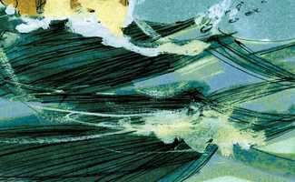 

**4** 	E a arca repousou no sétimo mês, no dia dezessete do mês, sobre os montes de Ararate.

> **Cmt MHenry**: *Versículos 4-1* A arca descansou sobre uma montanha, para onde foi dirigida pela sábia e bondosa providência de Deus, para que pudesse descansar mais cedo. Deus tem tempos e lugares de repouso para seu povo depois de ter sido chacoalhado; e muitas vezes Ele faz provisão para que se estabeleça cômoda e oportunamente, sem os estratagemas próprios deles, e completamente além do que eles poderiam prever. Deus tinha dito a Noé quando viria o dilúvio, embora não lhe deu uma revelação detalhada dos tempos e passos pelos quais terminaria. O conhecimento do anterior era necessário para a preparação da arca, porém o conhecimento do último teria servido somente para satisfazer a curiosidade; o ocultá-lo exercitaria sua fé e paciência. Noé enviou um corvo da arca, que continuou voando e comendo dos cadáveres que flutuavam. Depois, Noé enviou uma pomba que tornou, a primeira vez, sem boa notícia; mas a segunda vez trouxe em seu pico uma folha que arrancara de uma oliveira, mostrando simplesmente que as árvores, as frutíferas, começavam a aparecer sobre as águas. A segunda vez Noé enviou a pomba sete dias após da primeira; e a terceira vez foi também sete dias depois; provavelmente no dia do repouso. Tendo guardado o dia de descanso com sua pequena igreja, ele esperava uma bênção especial do céu, e perguntou por ela. A pomba é um emblema de uma alma bondosa que, não achando paz ou satisfação firmes neste mundo alagado e corrupto, regressa a Cristo como a sua arca, como a seu Noé, seu repouso. O coração carnal, como o corvo, se vira com o mundo e come da carniça que ali encontra; porém, volta a meu repouso, oh alma minha, a teu Noé, assim diz a palavra ([Sl 116.7](../19A-Sl/116.md#7)). Como Noé tirou sua mão, tomou a pomba e a atraiu a ele, ao interior da arca, assim Cristo salvará, ajudará e acolherá os que fogem a Ele em busca de repouso.

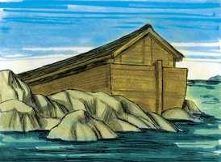 

**5** 	E foram as águas indo e minguando até ao décimo mês; no décimo mês, no primeiro dia do mês, apareceram os cumes dos montes.

**6** 	E aconteceu que ao cabo de quarenta dias, abriu Noé a janela da arca que tinha feito.

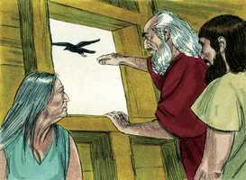 

**7** 	E soltou um corvo, que saiu, indo e voltando, até que as águas se secaram de sobre a terra.

**8** 	Depois soltou uma pomba, para ver se as águas tinham minguado de sobre a face da terra.

> **Cmt MHenry**: *CAPÍTULO 8*

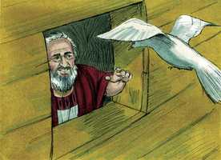 

**9** 	A pomba, porém, não achou repouso para a planta do seu pé, e voltou a ele para a arca; porque as águas estavam sobre a face de toda a terra; e ele estendeu a sua mão, e tomou-a, e recolheu-a consigo na arca.

**10** 	E esperou ainda outros sete dias, e tornou a enviar a pomba fora da arca.

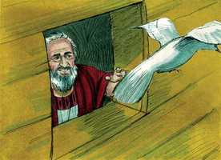 

**11** 	E a pomba voltou a ele à tarde; e eis, arrancada, uma folha de oliveira no seu bico; e conheceu Noé que as águas tinham minguado de sobre a terra.

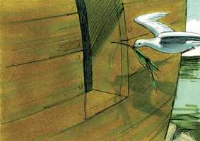 

**12** 	Então esperou ainda outros sete dias, e enviou fora a pomba; mas não tornou mais a ele.

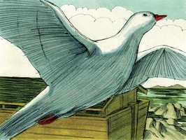 

**13** 	E aconteceu que no ano seiscentos e um, no mês primeiro, no primeiro dia do mês, as águas se secaram de sobre a terra. Então Noé tirou a cobertura da arca, e olhou, e eis que a face da terra estava enxuta.

> **Cmt MHenry**: *Versículos 13-19* Deus consulta nosso benefício mais que nossos desejos; Ele sabe o que é bom para nós melhor que nós mesmos, e por quanto tempo a mais é conveniente que continuem nossas restrições e sejam demoradas as misericórdias aneladas. Nós sairíamos da arca antes do solo estar seco; e, quiçá, se a porta estiver fechada, estaríamos dispostos a tirar a tampa e trepar de alguma forma; porém o tempo de Deus mostrar misericórdia é o melhor tempo. Como Noé recebeu a ordem de entrar na arca assim, por aborrecido que tenha sido seu confinamento, Ele esperaria de novo uma ordem para sair. Nós devemos reconhecer a Deus em todos os nossos caminhos e colocá-lo diante de nós em todos nossos movimentos. Somente vão sob a proteção de Deus os que seguem as instruções de Deus e se submetem a Ele.

**14** 	E no segundo mês, aos vinte e sete dias do mês, a terra estava seca.

**15** 	Então falou Deus a Noé dizendo:

**16** 	Sai da arca, tu com tua mulher, e teus filhos e as mulheres de teus filhos.

**17** 	Todo o animal que está contigo, de toda a carne, de ave, e de gado, e de todo o réptil que se arrasta sobre a terra, traze fora contigo; e povoem abundantemente a terra e frutifiquem, e se multipliquem sobre a terra.

**18** 	Então saiu Noé, e seus filhos, e sua mulher, e as mulheres de seus filhos com ele.

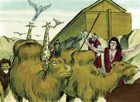 

**19** 	Todo o animal, todo o réptil, e toda a ave, e tudo o que se move sobre a terra, conforme as suas famílias, saiu para fora da arca.

**20** 	E edificou Noé um altar ao Senhor; e tomou de todo o animal limpo e de toda a ave limpa, e ofereceu holocausto sobre o altar.

> **Cmt MHenry**: *Versículos 20-22* Noé agora ia sair a um mundo desolado onde, alguém poderia pensar, sua primeira preocupação deveria ser edificar uma casa para ele, mas começa com um altar para Deus. Começa bem quem começa com Deus. embora o gado de Noé era pouco e salvo com grande cuidado e trabalho, ele não se queixou para servir com isso a Deus. Servir a Deus com o pouco que temos é a forma de fazê-lo crescer; nunca devemos pensar que é desperdiço aquilo com que honramos a Deus. A primeira coisa feita no novo mundo foi um ato de adoração. Agora devemos expressar nosso agradecimento, não com holocaustos, senão com louvor, devoções e conversações piedosas. Sem sentiu-se bem agradado com o que foi feito. A carne queimada não pode agradar mais a Deus que o sangue de touros ou bodes, salvo como tipo do sacrifício de Cristo e como expressão da fé e a consagração humilde de Noé a Deus. O dilúvio eliminou a raça dos homens maus, mas não eliminou o pecado da natureza do homem, que sendo concebido e nascido em pecado, pensa, imagina e ama a maldade, ainda desde a juventude, e tanto antes como depois do dilúvio. Porém Deus por graça declarou que nunca inundaria o mundo de novo. enquanto permanecer a terra, e o homem nela, haverá verão e inverno. É claro que esta terra não vai permanecer para sempre. Em breve deve ser queimada junto com todas as obras dela; e veremos novos céus e uma nova terra, quando todas estas coisas sejam desfeitas. Mas na medida em que permaneçam, a providência de Deus fará que o curso dos tempos e das estações prossiga e cada uma tenha seu lugar. e baseados nesta palavra, confiamos em que assim seja. Vemos que se cumprem as promessas de Deus às *criaturas* e podemos inferir que da mesma forma serão cumpridas suas promessas a todos os *crentes*.

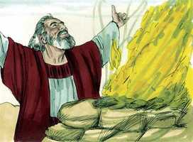 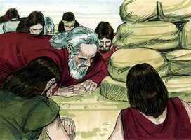 

**21** 	E o Senhor sentiu o suave cheiro, e o Senhor disse em seu coração: Não tornarei mais a amaldiçoar a terra por causa do homem; porque a imaginação do coração do homem é má desde a sua meninice, nem tornarei mais a ferir todo o vivente, como fiz.

**22** 	Enquanto a terra durar, sementeira e sega, e frio e calor, e verão e inverno, e dia e noite, não cessarão.

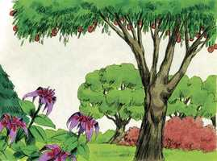 

> **Cmt MHenry** Intro: *• Versículos 1-3*> *Deus se lembra de Noé e seca as águas*> *• Versículos 4-12*> *A arca descansa sobre o Ararate – Noé manda um corvo e*> *uma pomba*> *• Versículos 13-19*> *Noé sai da arca, tendo sido ordenado que assim fizesse*> *• Versículos 20-22*> *Noé oferece um sacrifício – Deus promete não amaldiçoar*> *mais a terra*