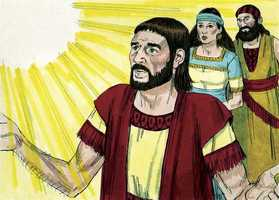
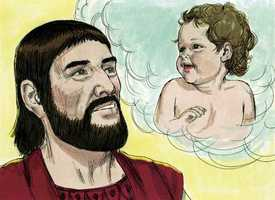
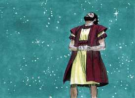
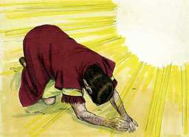
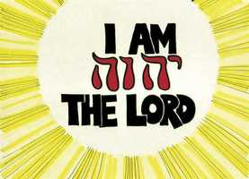
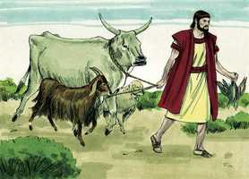
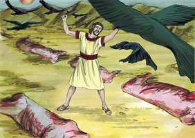
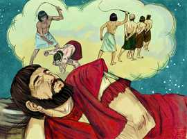
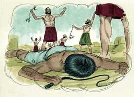
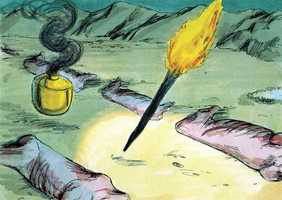

# Gênesis Cap 15

**1** 	DEPOIS destas coisas veio a palavra do Senhor a Abrão em visão, dizendo: Não temas, Abrão, eu sou o teu escudo, o teu grandíssimo galardão.

> **Cmt MHenry**: *Versículo 10A-2Sm 11A-1Rs 12A-2Rs 13A-1Cr 14A-2Cr 15A-Es 16A-Ne 17A-Et 18A-Jo 19A-Sl Deus assegurou a Abrão a segurança e a felicidade; que estaria sempre a salvo. "Eu sou teu escudo"; ou "Eu sou para ti um escudo, presente contigo, que te cuido em forma muito rel". a consideração de que o próprio Deus é e será um escudo para seu povo, para assegurá-lo de todos os males, um escudo disposto para eles e um escudo em volta deles, deveria silenciar todos os temores que atormentam e confundem.

 

**2** 	Então disse Abrão: Senhor Deus, que me hás de dar, pois ando sem filhos, e o mordomo da minha casa é o damasceno Eliézer?

> **Cmt MHenry**: *Versículos 2-6* Mesmo que nunca devemos queixar-nos Notas Bíblia de Estudo NVI-out_images.txt Simple_Bible_Reader_v2.9-bible_converter.exe Deus, temos permissão para queixar-nos 34A-Na 43N-Joa bible-acf2007.csv bible-ara_strongs.csv bible_markdown.sh biblia-sagrada-almeida-corrigida-fiel.pdf comment-AdamOT.csv Images images-catalog.csv images-old_bible_pictures.csv Images.zip markdown2html.sh Notas Bíblia de Estudo NVI-out_images.txt Simple_Bible_Reader_v2.9-bible_converter.exe Ele, e expressá-lhe todas as nossas aflições. É consolador para um espírito carregado apresentar seu caso a um amigo fiel e compassivo. A queixa de Abrão é que não tinha filho; que provavelmente nunca teria um; que a falta de um filho era um problema tão grande para ele que lhe tirava todo consolo. Se supusermos que Abrão não olhava mais que a comodidade externa, essa queixa teria estado carregada de culpa. Porém, se considerarmos que Abrão aqui estava referindo-se à Semente prometida, seu desejo era desígnio de encômio. Não devemos descansar satisfeitos até que tenhamos provas de nosso interesse em Cristo; de que me serve tudo se vou sem Cristo? Se continuarmos insistindo em oração, não obstante, orando com humilde submissão à vontade divina, não buscaremos em vão. Deus deu a Abrão a promessa expressa de um filho. Os cristãos podem crer em Deus a respeito das preocupações corriqueiras da vida, porém a fé pela qual são justificados sempre se refere à pessoa e obra de Cristo. Abrão creu a Deus que lhe prometia a Cristo; os cristãos crêem nEle como tendo sido levantados dentre os mortos ([Rm 4.24](../45N-Rm/04.md#24)). Pela fé em seu sangue obtiveram o perdão de seus pecados.

 

**3** 	Disse mais Abrão: Eis que não me tens dado filhos, e eis que um nascido na minha casa será o meu herdeiro.

**4** 	E eis que veio a palavra do Senhor a ele dizendo: Este não será o teu herdeiro; mas aquele que de tuas entranhas sair, este será o teu herdeiro.

**5** 	Então o levou fora, e disse: Olha agora para os céus, e conta as estrelas, se as podes contar. E disse-lhe: Assim será a tua descendência.

 

**6** 	E creu ele no Senhor, e imputou-lhe isto por justiça.

 

**7** 	Disse-lhe mais: Eu sou o Senhor, que te tirei de Ur dos caldeus, para dar-te a ti esta terra, para herdá-la.

> **Cmt MHenry**: *Versículos 7-11* Deus deu a certeza a Abrão de ter a terra de Canaã como herança. Deus nunca promete mais do que pode cumprir, que é o que amiúde fazem os homens. Abrão fez como Deus lhe mandou. Partiu pela metade os animais, conforme com a cerimônia acostumada para selar as alianças ([Jr 34.18-19](../24A-Jr/34.md#18)). Tendo preparado todo conforme ao indicado por Deus, se pôs a esperar o sinal que Deus poderia dar-lhe. Devemos manter-nos vigilantes ante nossos sacrifícios espirituais. Quando os pensamentos vãos, como aquelas aves, descem a atacar nossos sacrifícios, devemos espantá-los para esperar em Deus sem distrações.

 

**8** 	E disse ele: Senhor Deus, como saberei que hei de herdá-la?

**9** 	E disse-lhe: Toma-me uma bezerra de três anos, e uma cabra de três anos, e um carneiro de três anos, uma rola e um pombinho.

 

**10** 	E trouxe-lhe todos estes, e partiu-os pelo meio, e pôs cada parte deles em frente da outra; mas as aves não partiu.

**11** 	E as aves desciam sobre os cadáveres; Abrão, porém, as enxotava.

 

**12** 	E pondo-se o sol, um profundo sono caiu sobre Abrão; e eis que grande espanto e grande escuridão caiu sobre ele.

> **Cmt MHenry**: *Versículos 12-16* Um sono profundo caiu sobre Abrão: com este sono caiu sobre ele o horror de uma grande escuridão: uma mudança súbita. Os filhos da luz não sempre andam na luz. Então lhe foram anunciadas várias coisas: 1) *O sofrimento da semente de Abrão durante longo tempo*. Serão estrangeiros. Os herdeiros do céu são estrangeiros na terra. Serão servos; porém os cananeus servem sob maldição, e os hebreus servem sob uma bênção, eles sofrerão. Os que são abençoados e amados de Deus freqüentemente são afligidos gravemente pelos homens perversos.

**13** 	Então disse a Abrão: Saibas, de certo, que peregrina será a tua descendência em terra alheia, e será reduzida à escravidão, e será afligida por quatrocentos anos,

 

**14** 	Mas também eu julgarei a nação, à qual ela tem de servir, e depois sairá com grande riqueza.

 

**15** 	E tu irás a teus pais em paz; em boa velhice serás sepultado.

> **Cmt MHenry**: *CAPÍTULO 15A-Es

**16** 	E a quarta geração tornará para cá; porque a medida da injustiça dos amorreus não está ainda cheia.

**17** 	E sucedeu que, posto o sol, houve escuridão, e eis um forno de fumaça, e uma tocha de fogo, que passou por aquelas metades.

> **Cmt MHenry**: *Versículos 17-21* O forno fumegante e a tocha acesa representam, provavelmente, as severas provações e a feliz libertação dos israelitas, com o apoio bondoso recebido nos tempos difíceis. Provavelmente o forno e a tocha que passaram entre os pedaços, queimaram-nos e os consumiram, completando deste modo o sacrifício, a testemunhara que Deus o aceitou. Assim é sugerido que as alianças de Deus com o homem são feitas por sacrifício ([Sl 1.5](../19A-Sl/01.md#5)). nós podemos saber que Ele aceita nosso sacrifício se acende afetos piedosos e devotos em nossa alma. Estabelecem-se os limites da terra concedida. Fala-se de várias nações ou tribos que devem ser expulsas para dar lugar à semente de Abrão. Neste capítulo percebemos a fé de Abrão que luta contra a incredulidade, triunfando sobre ela. Não se assombrem, crentes, se encontram temporadas de trevas e mal-estar. Contudo, não é a vontade de Deus que estejam deprimidos: não temam, pois Ele será para vocês todo o que foi para Abrão. "

 

**18** 	Naquele mesmo dia fez o Senhor uma aliança com Abrão, dizendo: À tua descendência tenho dado esta terra, desde o rio do Egito até ao grande rio Eufrates;

**19** 	E o queneu, e o quenezeu, e o cadmoneu,

**20** 	E o heteu, e o perizeu, e os refains,

**21** 	E o amorreu, e o cananeu, e o girgaseu, e o jebuseu.

> **Cmt MHenry** Intro: *• Versículo 10A-2Sm 11A-1Rs 12A-2Rs 13A-1Cr 14A-2Cr 15A-Es 16A-Ne 17A-Et 18A-Jo 19A-Sl> *Deus dá ânimo a Abrão*> *• Versículos 2-6*> *A promessa divina – Abrão é justificado pela fé*> *• Versículos 7-11*> *Deus promete Canaã como herança a Abrão*> *• Versículos 12-16*> *A promessa é confirmada numa visão*> *• Versículos 17-21*> *A promessa confirmada por um sinal*> *2) O juízo dos inimigos da semente de Abrão*. Embora Deus pode permitir que perseguidores e opressores pisoteiem seu povo durante longo tempo, certamente os enfrentará no final. 3\) *Aqui se anuncia o grande acontecimento, a liberação da semente de Abrão no Egito.* 4\) *Seu feliz assentamento em Canaã*. Eles voltarão de novo a Canaã. A medida de pecado se enche paulatinamente. A medida do pecado de algumas pessoas se enche lentamente. O conhecimento dos acontecimentos futuros raramente ajuda para o nosso consolo, há tantas aflições nas famílias mais favorecidas e nas vidas mais felizes que é misericordioso de parte de Deus ocultar o que nos acontecerá a nós e aos nossos.