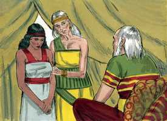
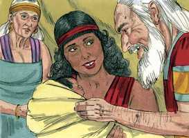

# Gênesis Cap 16

**1** 	ORA Sarai, mulher de Abrão, não lhe dava filhos, e ele tinha uma serva egípcia, cujo nome era Agar.

> **Cmt MHenry**: *Versículos 1-3* Sarai, que já não esperava ter filhos próprios, propôs a Abrão que tomasse outra esposa, cujos filhos ela poderia adotar: sua escrava, cujos filhos seriam propriedade de Sarai. Isto foi feito sem pedir o conselho do Senhor. operou a incredulidade, e esqueceram o poder onipotente de Deus. Foi um mau exemplo e fonte de múltiplo desconforto. Em toda relação e situação da vida há uma cruz que devemos carregar: grande parte do exercício da fé consiste em submeter-se pacientemente, em esperar o tempo do Senhor e usar somente aqueles médios que Ele designa para remover a cruz. As tentações néscias podem ter pretensões muito bonitas, e estar coloridas com isso que as faz luzir como muito plausíveis. A sabedoria carnal nos tira do caminho de Deus. Isto não seria assim se pedíssemos o conselho de Deus por Sua Palavra e oração antes de tentar aquilo que é duvidoso.

 

**2** 	E disse Sarai a Abrão: Eis que o Senhor me tem impedido de dar à luz; toma, pois, a minha serva; porventura terei filhos dela. E ouviu Abrão a voz de Sarai.

**3** 	Assim tomou Sarai, mulher de Abrão, a Agar egípcia, sua serva, e deu-a por mulher a Abrão seu marido, ao fim de dez anos que Abrão habitara na terra de Canaã.

**4** 	E ele possuiu a Agar, e ela concebeu; e vendo ela que concebera, foi sua senhora desprezada aos seus olhos.

> **Cmt MHenry**: *Versículos 4-6* O infeliz matrimônio de Abrão com Agar logrou muito cedo fazer muita maldade. Podemos agradecer-nos a culpa e pena que nos seguem quando nos saímos do caminho de nosso dever. Veja-se neste caso. A gente apaixonada costuma brigar com o próximo por coisas das quais eles mesmos devem carregar a culpa. Sarai tinha dado sua donzela a Abrão, porém ela grita: "Minha afronta seja sobre ti". Nunca se diz sabiamente aquilo que o orgulho e a ira colocam em nossas bocas. Nem sempre têm a razão aqueles que são mais barulhentos e ousados para apelarem a Deus: tal pressa e tais imprecações ousadas falam corriqueiramente de culpa e de uma má causa. Agar esqueceu que ela mesma tinha provocado primeiro o desprezo de sua senhora. Aqueles que sofrem por suas faltas devem suportá-lo com paciência ([1 Pe 2.20](../60N-1Pe/02.md#20)).

**5** 	Então disse Sarai a Abrão: Meu agravo seja sobre ti; minha serva pus eu em teu regaço; vendo ela agora que concebeu, sou menosprezada aos seus olhos; o Senhor julgue entre mim e ti.

**6** 	E disse Abrão a Sarai: Eis que tua serva está na tua mão; faze-lhe o que bom é aos teus olhos. E afligiu-a Sarai, e ela fugiu de sua face.

**7** 	E o anjo do Senhor a achou junto a uma fonte de água no deserto, junto à fonte no caminho de Sur.

> **Cmt MHenry**: *Versículos 7-16* Agar estava fora de seu lugar e fora do caminho de seu dever, e continuava descaminhando-se mais quando o anjo a encontrou. Grande misericórdia é ser detido num caminho pecador, seja pela consciência ou pela providência. De onde vem você? Considere que está fugindo do dever e dos privilégios com que era abençoada na tenda de Abrão. Bom é viver numa família religiosa, coisa que deveriam considerar aqueles que têm esta vantagem. Para onde iria? Está correndo rumo ao pecado; se Agar regressar ao Egito, voltará aos ídolos endeusados e ao perigo do deserto pelo qual deve viajar. Lembrar quem somos freqüentemente nos ensina nosso dever. Perguntar de onde viemos deveria mostrar-nos nosso pecado e tolice. Considerar para onde iremos descobre nosso perigo e desgraça. Aqueles que deixam seus lugares e deveres, devem apressar seu regresso, por mortificante que seja. A declaração do Anjo "Eu quero", indica que este Anjo era a Palavra eterna e Filho de Deus. Agar não pôde senão admirar a misericórdia do Senhor e sentir: "Tenho sido eu, que sou tão indigna, favorecida com uma bondosa visita do Senhor?" Ela foi levada a um melhor temperamento, regressou e com sua conduta abrandou a Sarai e recebeu um tratamento mais amável. Que nós sejamos sempre impressionados apropriadamente com este pensamento: Deus, Tu me vês! "

**8** 	E disse: Agar, serva de Sarai, donde vens, e para onde vais? E ela disse: Venho fugida da face de Sarai minha senhora.

**9** 	Então lhe disse o anjo do Senhor: Torna-te para tua senhora, e humilha-te debaixo de suas mãos.

**10** 	Disse-lhe mais o anjo do Senhor: Multiplicarei sobremaneira a tua descendência, que não será contada, por numerosa que será.

**11** 	Disse-lhe também o anjo do Senhor: Eis que concebeste, e darás à luz um filho, e chamarás o seu nome Ismael; porquanto o Senhor ouviu a tua aflição.

**12** 	E ele será homem feroz, e a sua mão será contra todos, e a mão de todos contra ele; e habitará diante da face de todos os seus irmãos.

**13** 	E ela chamou o nome do Senhor, que com ela falava: Tu és Deus que me vê; porque disse: Não olhei eu também para aquele que me vê?

**14** 	Por isso se chama aquele poço de Beer-Laai-Rói; eis que está entre Cades e Berede.

**15** 	E Agar deu à luz um filho a Abrão; e Abrão chamou o nome do seu filho que Agar tivera, Ismael.

 

**16** 	E era Abrão da idade de oitenta e seis anos, quando Agar deu à luz Ismael.

> **Cmt MHenry**: *CAPÍTULO 16A-Ne

> **Cmt MHenry** Intro: *• Versículos 1-3*> *A pedido de Sarai, Abrão toma a Agar*> *• Versículos 4-6*> *A má conduta de Agar com Sarai*> *• Versículos 7-16*> *O Anjo manda que Agar regresse – A promessa para ela – O*> *nascimento de Ismael*