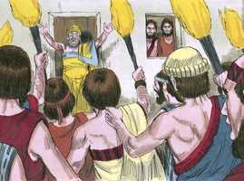

# Gênesis Cap 19

**1** 	E VIERAM os dois anjos a Sodoma à tarde, e estava Ló assentado à porta de Sodoma; e vendo-os Ló, levantou-se ao seu encontro e inclinou-se com o rosto à terra;

> **Cmt MHenry**: *Versículos 1-29* Ló era bom, mas não havia mais ninguém do mesmo caráter na cidade. toda a gente de Sodoma era muito má e vil. Portanto, tomou-se o cuidado de salvar a Ló e a sua família. Ló se demorou, agiu trivialmente. Assim, pois, muitos que estão convencidos de seu estado espiritual e da necessidade de uma mudança, delongam essa obra necessária. A salvação dos homens mais justos é da misericórdia de Deus, não por seus próprios méritos. Somos salvos pela graça. O poder de Deus deve também ser reconhecido ao tirar almas de um estado de pecado. se Deus não tiver sido misericordioso conosco, nossa demora teria sido nossa ruína. Ló deve correr por sua vida. Ele não deve anelar Sodoma. São dadas ordens como estas aos quais, por meio da graça, são livrados de um estado e de uma condição de pecado. não voltem ao pecado nem a Satanás. Não descansem no eu nem no mundo. Acudam a Cristo e ao céu, pois isso é escapar a montanha, não devendo deter-se antes de chegar. Em quanto a esta destruição, observe-se que é uma revolução da ira de Deus contra o pecado e os pecadores de todas as idades. Aprendamos daqui o mau de pecar e sua natureza daninha; conduz à ruína.

**2** 	E disse: Eis agora, meus senhores, entrai, peço-vos, em casa de vosso servo, e passai nela a noite, e lavai os vossos pés; e de madrugada vos levantareis e ireis vosso caminho. E eles disseram: Não, antes na rua passaremos a noite.

**3** 	E porfiou com eles muito, e vieram com ele, e entraram em sua casa; e fez-lhes banquete, e cozeu bolos sem levedura, e comeram.

 

**4** 	E antes que se deitassem, cercaram a casa, os homens daquela cidade, os homens de Sodoma, desde o moço até ao velho; todo o povo de todos os bairros.

 

**5** 	E chamaram a Ló, e disseram-lhe: Onde estão os homens que a ti vieram nesta noite? Traze-os fora a nós, para que os conheçamos.

**6** 	Então saiu Ló a eles à porta, e fechou a porta atrás de si,

 

**7** 	E disse: Meus irmãos, rogo-vos que não façais mal;

**8** 	Eis aqui, duas filhas tenho, que ainda não conheceram homens; fora vo-las trarei, e fareis delas como bom for aos vossos olhos; somente nada façais a estes homens, porque por isso vieram à sombra do meu telhado.

**9** 	Eles, porém, disseram: Sai daí. Disseram mais: Como estrangeiro este indivíduo veio aqui habitar, e quereria ser juiz em tudo? Agora te faremos mais mal a ti do que a eles. E arremessaram-se sobre o homem, sobre Ló, e aproximaram-se para arrombar a porta.

**10** 	Aqueles homens porém estenderam as suas mãos e fizeram entrar a Ló consigo na casa, e fecharam a porta;

**11** 	E feriram de cegueira os homens que estavam à porta da casa, desde o menor até ao maior, de maneira que se cansaram para achar a porta.

**12** 	Então disseram aqueles homens a Ló: Tens alguém mais aqui? Teu genro, e teus filhos, e tuas filhas, e todos quantos tens nesta cidade, tira-os fora deste lugar;

 

**13** 	Porque nós vamos destruir este lugar, porque o seu clamor tem aumentado diante da face do Senhor, e o Senhor nos enviou a destruí-lo.

**14** 	Então saiu Ló, e falou a seus genros, aos que haviam de tomar as suas filhas, e disse: Levantai-vos, saí deste lugar, porque o Senhor há de destruir a cidade. Foi tido porém por zombador aos olhos de seus genros.

 

**15** 	E ao amanhecer os anjos apertaram com Ló, dizendo: Levanta-te, toma tua mulher e tuas duas filhas que aqui estão, para que não pereças na injustiça desta cidade.

**16** 	Ele, porém, demorava-se, e aqueles homens lhe pegaram pela mão, e pela mão de sua mulher e de suas duas filhas, sendo-lhe o Senhor misericordioso, e tiraram-no, e puseram-no fora da cidade.

 

**17** 	E aconteceu que, tirando-os fora, disse: Escapa-te por tua vida; não olhes para trás de ti, e não pares em toda esta campina; escapa lá para o monte, para que não pereças.

**18** 	E Ló disse-lhe: Ora, não, meu Senhor!

 

**19** 	Eis que agora o teu servo tem achado graça aos teus olhos, e engrandeceste a tua misericórdia que a mim me fizeste, para guardar a minha alma em vida; mas eu não posso escapar no monte, para que porventura não me apanhe este mal, e eu morra.

> **Cmt MHenry**: *CAPÍTULO 19A-Sl

**20** 	Eis que agora aquela cidade está perto, para fugir para lá, e é pequena; ora, deixe-me escapar para lá (não é pequena?), para que minha alma viva.

**21** 	E disse-lhe: Eis aqui, tenho-te aceitado também neste negócio, para não destruir aquela cidade, de que falaste;

 

**22** 	Apressa-te, escapa-te para ali; porque nada poderei fazer, enquanto não tiveres ali chegado. Por isso se chamou o nome da cidade Zoar.

**23** 	Saiu o sol sobre a terra, quando Ló entrou em Zoar.

**24** 	Então o Senhor fez chover enxofre e fogo, do Senhor desde os céus, sobre Sodoma e Gomorra;

**25** 	E destruiu aquelas cidades e toda aquela campina, e todos os moradores daquelas cidades, e o que nascia da terra.

**26** 	E a mulher de Ló olhou para trás e ficou convertida numa estátua de sal.

  

**27** 	E Abraão levantou-se aquela mesma manhã, de madrugada, e foi para aquele lugar onde estivera diante da face do Senhor;

**28** 	E olhou para Sodoma e Gomorra e para toda a terra da campina; e viu, que a fumaça da terra subia, como a de uma fornalha.

**29** 	E aconteceu que, destruindo Deus as cidades da campina, lembrou-se Deus de Abraão, e tirou a Ló do meio da destruição, derrubando aquelas cidades em que Ló habitara.

**30** 	E subiu Ló de Zoar, e habitou no monte, e as suas duas filhas com ele; porque temia habitar em Zoar; e habitou numa caverna, ele e as suas duas filhas.

> **Cmt MHenry**: *Versículos 30-38* Veja-se o perigo da seguridade. Ló, que se manteve casto em Sodoma, que se lamentava da maldade do lugar, e era uma testemunha contra ela, quando está sozinho na montanha e, segundo acreditava, fora da tentação, é vencido vergonhosamente. Aquele que pensa que está alto e firme, cuide que não caia. Veja-se o perigo da embriaguez; não somente é um grande pecado em si mesmo, senão que leva a muitos pecados, os quais produzem feridas e desonra perduráveis. Muitos homens, quando estão ébrios fazem aquilo que, quando sóbrios, não poderiam pensar sem horrorizar-se. Também deve ver-se o perigo da tentação, até de parte de parentes e amizades, aos quais amamos e estimamos, e esperamos bondade de parte deles. Devemos temer uma armadilha, onde estivermos, e estar sempre em guarda. Não pode haver escusas para as filhas nem para Ló. Dificilmente pode dar-se razão a este assunto, salvo esta: o coração é enganoso mais que todas as coisas, e perverso, quem o conhecerá? ([Jr 17.9](../24A-Jr/17.md#9)). Pelo silêncio das Escrituras sobre Ló daí em diante, aprenda-se que a bebedeira, assim como faz esquecidos os homens, também faz que sejam esquecidos.

**31** 	Então a primogênita disse à menor: Nosso pai já é velho, e não há homem na terra que entre a nós, segundo o costume de toda a terra;

**32** 	Vem, demos de beber vinho a nosso pai, e deitemo-nos com ele, para que em vida conservemos a descendência de nosso pai.

**33** 	E deram de beber vinho a seu pai naquela noite; e veio a primogênita e deitou-se com seu pai, e não sentiu ele quando ela se deitou, nem quando se levantou.

**34** 	E sucedeu, no outro dia, que a primogênita disse à menor: Vês aqui, eu já ontem à noite me deitei com meu pai; demos-lhe de beber vinho também esta noite, e então entra tu, deita-te com ele, para que em vida conservemos a descendência de nosso pai.

**35** 	E deram de beber vinho a seu pai também naquela noite; e levantou-se a menor, e deitou-se com ele; e não sentiu ele quando ela se deitou, nem quando se levantou.

**36** 	E conceberam as duas filhas de Ló de seu pai.

**37** 	E a primogênita deu à luz um filho, e chamou-lhe Moabe; este é o pai dos moabitas até ao dia de hoje.

**38** 	E a menor também deu à luz um filho, e chamou-lhe Ben-Ami; este é o pai dos filhos de Amom até o dia de hoje.

> **Cmt MHenry** Intro: *• Versículos 1-29*> *Destruição de Sodoma e liberação de Ló*> *• Versículos 30-38*> *Pecado e desgraça de Ló*