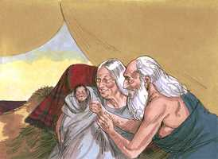

# Gênesis Cap 21

**1** 	E O Senhor visitou a Sara, como tinha dito; e fez o Senhor a Sara como tinha prometido.

> **Cmt MHenry**: *Versículos 1-8* No Antigo Testamento são poucos os que vieram ao mundo com tantas expectativas como Isaque. Nisto foi um tipo de Cristo, essa Semente que o santo Deus prometera muito tempo antes e que os homens santos esperaram por tanto tempo. nasceu conforme com a promessa, no momento designado do qual Deus tinha falado. As misericórdias prometidas por Deus certamente chegarão no momento em que Ele determina, e esse é o melhor momento. Isaque significa "riso", tendo boa razão para o nome (capítulo 17.17; 18.13). Quando o Sol do consolo se levanta na alma, é bom lembrar quão bem recebido foi o alvorecer do dia. Quando Sara recebeu a promessa, riu-se com desconfiança e dúvida. Quando Deus nos dá as misericórdias das que começamos a desesperar, deveríamos lembrar com pena e vergonha nossa pecadora desconfiança em seu poder e promessa, quando estávamos em busca delas. Esta misericórdia encheu a Sara de gozo e assombro. Os favores de Deus para seu povo da aliança são tais que superam seus próprios pensamentos e expectativas, como também os alheios: quem poderia imaginar que Ele fizesse tanto por aqueles que merecem tão pouco, mais ainda, por aqueles que merecem receber o mal? Quem teria dito que Deus enviaria seu Filho a morrer por nós, seu Espírito para fazer-nos santos, seus anjos para servir-nos? Quem teria pensado que pecados tão grandes seriam perdoados, que serviços tão mesquinhos seriam aceitos e que vermes tão indignos seriam integrados na aliança? Faze-se um breve relato da infância de Isaque. Deve reconhecer-se a bênção de Deus sobre a criadagem das crianças e sua preservação através dos perigos da idade infantil, como exemplo os sinais do cuidado e ternura da providência divina. Veja o[Salmo 22.9-10](../19A-Sl/22.md#9); [Os 11.1-2](../28A-Os/11.md#1).

 

**2** 	E concebeu Sara, e deu a Abraão um filho na sua velhice, ao tempo determinado, que Deus lhe tinha falado.

**3** 	E Abraão pôs no filho que lhe nascera, que Sara lhe dera, o nome de Isaque.

 

**4** 	E Abraão circuncidou o seu filho Isaque, quando era da idade de oito dias, como Deus lhe tinha ordenado.

**5** 	E era Abraão da idade de cem anos, quando lhe nasceu Isaque seu filho.

**6** 	E disse Sara: Deus me tem feito riso; todo aquele que o ouvir se rirá comigo.

**7** 	Disse mais: Quem diria a Abraão que Sara daria de mamar a filhos? Pois lhe dei um filho na sua velhice.

**8** 	E cresceu o menino, e foi desmamado; então Abraão fez um grande banquete no dia em que Isaque foi desmamado.

**9** 	E viu Sara que o filho de Agar, a egípcia, o qual tinha dado a Abraão, zombava.

> **Cmt MHenry**: *Versículos 9-13* Não descuidemos a forma em que este assunto familiar nos ensina a não descansar nos privilégios externos ou em nossas próprias obras. Procuremos as bênçãos da nova aliança pela fé na certeza Divina. A conduta de Ismael foi de perseguição, com desprezo profano da aliança e da promessa, e com malícia contra Isaque. Deus atenta no que dizem e fazem as crianças em suas brincadeiras; e os levará em conta se dizem e agem mal, embora não o façam seus pais. Zombar é um grave pecado e resulta em provocação contra Deus. Os filhos da promessa devem esperar que caçoem deles. Abraão se doeu de que Ismael se comportasse mal e que Sara exigisse um castigo tão severo. Porém, Deus mostrou que Isaque deve ser o pai da Semente prometida; portanto, "manda longe a Ismael, não seja que corrompa os costumes ou trate de usurpar os direitos de Isaque". A semente da aliança de Abraão deve ser um povo por si mesmo, não misturado com os que estão fora da aliança: Sara pouco pensou no que fez, porém Deus ratificou o que ela disse.

**10** 	E disse a Abraão: Ponha fora esta serva e o seu filho; porque o filho desta serva não herdará com Isaque, meu filho.

**11** 	E pareceu esta palavra muito má aos olhos de Abraão, por causa de seu filho.

**12** 	Porém Deus disse a Abraão: Não te pareça mal aos teus olhos acerca do moço e acerca da tua serva; em tudo o que Sara te diz, ouve a sua voz; porque em Isaque será chamada a tua descendência.

**13** 	Mas também do filho desta serva farei uma nação, porquanto é tua descendência.

**14** 	Então se levantou Abraão pela manhã de madrugada, e tomou pão e um odre de água e os deu a Agar, pondo-os sobre o seu ombro; também lhe deu o menino e despediu-a; e ela partiu, andando errante no deserto de Berseba.

> **Cmt MHenry**: *Versículos 14-21* Se Agar e Ismael tivessem se comportado bem na família de Abraão, teriam continuado ali, mas foram justamente castigados. Nós perdemos os privilégios por abusarmos deles. Os que não sabem quando estão bem, conhecerão o valor das misericórdias quando lhes faltem. Eles foram levados à angústia no deserto. Não se diz que se acabassem as provisões nem que Abraão os lançasse sem dinheiro. Mas acabou-se a água, e tendo perdido seu caminho, nesse clima cálido, Ismael foi rapidamente vencido pela fadiga e a sede. A prontidão de Deus em ajudar-nos quando estamos em problemas não deve diminuir senão apressar nossos esforços para ajudar a nós mesmos. A promessa referente a seu filho é repetida como razão pela qual Agar deve pôr-se em ação ela amém para ajudá-lo. Devemos comprometer nossa atenção e cuidados pelas crianças e jovens ao considerar que não sabemos qual seja a grande tarefa que Deus lhes têm designada, nem sabemos o que possa fazer deles. O anjo lhe mostra uma provisão presente. Muitos que têm razão para estar consolados, passam condoendo-se de dia em dia porque não vêem que exista razão para ter consolo. Há um poço de água perto deles na aliança da graça, porém eles não percebem até que o próprio Deus que abriu os olhos para ver suas feridas, os abre para que enxergam o remédio. Parã era um lugar silvestre, adequado para um homem rude como Ismael. Os que nascem segundo a carne se amoldam ao deserto deste mundo, enquanto os filhos da promessa que se dirigem à Canaã celestial não podem ter repouso até que estejam lá. Contudo, Deus estava com o rapaz; seu bem-estar exterior devia-se a isso.

**15** 	E consumida a água do odre, lançou o menino debaixo de uma das árvores.

**16** 	E foi assentar-se em frente, afastando-se à distância de um tiro de arco; porque dizia: Que eu não veja morrer o menino. E assentou-se em frente, e levantou a sua voz, e chorou.

**17** 	E ouviu Deus a voz do menino, e bradou o anjo de Deus a Agar desde os céus, e disse-lhe: Que tens, Agar? Não temas, porque Deus ouviu a voz do menino desde o lugar onde está.

**18** 	Ergue-te, levanta o menino e pega-lhe pela mão, porque dele farei uma grande nação.

**19** 	E abriu-lhe Deus os olhos, e viu um poço de água; e foi encher o odre de água, e deu de beber ao menino.

**20** 	E era Deus com o menino, que cresceu; e habitou no deserto, e foi flecheiro.

**21** 	E habitou no deserto de Parã; e sua mãe tomou-lhe mulher da terra do Egito.

> **Cmt MHenry**: *CAPÍTULO 21A-Ec

**22** 	E aconteceu naquele mesmo tempo que Abimeleque, com Ficol, príncipe do seu exército, falou com Abraão, dizendo: Deus é contigo em tudo o que fazes;

> **Cmt MHenry**: *Versículos 22-34* Abimeleque sentiu-se seguro de que as promessas de Deus lhe seriam cumpridas a Abraão. É sábio que nos relacionemos com os que são abençoados por Deus; e temos de pagar com bondade aos que têm sido bondosos conosco. Os poços de água são escassos e valiosos nos países orientais. Abraão teve cuidado de assegurar seu direito ao poço para evitar futuras disputas. Não pode esperar-se outra coisa de um homem honesto, senão que esteja pronto para fazer o bem tão logo como saiba que tem agido errado. Abraão, estando agora num bom lugar, permaneceu muito tempo nele. Ali fez não só uma prática constante, senão também ma profissão franca de sua religião. Ali invocou o nome de Jeová como o Deus eterno; provavelmente a árvore que plantou foi seu lugar de oração. Abraão manteve o culto público, no qual podiam participar seus vizinhos. Os homens bons devem fazer todo o que possam para fazer com que os outros cheguem a ser bons. Onde quer que peregrinemos, não devemos descuidar a adoração de Jeová, nem envergonhar-nos de fazê-lo. "

**23** 	Agora, pois, jura-me aqui por Deus, que não mentirás a mim, nem a meu filho, nem a meu neto; segundo a beneficência que te fiz, me farás a mim, e à terra onde peregrinaste.

**24** 	E disse Abraão: Eu jurarei.

**25** 	Abraão, porém, repreendeu a Abimeleque por causa de um poço de água, que os servos de Abimeleque haviam tomado à força.

**26** 	Então disse Abimeleque: Eu não sei quem fez isto; e também tu não mo fizeste saber, nem eu o ouvi senão hoje.

**27** 	E tomou Abraão ovelhas e vacas, e deu-as a Abimeleque; e fizeram ambos uma aliança.

**28** 	Pôs Abraão, porém, à parte sete cordeiras do rebanho.

**29** 	E Abimeleque disse a Abraão: Para que estão aqui estas sete cordeiras, que puseste à parte?

**30** 	E disse: Tomarás estas sete cordeiras de minha mão, para que sejam em testemunho que eu cavei este poço.

**31** 	Por isso se chamou aquele lugar Berseba, porquanto ambos juraram ali.

**32** 	Assim fizeram aliança em Berseba. Depois se levantou Abimeleque e Ficol, príncipe do seu exército, e tornaram-se para a terra dos filisteus.

**33** 	E plantou um bosque em Berseba, e invocou lá o nome do Senhor, Deus eterno.

**34** 	E peregrinou Abraão na terra dos filisteus muitos dias.

> **Cmt MHenry** Intro: *• Versículos 1-8*> *Nascimento de Isaque – O gozo de Sara*> *• Versículos 9-13*> *Ismael zomba de Isaque*> *• Versículos 14-21*> *Agar e Ismael expulsados – Socorridos e consolados por um*> *• Versículos 22-34*> *A aliança de Abimeleque com Abraão*