# Gênesis Cap 24

**1** 	E ERA Abraão já velho e adiantado em idade, e o Senhor havia abençoado a Abraão em tudo.

> **Cmt MHenry**: *Versículos 1-9* O efeito do bom exemplo, a boa educação e a adoração de Deus em uma família, geralmente se vê na piedade, a fidelidade, a prudência e o afeto dos servos. Viver nessas famílias ou ter tais servos são, ambas as coisas, bênçãos de Deus que devem ser altamente valorizadas e reconhecidas com gratidão. Contudo, não há na vida preocupação de maior importância para nós, o próximo ou a igreja de Deus que o matrimônio. Portanto, sempre deve empreender-se com muito cuidado e prudência, especialmente em referência à vontade de Deus, e com oração por sua direção e bênção. Onde não se consulta nem se consideram os bons pais, não podem esperar-se bênçãos de Deus. Ao dispor de seus filhos, os pais devem consultar cuidadosamente o bem-estar de suas almas, e seu progresso no caminho ao céu. Observe-se o cometido que Abraão deu a um bom servo, um cuja conduta, felicidade e afeto, para com ele e sua família, conhecia desde fazia muito tempo. observe-se também que Abraão lembra-se que Deus o tirou prodigiosamente da terra de seu nascimento, por um chamamento de sua graça e, portanto, não duvida que Ele prospere sua preocupação de não levar a seu filho de volta lá. Deus fará que isso termine em consolo para nós quando sinceramente temos o alvo colocado em Sua glória.

**2** 	E disse Abraão ao seu servo, o mais velho da casa, que tinha o governo sobre tudo o que possuía: Põe agora a tua mão debaixo da minha coxa,

**3** 	Para que eu te faça jurar pelo Senhor Deus dos céus e Deus da terra, que não tomarás para meu filho mulher das filhas dos cananeus, no meio dos quais eu habito.

**4** 	Mas que irás à minha terra e à minha parentela, e dali tomarás mulher para meu filho Isaque.

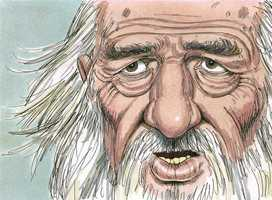 

**5** 	E disse-lhe o servo: Se porventura não quiser seguir-me a mulher a esta terra, farei, pois, tornar o teu filho à terra donde saíste?

**6** 	E Abraão lhe disse: Guarda-te, que não faças lá tornar o meu filho.

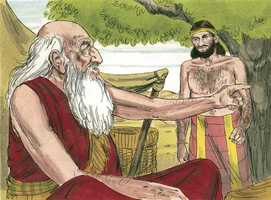 

**7** 	O Senhor Deus dos céus, que me tomou da casa de meu pai e da terra da minha parentela, e que me falou, e que me jurou, dizendo: À tua descendência darei esta terra; ele enviará o seu anjo adiante da tua face, para que tomes mulher de lá para meu filho.

**8** 	Se a mulher, porém, não quiser seguir-te, serás livre deste meu juramento; somente não faças lá tornar a meu filho.

**9** 	Então pôs o servo a sua mão debaixo da coxa de Abraão seu senhor, e jurou-lhe sobre este negócio.

**10** 	E o servo tomou dez camelos, dos camelos do seu senhor, e partiu, pois que todos os bens de seu senhor estavam em sua mão, e levantou-se e partiu para Mesopotâmia, para a cidade de Naor.

> **Cmt MHenry**: *Versículos 10-28* O servo de Abraham reconhecia devotadamente a Deus. nós estamos autorizados para encarregar em detalhe nossos assuntos ao cuidado da divina providência. Propõe um sinal, não porque tratasse de não avançar além dali se não era prosperado nisso; antes, trata-se de uma oração para que Deus proveja uma boa esposa para seu jovem amo; e essa foi uma boa oração. Ela devia ser simples, trabalhadora, humilde, alegre, serviçal e hospedeira. Não importa qual seja a moda, o sentido comum e a piedade nos indicam que estas são as qualidades apropriadas para uma esposa e mãe, pois é quem será companheira de seu marido, administradora das coisas domésticas e encarregada da formação da mente de seus filhos. Quando o mordomo foi buscar uma esposa para seu amo, não foi a lugares de diversão e prazer pecaminoso, orando por achar uma lá, senão que foi ao poço de água, esperando encontrar ali a uma que estivesse ocupada. Orou que agradasse a Deus fazer claro e liso seu caminho ante ele neste assunto. Nossos tempos estão nas mãos de Deus; não só os acontecimentos mesmos, senão seus tempos. Devemos cuidar-nos de não sermos audazes em excesso, insistindo no que Deus deve fazer, não seja que os fatos enfraqueçam nossa fé em lugar de fortalecê-la. Porém Deus o ouviu e lê aplanou o caminho. Em todos os aspectos, Rebeca respondia às características que ele buscava na mulher que seria a esposa de seu amo. Quando chegou ao poço, ela se inclinou, encheu seu cântaro e se endireitou para ir a sua casa. Não se deteve para olhar o forasteiro e seus camelos, senão que se ocupou de seus assuntos e não teria sido afastada deles senão por uma oportunidade de fazer o bem. Não se pôs a conversar com ele por curiosidade ou confiada, senão que respondeu com modéstia. Satisfeito de que o Senhor tinha ouvido sua oração, presenteou à donzela alguns ornamentos dos que se usam nos países orientais; ao mesmo tempo em que lhe perguntava por sua família. Ao saber que era parente de seu amo, inclinou a cabeça e adorou, abençoando a Deus. Suas palavras foram dirigidas ao Senhor, porém ditas ao alcance do ouvido de Rebeca, que pôde perceber quem era ele e de onde vinha.

**11** 	E fez ajoelhar os camelos fora da cidade, junto a um poço de água, pela tarde, ao tempo que as moças saíam a tirar água.

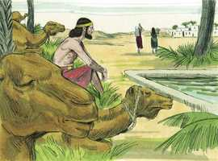 

**12** 	E disse: Ó Senhor, Deus de meu senhor Abraão, dá-me hoje bom encontro, e faze beneficência ao meu senhor Abraão!

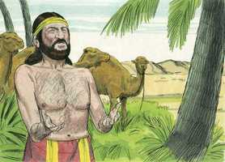 

**13** 	Eis que eu estou em pé junto à fonte de água e as filhas dos homens desta cidade saem para tirar água;

**14** 	Seja, pois, que a donzela, a quem eu disser: Abaixa agora o teu cântaro para que eu beba; e ela disser: Bebe, e também darei de beber aos teus camelos; esta seja a quem designaste ao teu servo Isaque, e que eu conheça nisso que usaste de benevolência com meu senhor.

**15** 	E sucedeu que, antes que ele acabasse de falar, eis que Rebeca, que havia nascido a Betuel, filho de Milca, mulher de Naor, irmão de Abraão, saía com o seu cântaro sobre o seu ombro.

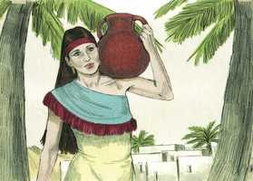 

**16** 	E a donzela era mui formosa à vista, virgem, a quem homem não havia conhecido; e desceu à fonte, e encheu o seu cântaro e subiu.

**17** 	Então o servo correu-lhe ao encontro, e disse: Peço-te, deixa-me beber um pouco de água do teu cântaro.

**18** 	E ela disse: Bebe, meu senhor. E apressou-se e abaixou o seu cântaro sobre a sua mão e deu-lhe de beber.

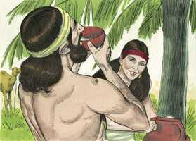 

**19** 	E, acabando ela de lhe dar de beber, disse: Tirarei também água para os teus camelos, até que acabem de beber.

**20** 	E apressou-se, e despejou o seu cântaro no bebedouro, e correu outra vez ao poço para tirar água, e tirou para todos os seus camelos.

**21** 	E o homem estava admirado de vê-la, calando-se, para saber se o Senhor havia prosperado a sua jornada ou não.

**22** 	E aconteceu que, acabando os camelos de beber, tomou o homem um pendente de ouro de meio siclo de peso, e duas pulseiras para as suas mãos, do peso de dez siclos de ouro;

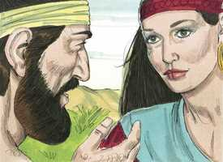 

**23** 	E disse: De quem és filha? Faze-mo saber, peço-te. Há também em casa de teu pai lugar para nós pousarmos?

**24** 	E ela lhe disse: Eu sou a filha de Betuel, filho de Milca, o qual ela deu a Naor.

> **Cmt MHenry**: *Capítulo 24A-Jr

**25** 	Disse-lhe mais: Também temos palha e muito pasto, e lugar para passar a noite.

**26** 	Então inclinou-se aquele homem e adorou ao Senhor,

**27** 	E disse: Bendito seja o Senhor Deus de meu senhor Abraão, que não retirou a sua benevolência e a sua verdade de meu senhor; quanto a mim, o Senhor me guiou no caminho à casa dos irmãos de meu senhor.

**28** 	E a donzela correu, e fez saber estas coisas na casa de sua mãe.

**29** 	E Rebeca tinha um irmão cujo nome era Labão, o qual correu ao encontro daquele homem até a fonte.

> **Cmt MHenry**: *Versículos 29-53* O concerto do matrimônio de Isaque e Rebeca se narra com muito detalhe. Devemos notar a providência de Deus nos fatos corriqueiros da vida humana e, neles, exercer prudência e outras graças. Labão foi a pedir ao servo de Abraão que entrasse, porém não antes de ver o anel e o bracelete em mãos de sua irmã. Conhecemos o caráter de Labão por sua conduta posterior, e podemos pensar que ele não teria estado tão livre de hospedá-lo se não tiver esperado ser bem recompensado. O servo estava dedicado a sua tarefa. Embora terminava uma viagem e havia chegado à casa que procurava, não comeria senão até cumprir sua diligência. Realizar nosso trabalho e cumprir nossos cometidos, sejam para Deus ou para o homem, deve ser preferido por nós antes que a comida; eram a comida e bebida de nosso Salvador ([Jo 4.34](../43N-Joa/04.md#34)). Conta-lhes o encargo que lhe dera seu amo, com a razão dele. Relata o acontecido no poço, para apoiar a proposição, mostrando simplesmente o dedo de Deus nisso. Os acontecimentos que nos parecem efeito de uma eleição, de planos ou do destino, são determinados por Deus. Isto não impede, antes estimula, o uso de todos os médios apropriados. Eles aceitam livre e alegremente a proposição; quando procede do Senhor, todo assunto provavelmente resultará fácil. O servo de Abraão reconhece agradecido o bem êxito que achou. Ele era um homem humilde e os homens humildes não se envergonham de sua situação na vida, qualquer que seja. Todas nossas preocupações temporais são doces se misturadas com a piedade.

**30** 	E aconteceu que, quando ele viu o pendente, e as pulseiras sobre as mãos de sua irmã, e quando ouviu as palavras de sua irmã Rebeca, que dizia: Assim me falou aquele homem; foi ter com o homem, que estava em pé junto aos camelos, à fonte,

**31** 	E disse: Entra, bendito do Senhor; por que estás fora? pois eu já preparei a casa, e o lugar para os camelos.

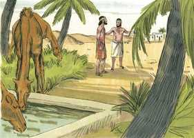 

**32** 	Então veio aquele homem à casa, e desataram os camelos, e deram palha e pasto aos camelos, e água para lavar os pés dele, e os pés dos homens que estavam com ele.

**33** 	Depois puseram comida diante dele. Ele, porém, disse: Não comerei, até que tenha dito as minhas palavras. E ele disse: Fala.

**34** 	Então disse: Eu sou o servo de Abraão.

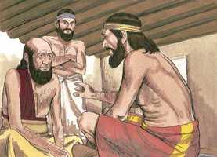 

**35** 	E o Senhor abençoou muito o meu senhor, de maneira que foi engrandecido, e deu-lhe ovelhas e vacas, e prata e ouro, e servos e servas, e camelos e jumentos.

**36** 	E Sara, a mulher do meu senhor, deu à luz um filho a meu senhor depois da sua velhice, e ele deu-lhe tudo quanto tem.

**37** 	E meu senhor me fez jurar, dizendo: Não tomarás mulher para meu filho das filhas dos cananeus, em cuja terra habito;

**38** 	Irás, porém, à casa de meu pai, e à minha família, e tomarás mulher para meu filho.

**39** 	Então disse eu ao meu senhor: Porventura não me seguirá a mulher.

**40** 	E ele me disse: O Senhor, em cuja presença tenho andado, enviará o seu anjo contigo, e prosperará o teu caminho, para que tomes mulher para meu filho da minha família e da casa de meu pai;

**41** 	Então serás livre do meu juramento, quando fores à minha família; e se não te derem, livre serás do meu juramento.

**42** 	E hoje cheguei à fonte, e disse: Ó Senhor, Deus de meu senhor Abraão, se tu agora prosperas o meu caminho, no qual eu ando,

**43** 	Eis que estou junto à fonte de água; seja, pois, que a donzela que sair para tirar água e à qual eu disser: Peço-te, dá-me um pouco de água do teu cântaro;

**44** 	E ela me disser: Bebe tu e também tirarei água para os teus camelos; esta seja a mulher que o Senhor designou ao filho de meu senhor.

**45** 	E antes que eu acabasse de falar no meu coração, eis que Rebeca saía com o seu cântaro sobre o seu ombro, desceu à fonte e tirou água; e eu lhe disse: Peço-te, dá-me de beber.

**46** 	E ela se apressou, e abaixou o seu cântaro de sobre si, e disse: Bebe, e também darei de beber aos teus camelos; e bebi, e ela deu também de beber aos camelos.

**47** 	Então lhe perguntei, e disse: De quem és filha? E ela disse: Filha de Betuel, filho de Naor, que lhe deu Milca. Então eu pus o pendente no seu rosto, e as pulseiras sobre as suas mãos;

**48** 	E inclinando-me adorei ao Senhor, e bendisse ao Senhor, Deus do meu senhor Abraão, que me havia encaminhado pelo caminho da verdade, para tomar a filha do irmão de meu senhor para seu filho.

**49** 	Agora, pois, se vós haveis de fazer benevolência e verdade a meu senhor, fazei-mo saber; e se não, também mo fazei saber, para que eu vá à direita, ou à esquerda.

**50** 	Então responderam Labão e Betuel, e disseram: Do Senhor procedeu este negócio; não podemos falar-te mal ou bem.

**51** 	Eis que Rebeca está diante da tua face; toma-a, e vai-te; seja a mulher do filho de teu senhor, como tem dito o Senhor.

**52** 	E aconteceu que, o servo de Abraão, ouvindo as suas palavras, inclinou-se à terra diante do Senhor.

**53** 	E tirou o servo jóias de prata e jóias de ouro, e vestidos, e deu-os a Rebeca; também deu coisas preciosas a seu irmão e à sua mãe.

**54** 	Então comeram e beberam, ele e os homens que com ele estavam, e passaram a noite. E levantaram-se pela manhã, e disse: Deixai-me ir a meu senhor.

> **Cmt MHenry**: *Versículos 54-67* O servo de Abraão, como quem opta por seu trabalho antes que por seu prazer, estava com pressa por chegar em casa. Demorar-se e permanecer não são ações próprias em absoluto de um homem sábio e bom que é fiel a seu dever. Como os filhos não devem casar sem o consentimento de seus pais, assim os pais não devem casá-los sem o deles. Rebeca consentiu, não só em ir, senão em partir de imediato. A bondade do caráter de Rebeca mostra que nada incorreto havia na resposta, embora não concorde com nossos costumes modernos. Podemos esperar que ela tivesse uma idéia tal da religião e piedade da família a qual ia, que se sentiu disposta a esquecer sua própria gente e a casa de seu pai. Suas amigas a despediram com atenções apropriadas e com cordiais bons desejos. Elas abençoaram a Rebeca. Quando nossas relações entram numa situação nova, devemos encomendá-las por meio da oração a bênção e graça de Deus. Isaque estava bem ocupado quando se encontrou com Rebeca. Saiu a aproveitar uma tarde tranqüila no lugar solitário para meditar e orar, esses exercícios divinos pelos quais conversamos com Deus e com nossos próprios corações. As almas santas amam o retiro; nos fará bem estar a sós com freqüência se usarmos isso em forma correta; e nunca estamos menos sozinhos que quando estamos a sós. Observe que filho tão afetuoso era Isaque: quase três anos tinham-se passado desde que morrera sua mãe, e, contudo, ele ainda não tinha sido consolado. Veja também que marido carinhoso foi com sua esposa. Os filhos respeitosos prometem ser maridos carinhosos; quem cumpre com honra sua primeira posição na vida, provavelmente faça o mesmo nas seguintes.

**55** 	Então disseram seu irmão e sua mãe: Fique a donzela conosco alguns dias, ou pelo menos dez dias, depois irá.

**56** 	Ele, porém, lhes disse: Não me detenhais, pois o Senhor tem prosperado o meu caminho; deixai-me partir, para que eu volte a meu senhor.

**57** 	E disseram: Chamemos a donzela, e perguntemos-lho.

**58** 	E chamaram a Rebeca, e disseram-lhe: Irás tu com este homem? Ela respondeu: Irei.

**59** 	Então despediram a Rebeca, sua irmã, e sua ama, e o servo de Abraão, e seus homens.

**60** 	E abençoaram a Rebeca, e disseram-lhe: Ó nossa irmã, sê tu a mãe de milhares de milhares, e que a tua descendência possua a porta de seus aborrecedores!

**61** 	E Rebeca se levantou com as suas moças, e subiram sobre os camelos, e seguiram o homem; e tomou aquele servo a Rebeca, e partiu.

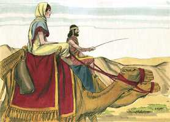 

**62** 	Ora, Isaque vinha de onde se vem do poço de Beer-Laai-Rói; porque habitava na terra do sul.

**63** 	E Isaque saíra a orar no campo, à tarde; e levantou os seus olhos, e olhou, e eis que os camelos vinham.

**64** 	Rebeca também levantou seus olhos, e viu a Isaque, e desceu do camelo.

**65** 	E disse ao servo: Quem é aquele homem que vem pelo campo ao nosso encontro? E o servo disse: Este é meu senhor. Então tomou ela o véu e cobriu-se.

**66** 	E o servo contou a Isaque todas as coisas que fizera.

**67** 	E Isaque trouxe-a para a tenda de sua mãe Sara, e tomou a Rebeca, e foi-lhe por mulher, e amou-a. Assim Isaque foi consolado depois da morte de sua mãe.

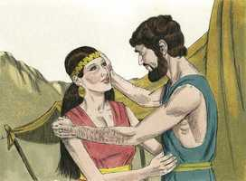 

> **Cmt MHenry** Intro: *• Versículos 1-9*> *Preocupação de Abraão pelo matrimônio de Isaque*> *• Versículos 10-28*> *Viagem do servo de Abraão à Mesopotâmia – Seu encontro*> *com Rebeca*> *• Versículos 29-53*> *Rebeca e seus familiares consentem ao matrimônio dela*> *• Versículos 54-67*> *O feliz encontro e matrimônio de Isaque e Rebeca*> 00-Pref 01A-Gn 02A-Ex 03A-Lv 04A-Nm 05A-Dt 06A-Js 07A-Jz 08A-Rt 09A-1Sm 10A-2Sm 11A-1Rs 12A-2Rs 13A-1Cr 14A-2Cr 15A-Es 16A-Ne 17A-Et 18A-Jo 19A-Sl 20A-Pv 21A-Ec 22A-Ct 23A-Is 24A-Jr 25A-Lm 26A-Ez 27A-Dn 28A-Os 29A-Jl 30A-Am 31A-Ob 32A-Jn 33A-Mq 34A-Na 35A-Hc 36A-Sf 37A-Ag 38A-Zc 39A-Ml 40N-Mt 41N-Mc 42N-Lc 43N-Joa 44N-At 45N-Rm 46N-1Co 47N-2Co 48N-Gl 49N-Ef 50N-Fp 51N-Cl 52N-1Ts 53N-2Ts 54N-1Tm 55N-2Tm 56N-Tt 57N-Fm 58N-Hb 59N-Tg 60N-1Pe 61N-2Pe 62N-1Jo 63N-2Jo 64N-3Jo 65N-Jd 66N-Ap bible-acf2007.csv bible-ara_strongs.csv bible_markdown.sh biblia-sagrada-almeida-corrigida-fiel.pdf comment-AdamOT.csv comment-McArthur.csv comment-MHenry.csv comment-NVI.csv Images images-catalog.csv images-old_bible_pictures.csv Images.zip markdown2html.sh Notas Bíblia de Estudo NVI-out_images.txt Simple_Bible_Reader_v2.9-bible_converter.exe working-comment-nvi.csv working.csv working-imgs.txt