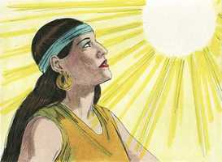
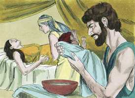
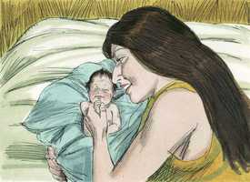
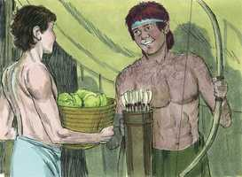
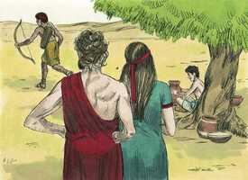
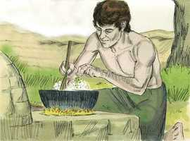
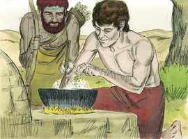
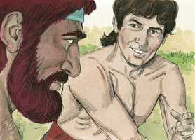
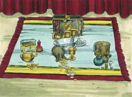
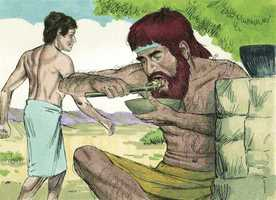

# Gênesis Cap 25

**1** 	E ABRAÃO tomou outra mulher; e o seu nome era Quetura;

> **Cmt MHenry**: *Versículos 1-10* Não todos os dias, até dos melhores e maiores santos, são dias notáveis; alguns se deslizam silenciosamente; tais foram os últimos dias de Abraão. Eis aqui uma lista dos filhos de Abraão com Quetura e a disposição que ele fez de seu patrimônio. Depois e nascer estes filhos pôs sua casa em ordem, com prudência e justiça. Fez isto enquanto estava vivo. Sábio é que os homens façam o que têm de fazer enquanto vivem, na maior média possível. Abraão viveu 175 anos; justo cem anos a mais que ao entrar em Canaã; todo esse tempo for peregrino num país estrangeiro. Pouco importa que nossa estadia nesta vida seja longa ou curta, sempre e quando deixemos atrás um testemunho da fidelidade e bondade do Senhor, e um bom exemplo para nossa família. Conta-se que seus filhos Isaque e Ismael o sepultaram. Parece que o próprio Abraão os havia reunido enquanto ele vivia. Não fechemos a história da vida de Abraão sem abençoar a Deus por tal testemunho do triunfo da fé.

**2** 	E deu-lhe à luz Zinrã, Jocsã, Medã, Midiã, Jisbaque e Suá.

**3** 	E Jocsã gerou Seba e Dedã; e os filhos de Dedã foram Assurim, Letusim e Leumim.

**4** 	E os filhos de Midiã foram Efá, Efer, Enoque, Abida e Elda. Estes todos foram filhos de Quetura.

**5** 	Porém Abraão deu tudo o que tinha a Isaque;

**6** 	Mas aos filhos das concubinas que Abraão tinha, deu Abraão presentes e, vivendo ele ainda, despediu-os do seu filho Isaque, enviando-os ao oriente, para a terra oriental.

**7** 	Estes, pois, são os dias dos anos da vida de Abraão, que viveu cento e setenta e cinco anos.

**8** 	E Abraão expirou, morrendo em boa velhice, velho e farto de dias; e foi congregado ao seu povo;

**9** 	E Isaque e Ismael, seus filhos, sepultaram-no na cova de Macpela, no campo de Efrom, filho de Zoar, heteu, que estava em frente de Manre,

**10** 	O campo que Abraão comprara aos filhos de Hete. Ali está sepultado Abraão e Sara, sua mulher.

**11** 	E aconteceu depois da morte de Abraão, que Deus abençoou a Isaque seu filho; e habitava Isaque junto ao poço Beer-Laai-Rói.

> **Cmt MHenry**: *Versículos 11-18* Ismael teve doze filhos, cujas famílias chegaram a ser distintas tribos. Povoaram um país muito grande que se encontra entre o Egito e a Assíria, chamado Arábia. A quantidade e a força desta família foi o fruto da promessa feita a Agar e a Abraão no tocante a Ismael.

**12** 	Estas, porém, são as gerações de Ismael filho de Abraão, que a serva de Sara, Agar, egípcia, deu a Abraão.

**13** 	E estes são os nomes dos filhos de Ismael, pelos seus nomes, segundo as suas gerações: O primogênito de Ismael era Nebaiote, depois Quedar, Adbeel e Mibsão,

**14** 	Misma, Dumá, Massá,

**15** 	Hadade, Tema, Jetur, Nafis e Quedemá.

**16** 	Estes são os filhos de Ismael, e estes são os seus nomes pelas suas vilas e pelos seus castelos; doze príncipes segundo as suas famílias.

**17** 	E estes são os anos da vida de Ismael, cento e trinta e sete anos, e ele expirou e, morrendo, foi congregado ao seu povo.

**18** 	E habitaram desde Havilá até Sur, que está em frente do Egito, como quem vai para a Assíria; e fez o seu assento diante da face de todos os seus irmãos.

**19** 	E estas são as gerações de Isaque, filho de Abraão: Abraão gerou a Isaque;

> **Cmt MHenry**: *Versículos 19-26* Isaque não parece ter sido muito provado, senão ter passado seus dias tranqüilamente. Jacó e Esaú foram resposta à oração: seus pais os tiveram por oração depois de se passar muito tempo sem filhos. O cumprimento da promessa de Deus sempre é seguro, embora costuma ser lento. A fé dos crentes prova e exercita sua paciência, e as misericórdias longamente esperadas são melhor recebidas quando chegam. Isaque e Rebeca tinham presente a promessa de que todas as nações seriam benditas em sua descendência, portanto, não somente desejavam filhos senão que ansiavam todas as coisas que pareceriam marcar o futuro caráter deles. Nós devemos perguntar ao Senhor em oração por todas as nossas dúvidas. Em muitos de nossos conflitos com o pecado e a Teimoso poderíamos adotar as palavras de Rebeca: "Se é assim, para que vivo eu?" Se um é filho de Deus, por que sou tão negligente e carnal? Se um é filho de Deus, por que é tão temeroso ou tão carregado de pecado?

**20** 	E era Isaque da idade de quarenta anos, quando tomou por mulher a Rebeca, filha de Betuel, arameu de Padã-Arã, irmã de Labão, arameu.

 

**21** 	E Isaque orou insistentemente ao Senhor por sua mulher, porquanto era estéril; e o Senhor ouviu as suas orações, e Rebeca sua mulher concebeu.

**22** 	E os filhos lutavam dentro dela; então disse: Se assim é, por que sou eu assim? E foi perguntar ao Senhor.

 

**23** 	E o Senhor lhe disse: Duas nações há no teu ventre, e dois povos se dividirão das tuas entranhas, e um povo será mais forte do que o outro povo, e o maior servirá ao menor.

 

**24** 	E cumprindo-se os seus dias para dar à luz, eis gêmeos no seu ventre.

 

**25** 	E saiu o primeiro ruivo e todo como um vestido de pêlo; por isso chamaram o seu nome Esaú.

> **Cmt MHenry**: *CAPÍTULO 25A-Lm

**26** 	E depois saiu o seu irmão, agarrada sua mão ao calcanhar de Esaú; por isso se chamou o seu nome Jacó. E era Isaque da idade de sessenta anos quando os gerou.

 

**27** 	E cresceram os meninos, e Esaú foi homem perito na caça, homem do campo; mas Jacó era homem simples, habitando em tendas.

> **Cmt MHenry**: *Versículos 27-28* Esaú caçava as bestas do campo com destreza e êxito até que chegou a ser um vencedor que dominava a seus vizinhos. Jacó era um homem simples, que gostava dos deleites verdadeiros do retiro, mais que de todos os pretendidos prazeres. Ele foi um estrangeiro e peregrino em seu espírito, e um pastor todos seus dias. Isaque e Rebeca tiveram somente estes dois filhos: um era o favorito do pai e o outro, da mãe. Embora os pais piedosos devem sentir mais afeto por um filho piedoso, contudo, não devem mostrar preferências. Que seus afetos os conduzam a fazer o que for justo e eqüitativo com cada filho, ou surgirão males.

  

**28** 	E amava Isaque a Esaú, porque a caça era de seu gosto, mas Rebeca amava a Jacó.

 

**29** 	E Jacó cozera um guisado; e veio Esaú do campo, e estava ele cansado;

> **Cmt MHenry**: *Versículos 29-34* Aqui temos a transação feita entre Jacó e Esaú pela primogenitura, que era de Esaú por nascimento, porém de Jacó pela promessa. Era um privilégio espiritual e vemos o desejo de Jacó pela primogenitura, porém procurou obtê-la por meios tortos, não segundo o caráter de homem simples. Ele tinha *razão* ao cobiçar fervorosamente os melhores dons; fez *mal* ao aproveitar-se da necessidade de seu irmão. A herança os bens mundanos do pai deles não correspondia a Jacó e não estava incluída nesta proposição. Porém, incluía a possessão futura da terra de Canaã por parte dos filhos de seus filhos, e a aliança feita com Abraão em quanto a Cristo, a Semente prometida. O crente Jacó valorizou estas coisas por acima de tudo; o incrédulo Esaú as desprezou. Ainda que devemos ter o juízo de Jacó para procurarmos a primogenitura, devemos evitar cuidadosamente toda malícia ao tratar de conseguir ainda as melhores vantagens. A comida de Jacó agradou os olhos de Esaú. "Rogo-te que me dês de comer desse guisado vermelho"; por isso foi chamado Edom, ou Vermelho. Satisfazer o apetite sensual arruína milhares de almas preciosas. Quando os corações dos homens andam em pós de seus olhos ([Jó 31.7](../18A-Jo/31.md#7)), e quando servem seus ventres, podem ter a certeza de que serão castigados. Se nos empenharmos em negar-nos a nós mesmos, rompemos a força da maioria das tentações. Não pode supor-se que Esaú estiver morrendo de fome na casa de Isaque. As palavras significam "eu vou rumo à morte"; ele parece dizer "Eu nunca viverei para herdar Canaã ou nenhuma dessas supostas bênçãos futuras ou o que signifiquem para quem as tenha quando eu estiver morto e tenha partido". Esta seria a linguagem do profano com que o apóstolo o qualifica ([Hb 12.16](../58N-Hb/12.md#16)); e este menosprezo da primogenitura é sua culpa (versículo 34). É a maior tolice separar-nos de nosso interesse em Deus, Cristo e o céu, pelas riquezas, honras e os prazeres deste mundo; é um negócio tão mau como o que vende sua primogenitura por um prato de guisado. Esaú comeu e bebeu, agradou seu paladar, satisfez seu apetite e, depois, se levantou descuidadamente e foi embora, sem pensar seriamente nem lamentar o mau negócio que tinha feito. Assim, Esaú desprezou sua primogenitura. Por sua negligência e desprezo posteriores e justificando-se no que tinha feito, deixou o assunto no esquecimento. A gente é destruída não tanto por fazer o que é errado, como por fazê-lo e não arrepender-se isso. "

 

**30** 	E disse Esaú a Jacó: Deixa-me, peço-te, comer desse guisado vermelho, porque estou cansado. Por isso se chamou Edom.

 

**31** 	Então disse Jacó: Vende-me hoje a tua primogenitura.

 

**32** 	E disse Esaú: Eis que estou a ponto de morrer; para que me servirá a primogenitura?

  

**33** 	Então disse Jacó: Jura-me hoje. E jurou-lhe e vendeu a sua primogenitura a Jacó.

**34** 	E Jacó deu pão a Esaú e o guisado de lentilhas; e ele comeu, e bebeu, e levantou-se, e saiu. Assim desprezou Esaú a sua primogenitura.

 

> **Cmt MHenry** Intro: *• Versículos 1-10*> *A família de Abraão por Quetura – Morte e sepultamento de*> *• Versículos 11-18*> *Deus abençoa Isaque – Os descendentes de Ismael*> *• Versículos 19-26*> *Nascimento de Esaú e Jacó*> *• Versículos 27-28*> *Diferentes caracteres de Esaú e Jacó*> *• Versículos 29-34*> *Esaú despreza sua primogenitura e a vende*