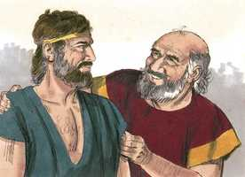
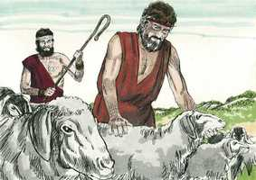
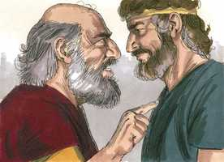

# Gênesis Cap 30

**1** 	VENDO Raquel que não dava filhos a Jacó, teve inveja de sua irmã, e disse a Jacó: Dá-me filhos, se não morro.

> **Cmt MHenry**: *Versículos 1-13* Raquel invejava a sua irmã: a inveja é doer-se porque o próximo está bem; não há pecado que seja mais odioso para Deus que esse, ou mais pernicioso para nosso próximo e nós mesmos. Ela não considerou que Deus estabelece a diferença e que em outras coisas ela tinha a vantagem. Cuidadosamente estejamos vigilantes contra todas as aparições e obras desta paixão em nossa mente. Que nosso olho não seja mau para nenhum de nossos conservos porque o olho de nosso Amo é bom. Jacó amava a Raquel e, portanto, a repreendeu por falar mal. As reprimendas fiéis revelam um verdadeiro afeto. Deus pode ocupar o lugar de qualquer criatura em nós, mas é pecado e tolice colocar uma criatura no lugar de Deus e depositar na criatura a confiança que somente a Ele deve dar-se. Jacó, convencido por Raquel, tomou a Bila, donzela dela, como esposa para que, conforme com os costumes da época, seus filhos fossem de sua senhora. Se seu coração não tivesse estado influenciado pelas más paixões, Raquel teria pensado nos filhos de sua irmã, mais próximos a ela e com mais direito a seu carinho que os de Bilha. Porém lhe eram mais desejáveis os filhos aos que ela tinha direito de mandar que os filhos aos que ela tinha mais razão para amar. Como exemplo precoce de seu poder sobre estes filhos, ela se compraz em dar-lhes nomes que levam em si a marca de sua rivalidade com sua irmã. Veja-se o que são as raízes da amargura, inveja e discórdia, e quanto mal fazem entre os entes queridos. Jacó, convencido por Lia, tomou a Zilpa, sua serva, como esposa também. Veja o poder doa ciúmes e da rivalidade, e admire-se a sabedoria do desígnio divino, que une a um só homem com uma só mulher; porque Deus nos tem chamado à paz e à pureza.

**2** 	Então se acendeu a ira de Jacó contra Raquel, e disse: Estou eu no lugar de Deus, que te impediu o fruto de teu ventre?

**3** 	E ela disse: Eis aqui minha serva Bila; coabita com ela, para que dê à luz sobre meus joelhos, e eu assim receba filhos por ela.

**4** 	Assim lhe deu a Bila, sua serva, por mulher; e Jacó a possuiu.

**5** 	E concebeu Bila, e deu a Jacó um filho.

**6** 	Então disse Raquel: Julgou-me Deus, e também ouviu a minha voz, e me deu um filho; por isso chamou-lhe Dã.

**7** 	E Bila, serva de Raquel, concebeu outra vez, e deu a Jacó o segundo filho.

**8** 	Então disse Raquel: Com grandes lutas tenho lutado com minha irmã; também venci; e chamou-lhe Naftali.

**9** 	Vendo, pois, Lia que cessava de ter filhos, tomou também a Zilpa, sua serva, e deu-a a Jacó por mulher.

**10** 	E deu Zilpa, serva de Lia, um filho a Jacó.

**11** 	Então disse Lia: Afortunada! e chamou-lhe Gade.

**12** 	Depois deu Zilpa, serva de Lia, um segundo filho a Jacó.

**13** 	Então disse Lia: Para minha ventura; porque as filhas me terão por bem-aventurada; e chamou-lhe Aser.

**14** 	E foi Rúben nos dias da ceifa do trigo, e achou mandrágoras no campo. E trouxe-as a Lia sua mãe. Então disse Raquel a Lia: Ora dá-me das mandrágoras de teu filho.

> **Cmt MHenry**: *Versículos 14-24* O desejo de ser a mãe da Semente prometida, bom em si mesmo, porém amiúde demasiado grande e irregular, junto com a honra de ter muitos filhos e a censura de ser estéril, foram algumas das causas desta inconveniente disputa entre as irmãs. A verdade parece ser que elas estavam influenciadas pelas promessas de Deus a Abraão, a cuja posteridade tinha-se feito a promessa das mais ricas bênçãos, e de quem sairia o Messias.

**15** 	E ela lhe disse: É já pouco que hajas tomado o meu marido, tomarás também as mandrágoras do meu filho? Então disse Raquel: Por isso ele se deitará contigo esta noite pelas mandrágoras de teu filho.

**16** 	Vindo, pois, Jacó à tarde do campo, saiu-lhe Lia ao encontro, e disse: A mim possuirás, esta noite, porque certamente te aluguei com as mandrágoras do meu filho. E deitou-se com ela aquela noite.

**17** 	E ouviu Deus a Lia, e concebeu, e deu à luz um quinto filho.

**18** 	Então disse Lia: Deus me tem dado o meu galardão, pois tenho dado minha serva ao meu marido. E chamou-lhe Issacar.

**19** 	E Lia concebeu outra vez, e deu a Jacó um sexto filho.

**20** 	E disse Lia: Deus me deu uma boa dádiva; desta vez morará o meu marido comigo, porque lhe tenho dado seis filhos. E chamou-lhe Zebulom.

**21** 	E depois teve uma filha, e chamou-lhe Diná.

**22** 	E lembrou-se Deus de Raquel; e Deus a ouviu, e abriu a sua madre.

**23** 	E ela concebeu, e deu à luz um filho, e disse: Tirou-me Deus a minha vergonha.

**24** 	E chamou-lhe José, dizendo: O Senhor me acrescente outro filho.

**25** 	E aconteceu que, como Raquel deu à luz a José, disse Jacó a Labão: Deixa-me ir, que me vá ao meu lugar, e à minha terra.

> **Cmt MHenry**: *Versículos 25-43* Passados os catorze anos, Jacó estava desejoso de partir sem provisão, salvo a promessa de Deus. mas de muitas forma, tinha um justo reclamo sobre a fortuna de Labão, e era vontade de Deus que ele recebesse provisão dela. Ele referiu sua causa a Deus em vez de acordar os salários estipulados com Labão, cujo egoísmo era muito grande. Pareceria ser que agiu honestamente quando não se achou nenhum gado entre os seus, senão aqueles das cores acordadas. Labão pensou egoisticamente que seu gado produziria poucos de cores diferentes das do seu. Tem sido considerado que a conduta de Jacó depois deste acordo é um exemplo de sua política e administração. Porém aconteceu assim a instâncias de Deus e como sinal de seu poder. O Senhor de uma ou de outra forma defenderá a causa do oprimido e honrará os que simplesmente confiam em sua providência. Tampouco pôde Labão queixar-se de Jacó, já que não tinha nada além do que fora livremente acordado; também não foi danificado, senão muito beneficiado pelos serviços de Jacó. Que todas nossas misericórdias sejam recebidas com ação de graças e oração, para que, vindo de sua generosidade, não levianamente a louvá-lo.

 

**26** 	Dá-me as minhas mulheres, e os meus filhos, pelas quais te tenho servido, e ir-me-ei; pois tu sabes o serviço que te tenho feito.

**27** 	Então lhe disse Labão: Se agora tenho achado graça em teus olhos, fica comigo. Tenho experimentado que o Senhor me abençoou por amor de ti.

**28** 	E disse mais: Determina-me o teu salário, que to darei.

**29** 	Então lhe disse: Tu sabes como te tenho servido, e como passou o teu gado comigo.

**30** 	Porque o pouco que tinhas antes de mim tem aumentado em grande número; e o Senhor te tem abençoado por meu trabalho. Agora, pois, quando hei de trabalhar também por minha casa?

> **Cmt MHenry**: *CAPÍTULO 30A-Am

**31** 	E disse ele: Que te darei? Então disse Jacó: Nada me darás. Se me fizeres isto, tornarei a apascentar e a guardar o teu rebanho;

 

**32** 	Passarei hoje por todo o teu rebanho, separando dele todos os salpicados e malhados, e todos os morenos entre os cordeiros, e os malhados e salpicados entre as cabras; e isto será o meu salário.

**33** 	Assim testificará por mim a minha justiça no dia de amanhã, quando vieres e o meu salário estiver diante de tua face; tudo o que não for salpicado e malhado entre as cabras e moreno entre os cordeiros, ser-me-á por furto.

**34** 	Então disse Labão: Quem dera seja conforme a tua palavra.

 

**35** 	E separou naquele mesmo dia os bodes listrados e malhados e todas as cabras salpicadas e malhadas, todos em que havia brancura, e todos os morenos entre os cordeiros; e deu-os nas mãos dos seus filhos.

**36** 	E pôs três dias de caminho entre si e Jacó; e Jacó apascentava o restante dos rebanhos de Labão.

**37** 	Então tomou Jacó varas verdes de álamo e de aveleira e de castanheiro, e descascou nelas riscas brancas, descobrindo a brancura que nas varas havia,

**38** 	E pôs estas varas, que tinha descascado, em frente aos rebanhos, nos canos e nos bebedouros de água, aonde os rebanhos vinham beber, para que concebessem quando vinham beber.

**39** 	E concebiam os rebanhos diante das varas, e as ovelhas davam crias listradas, salpicadas e malhadas.

**40** 	Então separou Jacó os cordeiros, e pôs as faces do rebanho para os listrados, e todo o moreno entre o rebanho de Labão; e pôs o seu rebanho à parte, e não o pôs com o rebanho de Labão.

**41** 	E sucedia que cada vez que concebiam as ovelhas fortes, punha Jacó as varas nos canos, diante dos olhos do rebanho, para que concebessem diante das varas.

**42** 	Mas, quando era fraco o rebanho, não as punha. Assim as fracas eram de Labão, e as fortes de Jacó.

**43** 	E cresceu o homem em grande maneira, e teve muitos rebanhos, e servas, e servos, e camelos e jumentos.

 

> **Cmt MHenry** Intro: *• Versículos 1-13*> *Outro relato mais da família de Jacó*> *• Versículos 14-24*> *Raquel dá a luz a José*> *• Versículos 25-43*> *A nova aliança de Jacó com Labão para servi-lo pelo rebanho*