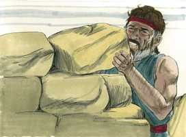
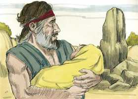
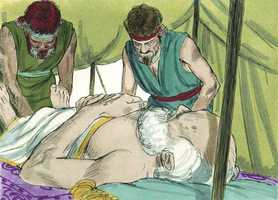

# Gênesis Cap 35

**1** 	DEPOIS disse Deus a Jacó: Levanta-te, sobe a Betel, e habita ali; e faze ali um altar ao Deus que te apareceu, quando fugiste da face de Esaú teu irmão.

> **Cmt MHenry**: *Versículos 1-5* Betel estava esquecido. Todavia, a quantos Deus ama, lembrará dos deveres descuidados de uma ou de outra forma, pela consciência ou pela providência. Quando temos feito um voto a Deus, é melhor não demorar o pagamento; melhor tarde que nunca. Jacó mandou seu lar que se preparasse não somente para a viagem e a mudança, senão para os serviços religiosos. os chefes de família devem usar sua autoridade para conservar a fé em suas famílias ([Js 24.15](../06A-Js/24.md#15)). Eles devem tirar os deuses alheios. Nas famílias nas que há uma aparência de religião e um altar para Deus, muitas vezes há muita perdição e mais deuses estranhos do que alguém poderia supor. Devem purificar-se e trocar as vestes. Estas são somente cerimônias externas, que representam a purificação e a mudança de coração. Que são as roupas limpas e as vestes novas, sem um coração limpo, sem um novo coração? Se Jacó tiver procurado antes esses ídolos, se teria separado antes deles. Às vezes as tentativas de reforma triunfam melhor do que tivéssemos pensado. Jacó enterrou as imagens. Devemos estar totalmente afastados de nossos pecados, como o estamos daqueles que estão mortos e sepultados, fora da vista. Mudou-se de Siquem a Betel. Embora os cananeus estavam muito enraivecidos com os filhos de Jacó pelo tratamento bárbaro contra os de Siquem, foram retidos de tal modo pelo poder divino, que não puderam aproveitar a oportunidade de vingar-se que agora se lhes oferecia. O caminho do dever é I caminho da segurança. Quando estamos ocupados na obra de Deus, estamos sob proteção especial; Deus está conosco enquanto nós permaneçamos com Ele; e se Ele é por nós, quem contra nós? Deus rege o mundo por terrores secretos na mente dos homens mais do que podemos perceber.

 

**2** 	Então disse Jacó à sua família, e a todos os que com ele estavam: Tirai os deuses estranhos, que há no meio de vós, e purificai-vos, e mudai as vossas vestes.

**3** 	E levantemo-nos, e subamos a Betel; e ali farei um altar ao Deus que me respondeu no dia da minha angústia, e que foi comigo no caminho que tenho andado.

**4** 	Então deram a Jacó todos os deuses estranhos, que tinham em suas mãos, e as arrecadas que estavam em suas orelhas; e Jacó os escondeu debaixo do carvalho que está junto a Siquém.

**5** 	E partiram; e o terror de Deus foi sobre as cidades que estavam ao redor deles, e não seguiram após os filhos de Jacó.

**6** 	Assim chegou Jacó a Luz, que está na terra de Canaã (esta é Betel), ele e todo o povo que com ele havia.

> **Cmt MHenry**: *Versículos 6-15* O consolo que os santos têm nas sagradas ordenanças não é tanto de Betel, a casa de Deus, como de El-Betel, o Deus da casa. Os mandamentos são coisas vazias se não nos encontramos com Deus neles. Jacó enterrou ali a Débora, a ama de Rebeca. Sua morte foi muito lamentada. Os velhos servos da família, que têm sido fiéis e úteis em seu tempo, devem ser respeitados. Deus se apareceu a Jacó. Renovou a aliança com ele. Eu sou Deus Todo Poderoso, Deus onipotente, capaz de cumprir a promessa no *devido* tempo e de sustentar-te e prover para você no tempo *mau*. Promete duas coisas: que ele será o pai de uma grande nação e o dono de uma boa terra. Estas duas promessas tinham um significado espiritual do qual Jacó tinha certa noção, embora não tão clara e definida como a temos nós agora. Cristo é a Semente prometida e o céu é a terra prometida; o primeiro é o fundamento e o segundo, a culminação de todos os favores de Deus.

**7** 	E edificou ali um altar, e chamou aquele lugar El-Betel; porquanto Deus ali se lhe tinha manifestado, quando fugia da face de seu irmão.

**8** 	E morreu Débora, a ama de Rebeca, e foi sepultada ao pé de Betel, debaixo do carvalho cujo nome chamou Alom-Bacute.

**9** 	E apareceu Deus outra vez a Jacó, vindo de Padã-Arã, e abençoou-o.

**10** 	E disse-lhe Deus: O teu nome é Jacó; não te chamarás mais Jacó, mas Israel será o teu nome. E chamou-lhe Israel.

**11** 	Disse-lhe mais Deus: Eu sou o Deus Todo-Poderoso; frutifica e multiplica-te; uma nação, sim, uma multidão de nações sairá de ti, e reis procederão dos teus lombos;

**12** 	E te darei a ti a terra que tenho dado a Abraão e a Isaque, e à tua descendência depois de ti darei a terra.

**13** 	E Deus subiu dele, do lugar onde falara com ele.

**14** 	E Jacó pôs uma coluna no lugar onde falara com ele, uma coluna de pedra; e derramou sobre ela uma libação, e deitou sobre ela azeite.

**15** 	E chamou Jacó aquele lugar, onde Deus falara com ele, Betel.

**16** 	E partiram de Betel; e havia ainda um pequeno espaço de terra para chegar a Efrata, e deu à luz Raquel, e ela teve trabalho em seu parto.

> **Cmt MHenry**: *Versículos 16-20* Raquel tinha falado apaixonadamente "Dá-me filhos ou senão morro"; e agora que tinha filhos, morreu! A morte do corpo não é senão a partida da alma ao mundo dos espíritos. Quando aprendamos que é Deus só quem realmente sabe o que é o melhor para seu povo, e que em todos nossos assuntos mundanos a via mais segura para o cristão é dizer de todo coração: "É o Senhor, que Ele faça o que bem lhe parecer". Somente nisso está a nossa seguridade e nosso consolo, em não conhecer outra vontade senão a Sua. Seus lábios moribundos chamaram Benoni a seu filho recém-nascido, *filho de minha dor*; e muitos filhos resultam ser uma carga insuportável para a que os teve. Os filhos são uma dor bastante grande para suas mães; portanto, quando cresçam deveriam estudar para ser o gozo delas e, de ser possível, fazer algumas emendas. Porém Jacó, devido a que não queria reviver a lembrança penosa da morte da mãe cada vez que chamasse a seu filho, mudou seu nome por Benjamim, o *filho de minha destra*, isto é, muito querido para mim; o apoio de minha velhice, o cajado de minha mão direita.

**17** 	E aconteceu que, tendo ela trabalho em seu parto, lhe disse a parteira: Não temas, porque também este filho terás.

**18** 	E aconteceu que, saindo-se-lhe a alma (porque morreu), chamou-lhe Benoni; mas seu pai chamou-lhe Benjamim.

**19** 	Assim morreu Raquel, e foi sepultada no caminho de Efrata; que é Belém.

 

**20** 	E Jacó pôs uma coluna sobre a sua sepultura; esta é a coluna da sepultura de Raquel até o dia de hoje.

**21** 	Então partiu Israel, e estendeu a sua tenda além de Migdal Eder.

> **Cmt MHenry**: *Versículos 21-29* Mostra-se a profunda aflição que foi o pecado de Rubem em "e Israel o soube". Não se diz mais, mas é suficiente. Rubem pensou que seu pai nunca saberia, mas aqueles que se prometem secreto ao pecar, geralmente se desenganam. Registra-se a idade e a morte de Isaque, embora não morreu senão depois que José fosse vendido ao Egito. Isaque viveu uns quarenta anos depois de ter feito seu testamento (capítulo 27.2). Não morreremos uma hora antes por colocar nosso coração e nossa casa em ordem; contudo, isto será muito melhor. Destaca-se em particular o acordo de Esaú e Jacó em quanto ao funeral de seu pai, para mostrar como Deus tinha mudado prodigiosamente a mente de Esaú. É horrível ver os parentes que brigam sobre os túmulos de suas amizades, por um pouco dos bens deste mundo, enquanto estão próximos a partir eles mesmos ao túmulo. "

**22** 	E aconteceu que, habitando Israel naquela terra, foi Rúben e deitou-se com Bila, concubina de seu pai; e Israel o soube. E eram doze os filhos de Jacó.

**23** 	Os filhos de Lia: Rúben, o primogênito de Jacó, depois Simeão e Levi, e Judá, e Issacar e Zebulom;

**24** 	Os filhos de Raquel: José e Benjamim;

**25** 	E os filhos de Bila, serva de Raquel: Dã e Naftali;

**26** 	E os filhos de Zilpa, serva de Lia: Gade e Aser. Estes são os filhos de Jacó, que lhe nasceram em Padã-Arã.

**27** 	E Jacó veio a seu pai Isaque, a Manre, a Quiriate-Arba (que é Hebrom), onde peregrinaram Abraão e Isaque.

**28** 	E foram os dias de Isaque cento e oitenta anos.

**29** 	E Isaque expirou, e morreu, e foi recolhido ao seu povo, velho e farto de dias; e Esaú e Jacó, seus filhos, o sepultaram.

 

> **Cmt MHenry** Intro: *CAPÍTULO 35A-Hc> *• Versículos 1-5*> *Deus manda a Jacó a ir a Betel – Tira os ídolos de sua família*> *• Versículos 6-15*> *Jacó erige um altar – Morte de Débora – Deus abençoa a*> *• Versículos 16-20*> *Morte de Raquel*> *• Versículos 21-29*> *O crime de Rubem – A morte de Isaque*