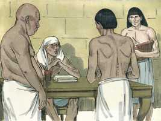
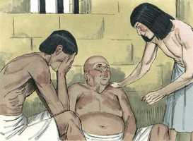
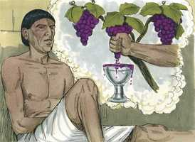
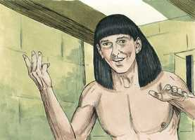
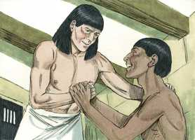
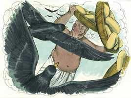
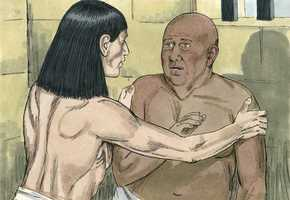
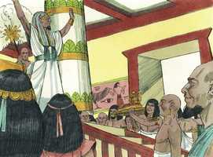
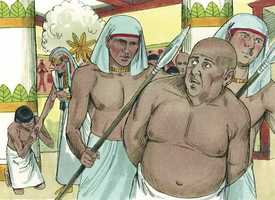

# Gênesis Cap 40

**1** 	E ACONTECEU, depois destas coisas, que o copeiro do rei do Egito, e o seu padeiro, ofenderam o seu senhor, o rei do Egito.

> **Cmt MHenry**: *Versículos 1-19* Não foi o cárcere o que tanto entristeceu o copeiro e o padeiro, como seus sonhos. Deus tem mais de um caminho para contristar os espíritos. José teve compaixão deles. Que nos interessemos pela tristeza dos rostos de nossos irmãos. Para os que têm problemas freqüentemente é um alívio ser percebidos. Além disso, aprendamos a ver a causa de nosso próprio pesar. Existe uma boa razão? Não há suficiente consolo para equilibrá-la, qualquer que seja? Por que estás abatida, oh minha alma? José teve cuidado de dar a glória a Deus. O sonho do chefe dos copeiros anunciava sua ascensão. O sonho do padeiro-mor, sua morte. Não era culpa de José que não lhe fossem dadas melhores notícias ao padeiro. Assim, os ministros somente são intérpretes; eles não podem fazer que as coisas sejam distintas do que são: se eles se conduzem com fidelidade e sua mensagem resulta desagradável, a culpa não é deles. José não pensa em seus irmãos que o venderam; tampouco no mal que sua ama e seu amo lhe fizeram, senão que mansamente afirma sua inocência. Quando somos chamados a defender-nos, devemos evitar, cuidadosamente, dentro do possível, falar mal dos outros. contentemo-nos com demonstrar a nossa inocência e não recriminemos aos outros sua culpa.

**2** 	E indignou-se Faraó muito contra os seus dois oficiais, contra o copeiro-mor e contra o padeiro-mor.

**3** 	E entregou-os à prisão, na casa do capitão da guarda, na casa do cárcere, no lugar onde José estava preso.

**4** 	E o capitão da guarda pô-los a cargo de José, para que os servisse; e estiveram muitos dias na prisão.

 

**5** 	E ambos tiveram um sonho, cada um seu sonho, na mesma noite, cada um conforme a interpretação do seu sonho, o copeiro e o padeiro do rei do Egito, que estavam presos na casa do cárcere.

**6** 	E veio José a eles pela manhã, e olhou para eles, e viu que estavam perturbados.

 

**7** 	Então perguntou aos oficiais de Faraó, que com ele estavam no cárcere da casa de seu senhor, dizendo: Por que estão hoje tristes os vossos semblantes?

**8** 	E eles lhe disseram: Tivemos um sonho, e ninguém há que o interprete. E José disse-lhes: Não são de Deus as interpretações? Contai-mo, peço-vos.

**9** 	Então contou o copeiro-mor o seu sonho a José, e disse-lhe: Eis que em meu sonho havia uma vide diante da minha face.

 

**10** 	E na vide três sarmentos, e brotando ela, a sua flor saía, e os seus cachos amadureciam em uvas;

**11** 	E o copo de Faraó estava na minha mão, e eu tomava as uvas, e as espremia no copo de Faraó, e dava o copo na mão de Faraó.

**12** 	Então disse-lhe José: Esta é a sua interpretação: Os três sarmentos são três dias;

 

**13** 	Dentro ainda de três dias Faraó levantará a tua cabeça, e te restaurará ao teu estado, e darás o copo de Faraó na sua mão, conforme o costume antigo, quando eras seu copeiro.

**14** 	Porém lembra-te de mim, quando te for bem; e rogo-te que uses comigo de compaixão, e que faças menção de mim a Faraó, e faze-me sair desta casa;

 

**15** 	Porque, de fato, fui roubado da terra dos hebreus; e tampouco aqui nada tenho feito para que me pusessem nesta cova.

**16** 	Vendo então o padeiro-mor que tinha interpretado bem, disse a José: Eu também sonhei, e eis que três cestos brancos estavam sobre a minha cabeça;

 

**17** 	E no cesto mais alto havia de todos os manjares de Faraó, obra de padeiro; e as aves o comiam do cesto, de sobre a minha cabeça.

 

**18** 	Então respondeu José, e disse: Esta é a sua interpretação: Os três cestos são três dias;

 

**19** 	Dentro ainda de três dias Faraó tirará a tua cabeça e te pendurará num pau, e as aves comerão a tua carne de sobre ti.

**20** 	E aconteceu ao terceiro dia, o dia do nascimento de Faraó, que fez um banquete a todos os seus servos; e levantou a cabeça do copeiro-mor, e a cabeça do padeiro-mor, no meio dos seus servos.

> **Cmt MHenry**: *Versículos 20-23* A interpretação que José deu aos sonhos aconteceu no dia indicado. No aniversário do Faraó todos seus servos o atendiam e então foram revisados os casos dos dois. Todos podemos olhar para o nosso aniversário com proveito, com gratidão pelas misericórdias de nosso nascimento, com tristeza pelo pecado de nossa vida e com a expectativa de que o dia de nossa morte seja melhor que o dia de nosso nascimento. Mas parece raro que a gente mundana, tão aficionada a viver aqui, deva regozijar-se afinal de cada ano de sua curta expectativa de vida. O cristão tem razão para alegrar-se por ter nascido, de ir aproximando-se o final de seu pecado e pesar, e sua eterna felicidade. O chefe dos copeiros não se lembrou de José, senão que o esqueceu. José teria merecido algo melhor dele, porém esqueceu. Não devemos pensar que é estranho se neste mundo nos devolvem ódio por nosso amor e dardos por nossa bondade. Veja-se quão dados a esquecer-se dos outros que estão em problemas são os que agora estão bem. José aprendeu, por seu desengano, a confiar unicamente em Deus. Nós nunca podemos esperar demasiado pouco do homem nem demasiado de Deus. Não esqueçamos os sofrimentos, as promessas e o amor de nosso Redentor. Culpamos a ingratidão do copeiro-mor para com José, porém nós mesmos agimos com muita mais ingratidão para com o Senhor Jesus. José apenas tinha *anunciado* a ascensão do chefe dos copeiros, porém Cristo *produziu* a nossa; Ele intercedeu com o Rei de reis por nós, mas nós o esquecemos, embora freqüentemente se nos faz lembrá-lo e apesar de ter prometido não esquecê-lo jamais. Assim de mal lhe pagamos, como a gente néscia e imprudente.

 

**21** 	E fez tornar o copeiro-mor ao seu ofício de copeiro, e este deu o copo na mão de Faraó,

 

**22** 	Mas ao padeiro-mor enforcou, como José havia interpretado.

 

**23** 	O copeiro-mor, porém, não se lembrou de José, antes se esqueceu dele.

> **Cmt MHenry** Intro: *CAPÍTULO 40N-Mt> *• Versículos 1-19*> *O copeiro e o padeiro do Faraó na prisão – Seus sonhos*> *interpretados por José*> *• Versículos 20-23*> *A ingratidão do chefe dos copeiros*